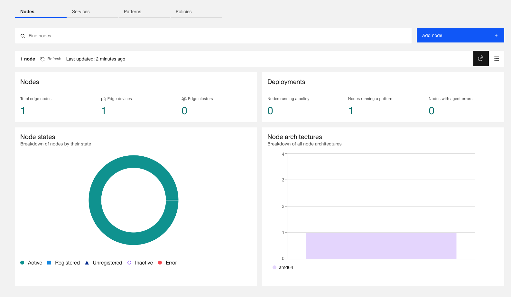
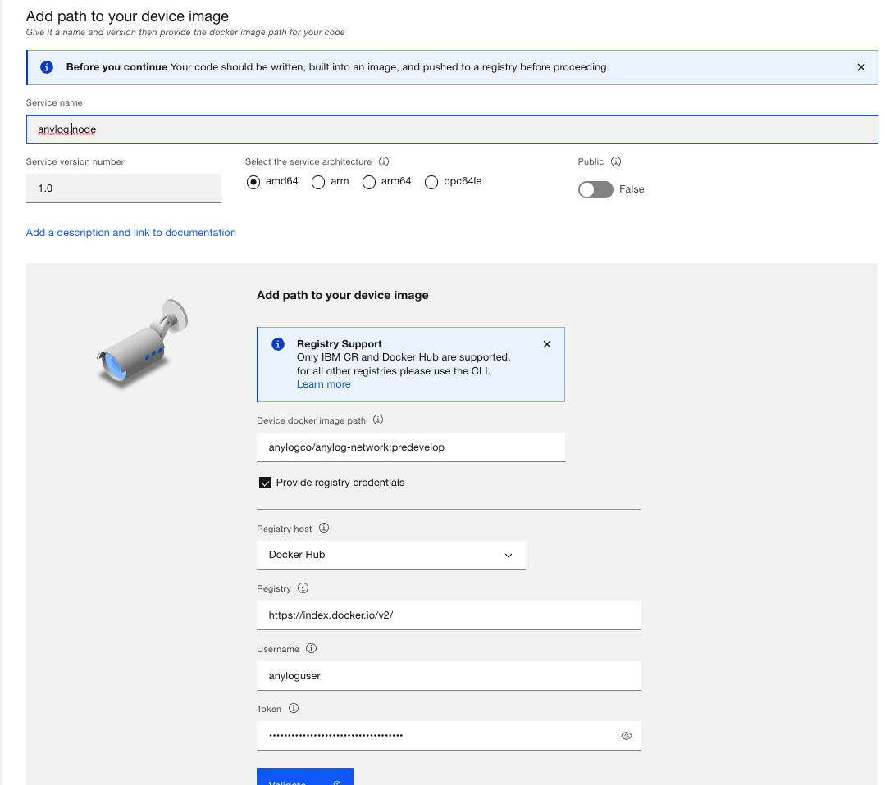
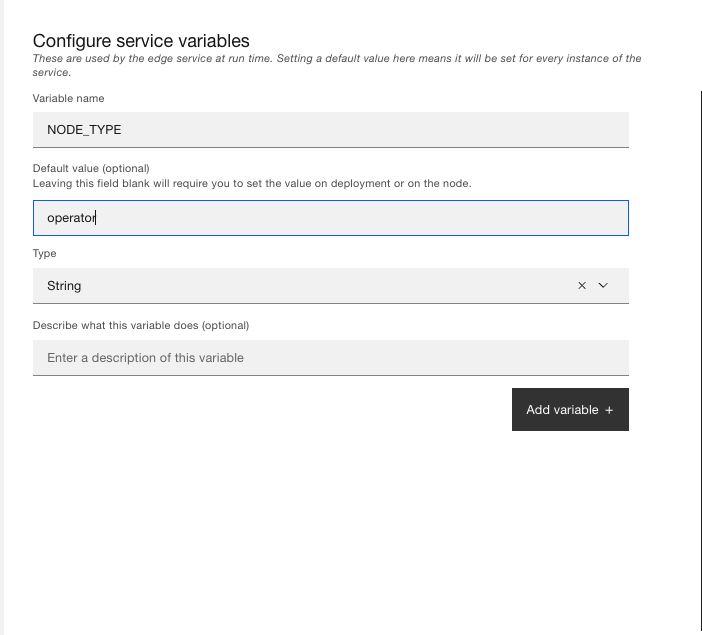
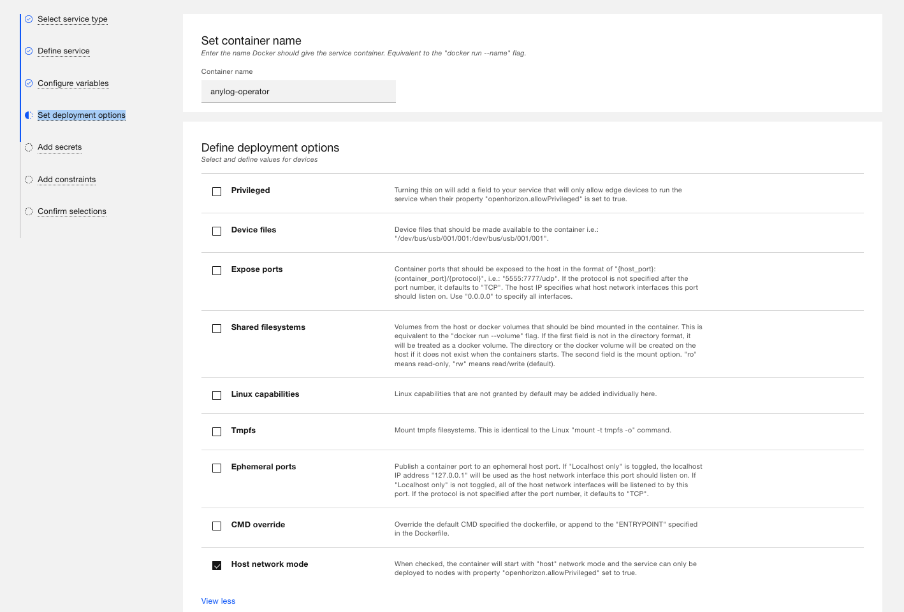
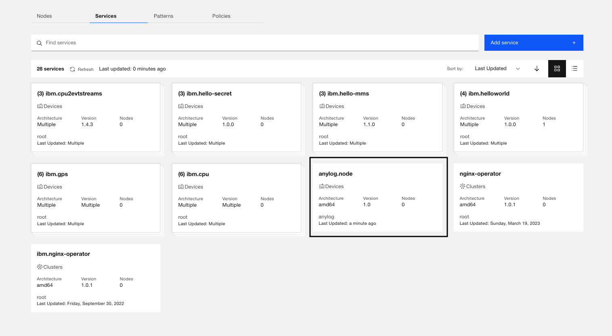
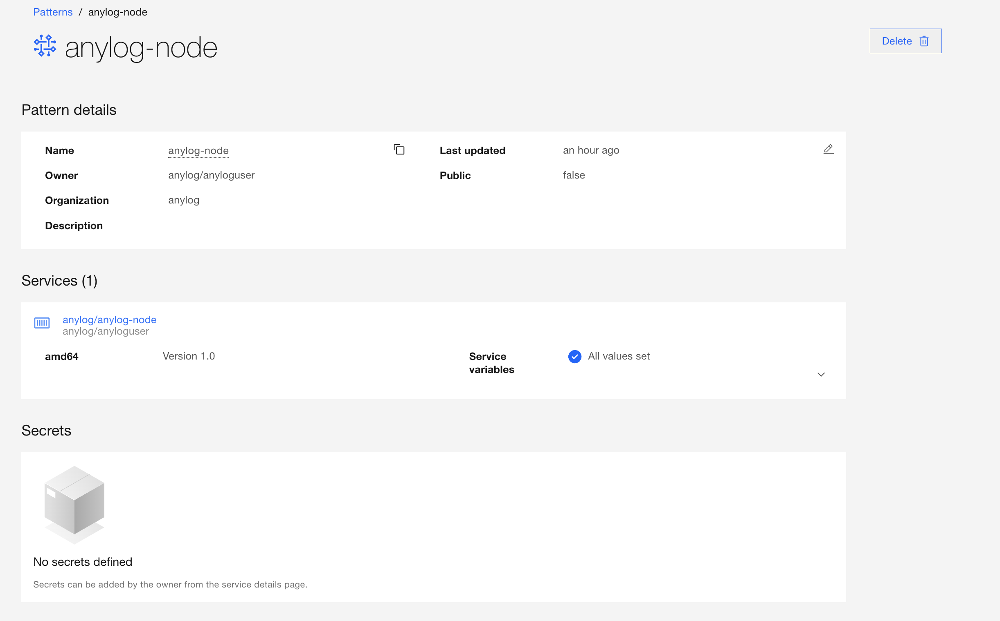

<!---
### 📜 Change Log
 **Date**   | **Name**       | **Change**         | **Version** |
 |------------|----------------|------------------|----------|
 |            |                |                  |          |
 | 2026-07-17 | Eric Aquaronne | added change log | 2.0.2606 |
 |            |
--->

# Open Horizon 

Open Horizon is a platform for managing the service software lifecycle of containerized workloads and related machine 
learning assets. It enables autonomous management of applications deployed to distributed web scale fleets of edge 
computing nodes and devices without requiring on-premise administrators.

Open Horizon can be used to easily manage and deploy AnyLog node(s) through their interface.
* <a href="https://www.lfedge.org/projects/openhorizon/" target="_blank">Open Horizon Website</a>
* <a href="https://developer.ibm.com/components/open-horizon/" target="_blank">IBM Documentation for Open Horizon</a>
* <a href="https://open-horizon.github.io/" target="_blank">Open Source Documentation</a>
* <a href="https://github.com/AnyLog-co/documentation" target="_blank">AnyLog Documentation</a>
* <a href="https://anylog.co" target="_blank">AnyLog Website</a>

## Requirements 
* A physical / virtual machine for each node, as OpenHorizon is unable to deploy more than 1 instance per node 
* <a href="https://www.ibm.com/docs/en/eam/4.0?topic=devices-preparing-edge-devicehttps://www.ibm.com/docs/en/eam/4.0?topic=devices-preparing-edge-device" target="_blank">Machine requirements</a>

**For 64-bit Intel or AMD device or virtual machine:**

* 64-bit Intel or AMD device or virtual machine
* An internet connection for your device (wired or Wi-Fi)

**For Linux on ARM (32-bit):**

* Hardware requirements - Raspberry Pi 3A+, 3B, 3B+, or 4 (preferred), but also supports  A+, B+, 2B, Zero-W, or Zero-WH
* MicroSD flash card (32 GB preferred)
* An Internet connection for your device (wired or Wi-Fi). Note: Some devices can require extra hardware for supporting Wi-Fi.

## Associating Machine to Open Horizon
The following steps will associate a new machine with the Open Horizon management platform. The process will complete the 
following:  
* <a href="https://www.ibm.com/docs/en/eam/4.3?topic=installation-creating-your-api-key" target="_blank">Create an API key</a> 
* <a href="https://www.ibm.com/docs/en/eam/4.1?topic=cli-installing-hzn" target="_blank">Install Horizon CLI</a> 
* <a href="https://docs.docker.com/engine/install/" target="_blank">Install Docker</a> 
* Validate Open Horizon is working by deploying a _Hello World_ package

1. On the node Update / Upgrade Node
```shell
for CMD in update upgrade ; do sudo apt-get -y ${CMD} ; done
```

2. Create an Open Horizon <a href="https://www.ibm.com/docs/en/eam/4.3?topic=installation-creating-your-api-key" target="_blank">API Key</a>

3. Update Environment variables
* In `~/.bashrc` (or `~/.profile` for Alpine) add the following variables

```shell
export HZN_ORG_ID=<COMPANY_NAME> 
export HZN_EXCHANGE_USER_AUTH="iamapikey:<API_KEY>"
export HZN_EXCHANGE_URL=<HZN_EXCHANGE_URL>
export HZN_FSS_CSSURL=<HZN_FSS_CSSURL> 
```
* Set Environment variables

```shell
# For non-Alpine operating systems 
source ~/.bashrc 

# For Alpine operating systems 
source ~/.profile 
```

4. Install agent and provide admin privileges

```shell
curl -u "${HZN_ORG_ID}/${HZN_EXCHANGE_USER_AUTH}" -k -o agent-install.sh ${HZN_FSS_CSSURL}/api/v1/objects/IBM/agent_files/agent-install.sh/data

chmod +x agent-install.sh

sudo -s -E ./agent-install.sh -i 'css:' -p IBM/pattern-ibm.helloworld -w '*' -T 120
```

5. Validate helloworld sample edge service is running

```shell
hzn eventlog list -f

<<COMMENT  
"2022-06-13 21:27:13:   Workload service containers for IBM/ibm.helloworld are up and running."
<<COMMENT
```

**To unregister an edge service**: 

```shell
hzn unregister -f 
```

> If Docker is already installed via _hzn_, however needs permissions to not use root run: 
>```shell
> sudo groupadd docker 
> sudo usermod -aG docker $(whoami)
> newgrp docker
>```

At the end of the process, OpenHorizon should show a new active node


# AnyLog
By deploying AnyLog, users can monitor Distributed Edge Nodes and Data from a single point, without centralizing the data.

To include AnyLog in your edge deployments, follow a 3 steps process:
1.	Request a license key from AnyLog using the following link (once) https://anylog.co/download-anylog/.
2.	Update the service definition for each monitored node.
3. Publish the AnyLog-Node Service for each monitored node.

This process is detailed below. 

## Associate AnyLog Deployment with OpenHorizon

1. Log into <a href="https://cp-console.ieam42-edge-8e873dd4c685acf6fd2f13f4cdfb05bb-0000.us-south.containers.appdomain.cloud/edge#/#0?content=snapshot" target="_blank">IBM Edge Application Manager</a>

2. Under _Services_ add an "Edge Device"

3. Declare _AnyLog_ as a device image - Docker login credentials are received using: <a href="https://anylog.co/download-anylog" target="_blank">AnyLog Downloads</a>



4. Configure Service variables 
* `INIT_TYPE` (**value**: training) - Which AnyLog scripts to use for the deployment 
* `LICENSE_KEY` - AnyLog license key 
* `NODE_TYPE` (**value**: operator) - which AnyLog node type to deploy (for training purposes we support: _operator_, _query_ and _master_)
* `NODE_NAME` - AnyLog node name
* `COMPANY_NAME` - company the node is associated with 
* `ANYLOG_SERVER_PORT` (**value**: 32148) - Port used for communicating between AnyLog nodes 
* `ANYLOG_SERVER_PORT` (**value**: 32149) - Port used for communicating used for communicating with an AnyLog node via REST
* `LEDGER_CONN` (**value**: 132.177.125.232:32048) - A remote AnyLog instance used as the "manager" for AnyLog 
* `ENABLE_MQTT` (**value**: true) - Enable receiving data from a remote MQTT broker 
* `ENABLE_MONITORING` (**value**: true) - Enable monitoring of the Node 



5. Under "Deployment Options", Enable _Host Network Mode_



6. Save changes - you should see "anylog-node" as a published service 



7. Create an AnyLog pattern 


## Create AnyLog node as a Service on Open Horizon

1. Request the AnyLog license key to download AnyLog from the _Docker_ repository using: <a href="https://anylog.co/download-anylog" target="_blank">AnyLog Downloads</a> 

2. Update variables in the `service.definition.json` configuration file at (<a href="https://github.com/open-horizon-services/service-anylog/blob/main/sample-deployment-policy/generic.deployment.json" target="_blank">Operator Node</a>) with the following:

| Variable       | Update with                             | Default Value | Comments     |
| -------------- | --------------------------------------- |  ------------ | ------------ |
| INIT_TYPE | training | training | Used to decide which AnyLog scripts to use for the deployment |   
| LICENSE_KEY    | The Docker Hub key provided by AnyLog   |               |  Request key using <a href="https://anylog.co/download-anylog" target="_blank">AnyLog Downloads</a> |
| NODE_TYPE      | operator                                | operator      |  A node configured to host data |
| NODE_NAME      | [your company name]_operator[node id]   |               |  For example: ibm_operator123 |
| COMPANY_NAME   | [your company name]                     |               |  For example: ibm |
| LEDGER_CONN    | `132.177.125.232:32048`                   | `132.177.125.232:32048` | The Network ID (the IP and Port of the Master) |

3. Deploy Node 

> Note, `hzn` is not able to deploy more than a single instance on a given machine 

```shell
# Operator Node 
cd ~/service-anylog/deployments/operator/
hzn register --policy node.policy.json

# Query Node 
cd ~/service-anylog/deployments/query/
hzn register --policy node.policy.json
```

4. Validate node is running - the example is of 

* Validate via `docker log`

```shell
docker logs c33bd07d4808467d90fc1ef41ef2bff81d6502d5ca0bfb6b97ce614becda42b6-anylog-node

<<COMMENT
...
AL anylog-operator1 > 
    Process         Status       Details                                                                     
    ---------------|------------|---------------------------------------------------------------------------|
    TCP            |Running     |Listening on: 198.74.50.131:32148, Threads Pool: 6                         |
    REST           |Running     |Listening on: 198.74.50.131:32149, Threads Pool: 5, Timeout: 20, SSL: False|
    Operator       |Running     |Cluster Member: True, Using Master: 172.105.4.104:32048, Threads Pool: 3   |
    Publisher      |Not declared|                                                                           |
    Blockchain Sync|Running     |Sync every 30 seconds with master using: 132.177.125.232:32048             |
    Scheduler      |Running     |Schedulers IDs in use: [0 (system)] [1 (user)]                             |
    Distributor    |Not declared|                                                                           |
    Blobs Archiver |Running     |                                                                           |
    Consumer       |Not declared|                                                                           |
    MQTT           |Running     |                                                                           |
    Message Broker |Running     |Listening on: 198.74.50.131:32150, Threads Pool: 5                         |
    SMTP           |Not declared|                                                                           |
    Streamer       |Running     |Default streaming thresholds are 60 seconds and 10,240 bytes               |
    Query Pool     |Running     |Threads Pool: 3                                                            |
    Kafka Consumer |Not declared|                                                                           |

AL anylog-operator1 > 
Subscription ID: 0001
User:         ibglowct
Broker:       driver.cloudmqtt.com:18785
Connection:   Connected

     Messages    Success     Errors      Last message time    Last error time      Last Error
     ----------  ----------  ----------  -------------------  -------------------  ----------------------------------
              0           0           0  
     
     Subscribed Topics:
     Topic            QOS DBMS         Table            Column name Column Type Mapping Function        Optional Policies 
     ----------------|---|------------|----------------|-----------|-----------|-----------------------|--------|--------|
     anylogedgex-demo|  0|open_horizon|['[sourceName]']|timestamp  |timestamp  |now()                  |False   |        |
                     |   |            |                |value      |float      |['[readings][][value]']|False   |        |
<< 
```

* Test Network

```shell
curl -X GET 127.0.0.1:32149 -H "command: test network"

<<COMMNET
Address               Node Type Node Name         Status 
---------------------|---------|-----------------|------|
132.177.125.232:32048|master   |anylog-master    |  +   |
129.41.87.0:32348    |query    |openhorizon-query|  +   |
198.74.50.131:32148  |operator |anylog-operator1 |  +   |
<< 
``` 
