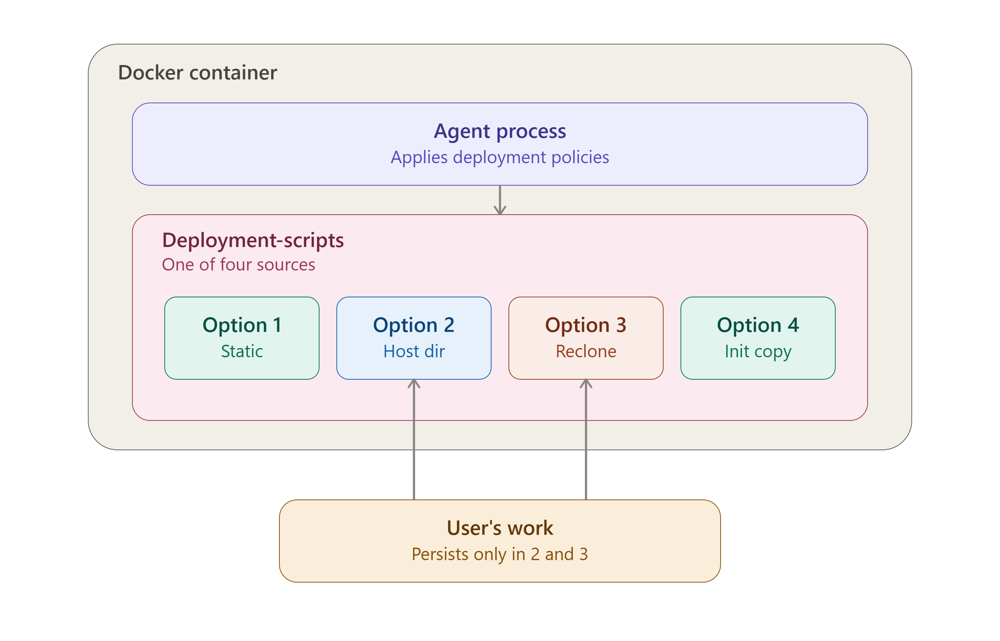

<!---
### 📜 Change Log

| **Date** | **Name** | **Version** |
|---|---|---|
| 2026-07-20 | Eric Aquaronne | 2.0.2606 |

**2026-07-20 — Eric Aquaronne:**
- Added this change log.
- Merged `customizing-scripts.md` into this file; that file is now retired. Two pieces moved over:
  1. A practical framing sentence added right after the Stage A table ("if you've created your own repo with the
     same structure, option 3 or 2 is usually the one you want...") — everything else in that table was already an
     exact duplicate of Stage A, so only the missing framing was worth carrying over.
  2. A new "Overriding the Entry Point" section (docker-compose / `docker run` examples for when your custom entry
     script isn't named `main.al`) — this was genuinely new content, not duplicated anywhere else.
- `customizing-scripts.md`'s `local_script.al` walkthrough was **not** carried over — it's already covered (in more
  detail, with both the auto-run and manual-apply paths) in *01- Getting Started*'s *01 Deployment Scripts.md*.
- **Open item, not yet verified:** confirm `../imgs/deployment_stack_layers.png` actually resolves at that relative
  path before publishing.
--->


# Deployment Integration

The following document describes the relationship between the compiled source code (ie AnyLog agent) and deployment-scripts
which defines which services to run on a given AnyLog agent. 

As such the document covers a few things: 

1. [The break between AnyLog and deployment-scripts](#the-break-between-anylog-and-deployment-scripts)
2. [How to deploy AnyLog (simple)](#initial-deployment)
3. [The connection between AnyLog & `deployment-scripts`](#what-happens-in-the-docker-container)
4. [Overriding the Entry Point](#overriding-the-entry-point)
5. [Patches & Version Updates](#patches--version-updates)



The document discusses AnyLog, but the same logic also works when deploying EdgeLake. 

## The break between AnyLog and deployment-scripts

A running node is really two independent pieces:

```
┌─────────────────────────────────┐
│  AnyLog / EdgeLake binary       │  ← the engine — compiled, never edited
├─────────────────────────────────┤
│  deployment-scripts (git repo)  │  ← the configuration — yours to read, fork, or customize
└─────────────────────────────────┘
```

- **The binary** is the compiled AnyLog/EdgeLake runtime. It knows how to execute commands and `.al` script files, but
it doesn't know anything about *what* to run on its own.
- **`deployment-scripts`** is what tells the binary what to actually do — which services to start, which database
to connect, which policies to publish. It's plain text, not compiled, and it's designed to be read, forked, or edited.

This split is why you never need to rebuild the AnyLog image just to change how a node behaves — you only need to
change the scripts it's pointed at.


## Initial Deployment

1. User clones a repo called `docker-compose` (or `K8s-compose`) containing a set of configuration files.
2. User updates the configuration files as needed.
   **Key configs:**
   1. `LICENSE_KEY`
   2. `LEDGER_CONN`
   3. `NODE_TYPE`

   A user can skip the full config file (i.e. skip `make`) and just run `docker run` with the 3 environment variables directly.
3. Deploy AnyLog / EdgeLake using `make` or `docker run`.

## What Happens in the Docker Container

AnyLog is the actual source code. To configure its services, AnyLog agents use configuration policies driven by a set of 
scripts called **deployment-scripts**. For the internals of how those policies and scripts actually communicate (and 
the `process` vs. `thread` execution model behind them), see [Deployment Scripts — Integration Reference](05-%20deployment-scripts.md).

By default, the docker image ships with the `main` deployment-scripts already baked in. Using the environment params 
`DEPLOYMENTS_REPO` and `DEPLOYMENTS_BRANCH`, a user can point at a different set of deployment-scripts instead.

Resolution happens in two stages — **build time** (compose file generation, driven by `make`) and, for one of the four 
options below, **runtime** (inside the running agent container).

### Stage A — Build script (compose file generation)

The build script picks one of four modes, in order:

| # | Condition | Behavior |
|---|-----------|----------|
| 1 | `DEPLOYMENTS_REPO`/`DEPLOYMENTS_BRANCH` unset, **or** explicitly set to the default (`https://github.com/AnyLog-co/deployment-scripts` @ `main`) | **Built-in default.** Enables the `${CONTAINER_NAME}-local-scripts` named volume. On first creation, Docker seeds it from the scripts baked into the image; after that it's just a persistent volume. |
| 2 | `DEPLOYMENTS_REPO` is set and is an existing **local directory** on the host | **Host bind mount.** Compose is rewritten to mount that directory directly at `/app/deployment-scripts`, and the named volume + init-service references are stripped out entirely. Fully static — no cloning, no copying. |
| 3 | `DEPLOYMENTS_REPO` is an `http://` or `https://` **URL** | **Reclone at startup.** No volume is mounted at all at build time; the agent clones the repo itself when it starts (see Stage B below). |
| 4 | `DEPLOYMENTS_REPO` is set but matches none of the above (e.g. a docker image reference) | **Secondary deployment-scripts container.** A one-shot helper service is injected into the compose file: `image: ${DEPLOYMENTS_REPO}:${DEPLOYMENTS_BRANCH}`, which copies `/app/deployment-scripts` out of that image into the shared `${CONTAINER_NAME}-local-scripts` named volume, then exits. The main service waits on it (`condition: service_completed_successfully`) before starting. |

So if you've simply created your own repo with the same structure, **option 3** (or **option 2**, if it's a local
directory) is usually the one you want — point `DEPLOYMENTS_REPO`/`DEPLOYMENTS_BRANCH` at it and the rest of the
machinery (volumes, cloning) is handled for you.

> The same build script also has an unrelated block detecting `DOCKER_SOCKET` and setting `DOCKER_GID` (for Docker-in-Docker 
> support). That's a separate concern from deployment-scripts selection.

**Important caveat — this entire table only applies when deploying via `make`.** If a user runs `docker run` directly 
instead (skipping `make`, using just the 3 core env vars), none of this build-time logic ever executes. It becomes the 
user's responsibility to configure everything themselves:
- volumes (highly recommended)
- branch selection for deployment-scripts, if changing from default at all
- anything else this script would otherwise have handled

**Why "a pre-existing volume takes precedence"** (the original point 0): Options 1 and 4 both mount the *same* named 
volume, `${CONTAINER_NAME}-local-scripts`. Docker does not recreate or repopulate an existing named volume just because 
`make` reruns — it's reused as-is. So if that volume already exists from a prior run, it keeps whatever content it has 
regardless of what `DEPLOYMENTS_REPO`/`DEPLOYMENTS_BRANCH` currently say. This applies specifically to Options 1 & 4 
(the two modes sharing that volume), not to Options 2 or 3.

### Stage B — Runtime (inside the agent container, on startup — Option 3 only)

This clone logic only runs when Stage A resolved to **Option 3** (URL, reclone-at-startup). Options 1, 2, and 4 are all 
static by the time the container starts — no git operations happen for them inside the agent.

```bash
if [[ CURRENT_REMOTE == DEPLOYMENTS_REPO ]] && [[ CURRENT_BRANCH == DEPLOYMENTS_BRANCH ]]; then
  # already matches — skip reclone
elif git ls-remote --exit-code --heads "${DEPLOYMENTS_REPO}" "${DEPLOYMENTS_BRANCH}"; then
  # branch exists on remote — wipe LOCAL_SCRIPTS and reclone fresh
else
  # branch/repo not reachable — error, leave existing LOCAL_SCRIPTS untouched
fi

if [[ ! -d ${LOCAL_SCRIPTS} ]]; then
  # still missing — hard fail, agent won't start
fi
```

- If the currently-recorded remote **and** branch already match `DEPLOYMENTS_REPO`/`DEPLOYMENTS_BRANCH` → skip re-cloning, reuse what's on disk.
  ⚠️ **This check only compares repo + branch name, not commit hash.** See the Patches section below — this is the mechanism that determines whether a customer picks up a fix automatically.
- Else, if that branch actually exists on the remote → delete the existing `LOCAL_SCRIPTS` directory and clone fresh.
- Else (repo/branch unreachable) → log an error and leave whatever's currently in `LOCAL_SCRIPTS` alone.
- If `LOCAL_SCRIPTS` still doesn't exist after all that → hard fail (`exit 1`). The agent will not start without deployment-scripts present.

*(The "download the repo as a docker container, `DEPLOYMENTS_BRANCH` as the tag" behavior from the original description 
is real — it's Option 4 above, implemented at build time as a helper compose service rather than inside this runtime script.)*

---

## Overriding the Entry Point

Pointing `DEPLOYMENTS_REPO`/`DEPLOYMENTS_BRANCH` at your own repo (Stage A above) determines *which copy* of
deployment-scripts loads — but the container's `ENTRYPOINT` (`/app/deploy_anylog.sh`) separately hardcodes the path it
runs once that repo is in place:

```bash
${ANYLOG_PATH}/${APP_NAME} process $ANYLOG_PATH/deployment-scripts/node-deployment/main.al
```

This path is fixed in the entrypoint script itself — it doesn't follow `$LOCAL_SCRIPTS`/`$ANYLOG_PATH` the way
`main.al`'s *internal* references do. So if your own repo's entry script isn't named `main.al`, you have two options:

**Simplest — no override needed:** name (or copy) your custom entry script to `node-deployment/main.al` within your
repo. The entrypoint picks it up with zero further changes, regardless of which Stage A option loaded your repo.

**If you need a genuinely different filename**, override the container's entrypoint so it calls your script's actual
path instead of the hardcoded one. This bypasses `deploy_anylog.sh`'s other setup steps (OpenBao secret fetch,
version/arch detection, deployment-scripts resolution, the Kubernetes `/etc/hosts` patch, etc.) — only do this if
you've already handled those yourself, or if you maintain your own modified copy of `deploy_anylog.sh` that still does
them before calling your script.

*Docker Compose:*
```yaml
services:
  anylog-node:
    image: your-anylog-image
    environment:
      - ANYLOG_PATH=/app
      - APP_NAME=anylog_v1.0.0_x86_64   # or however your image derives this
    entrypoint: ["/bin/bash", "-c"]
    command:
      - >
        ${ANYLOG_PATH}/${APP_NAME} process ${ANYLOG_PATH}/deployment-scripts/node-deployment/my_custom_main.al
```

*Docker Run:*
```bash
docker run \
  --entrypoint /bin/bash \
  your-anylog-image \
  -c '${ANYLOG_PATH}/${APP_NAME} process ${ANYLOG_PATH}/deployment-scripts/node-deployment/my_custom_main.al'
```

Both forms replace `deploy_anylog.sh` entirely for that container, so double-check you don't need anything it would
otherwise have done for you before reaching this line.

---

## Patches & Version Updates

Standard process for any reported issue:

1. Understand the issue.
2. Check whether it still exists in the latest code.
3. Fix it.
4. Ask the customer to update to the newer build.

What "update to the newer build" actually does **depends on where the bug lives**, because a docker container bundles 
two different things — the AnyLog/EdgeLake agent binary and the deployment-scripts — and they update through different 
mechanisms.

### A. Bug is in the agent itself
Customer pulls the new image and restarts. The agent code updates immediately, since the image itself is what's being 
replaced. Deployment-scripts are untouched by this step — they live in a separate clone/volume/mount, not something baked 
fresh into every container restart.

### B. Bug is in the deployment-scripts
This depends on which of the four build-time options (see Section 2) the customer is running:

- **Option 1 — default, in-image `main` scripts:** a new image pull brings fixed scripts along *only if* the `${CONTAINER_NAME}-local-scripts` volume doesn't already exist. If it does (i.e. this isn't the customer's first run), the volume is reused as-is and the fix never lands — the customer needs to remove that volume (and ideally the associated configuration policy) so it gets reseeded from the new image.
- **Option 2 — local directory (bind mount):** no clone/copy step exists at all here. The customer has to update that host directory themselves; pulling a new agent image has zero effect on it.
- **Option 3 — URL, reclone at startup:** ⚠️ **if the fix is pushed to the *same* branch the customer is already tracking, a restart will NOT pick it up.** The runtime match check only compares repo + branch strings — it has no concept of "is there a newer commit on this branch." Since repo and branch are unchanged, the agent treats its existing clone as current and skips re-cloning.
  - Workarounds until/unless this is fixed: point at a new branch or tag for the patched scripts, manually delete the `LOCAL_SCRIPTS` directory/volume so nothing matches and a reclone is forced, or `docker exec` in and `git pull` manually.
- **Option 4 — secondary deployment-scripts container:** the helper service runs once and copies into the shared named volume, then exits — it doesn't run again on a plain restart. Same volume-reuse caveat as Option 1: if `${CONTAINER_NAME}-local-scripts` already exists, a new image (even with a bumped tag) won't get re-copied in unless the volume is cleared first (or the compose file is regenerated with a config that forces recreation).

**Practical takeaway for triage:** when a customer reports a deployment-scripts bug, first ask which of the four options 
they're in — that determines whether "just pull the new image" is actually sufficient, or whether they also need to clear 
the `local-scripts` volume, bump a branch/tag, or manually sync a local directory. And if they're deploying via bare 
`docker run` instead of `make`, none of this is automatic in the first place — walk through their setup manually.