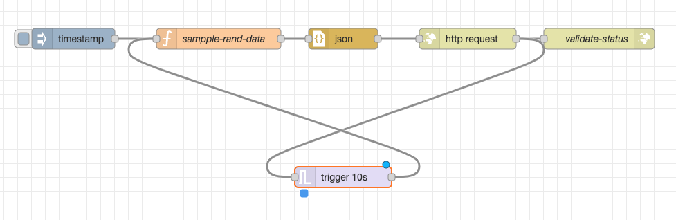
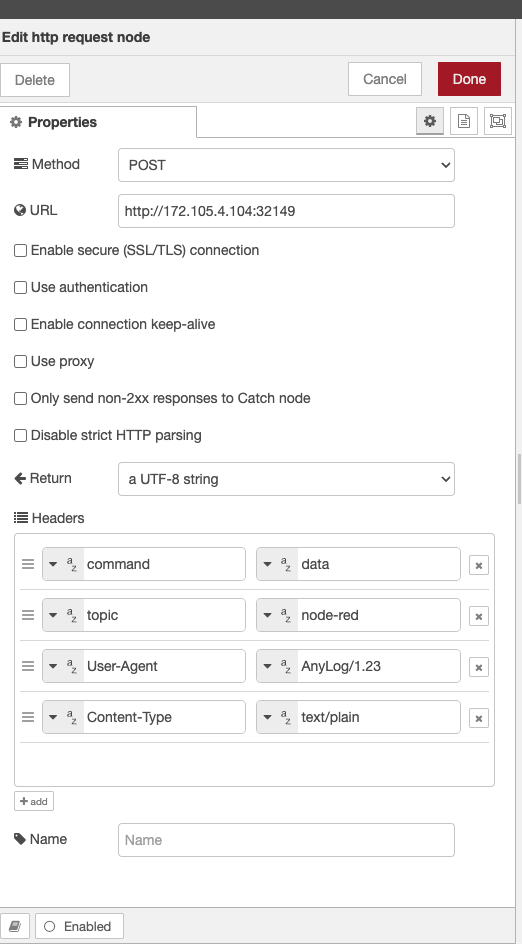

<!---
### 📜 Change Log
 **Date**   | **Name** | **Change**   | **Version** |
 |------------|--|--------------|--|
 | 2026-04-17 |  | file created |  |
 | 2026-04-25 |  | hyperlinks   |  |
 | 2026-07-17 | Eric Aquaronne | added change log | 2.0.2606 |
 | 2026-07-20 | Eric Aquaronne | added change log (second copy of this doc) | 2.0.2606 |
 | 2026-07-25 | Ori Shadmon | Merged the two copies of this doc. Kept the cleaner numbered-step structure and
   header table from "01- node-RED.md" — it had already fixed a real inconsistency in "02 Node Red.md" (Step 5 there
   said "create a new `run mqtt client` process" but showed `run msg client` code; the correct command name is used
   throughout, so the mislabeled step reference was dropped rather than carried forward). Restored two things the
   cleaner rewrite had dropped: the two flow/config screenshots, and the fuller sample-output table (with the
   `tsd_name`/`tsd_id` columns, the `AL anylog-query +>` prompt, and the `Statistics` JSON footer) that matches the
   fidelity used elsewhere in this doc set (e.g. Syslog Integration's sample query output). |
--->

[Node-RED](https://nodered.org/) is an open-source flow-based programming tool for connecting hardware, APIs, and services visually. This guide shows how to stream timestamp/value data from a Node-RED flow into an AnyLog operator via REST POST.

---

## Prerequisites

- [Node-RED installed](https://nodered.org/docs/getting-started/local)
- An AnyLog operator node running with REST service enabled (see <a href="{{ '/docs/Network-Services/background-services//#rest-service' | relative_url }}">Background Services</a>)

---

## Step 1 — Create the flow

Build a flow with these nodes:

- **Inject** — triggers the flow
- **Function** — generates the payload
- **JSON** — serialises the output
- **HTTP request** — sends the POST to AnyLog
- **HTTP response** — handles the reply
- **Trigger** — repeats every N seconds

A [sample flow JSON](https://github.com/AnyLog-co/documentation/blob/master/examples/node_red_sample_flow.json) is available in the AnyLog documentation repo.



---

## Step 2 — Write the function node

This function generates a random value with a timestamp and wraps it with a table name:

```javascript
var timestamp = new Date();

var min = 1;
var max = 100;
var randomValue = Math.floor(Math.random() * (max - min + 1)) + min;

var combinedResults = {
    table: "rand_data",
    timestamp: timestamp,
    value: randomValue
};

msg.payload = combinedResults;
return msg;
```

---

## Step 3 — Configure the HTTP request node

Set the method to **POST** with these headers:

| Header | Value |
|---|---|
| `command` | `data` |
| `topic` | `node-red` |
| `User-Agent` | `AnyLog/1.23` |
| `Content-Type` | `text/plain` |

Set the URL to your operator's REST endpoint: `http://[operator-ip]:[rest-port]`



---

## Step 4 — Configure the AnyLog operator

On the operator node, start a message client that subscribes to the `node-red` topic on the REST port:

```anylog
<run msg client where
  broker = rest and
  port = !anylog_rest_port and
  user-agent = anylog and
  log = false and
  topic = (
    name = node-red and
    dbms = !default_dbms and
    table = "bring [table]" and
    column.timestamp.timestamp = "bring [timestamp]" and
    column.value.int = "bring [value]"
  )>
```

---

## Step 5 — Run the flow and verify

Start the Node-RED flow, then query the data from a query node:

```anylog
AL anylog-query +> run client () sql new_company format=table "select * from rand_data limit 15;"
[3]
AL anylog-query +>
row_id insert_timestamp           tsd_name tsd_id timestamp               value
------ -------------------------- -------- ------ ----------------------- ----- 
     1 2024-02-24 00:14:41.157796      131     17 2024-02-24 00:13:34.402    15 
     2 2024-02-24 00:14:41.157796      131     17 2024-02-24 00:13:58.632    35 
     3 2024-02-24 00:14:41.157796      131     17 2024-02-24 00:13:58.750    97 
     4 2024-02-24 00:14:41.157796      131     17 2024-02-24 00:13:59.029    56 
     5 2024-02-24 00:14:41.157796      131     17 2024-02-24 00:13:59.163    98 
     6 2024-02-24 00:14:41.157796      131     17 2024-02-24 00:13:59.338    20 
     7 2024-02-24 00:14:41.157796      131     17 2024-02-24 00:13:59.523    29 
     8 2024-02-24 00:14:41.157796      131     17 2024-02-24 00:13:59.798    54 
     9 2024-02-24 00:14:41.157796      131     17 2024-02-24 00:13:59.937    94 
    10 2024-02-24 00:14:41.157796      131     17 2024-02-24 00:14:00.124    68 
    11 2024-02-24 00:14:41.157796      131     17 2024-02-24 00:14:00.267    17 
    12 2024-02-24 00:14:41.157796      131     17 2024-02-24 00:14:00.443     6 
    13 2024-02-24 00:14:41.157796      131     17 2024-02-24 00:14:00.565    70 
    14 2024-02-24 00:14:41.157796      131     17 2024-02-24 00:14:00.702    34 
    15 2024-02-24 00:14:41.157796      131     17 2024-02-24 00:14:00.856    28 

{"Statistics":[{"Count": 15,
                "Time":"00:00:00",
                "Nodes": 1}]}
```