<!--
## Changelog
- 2026-04-17 | (edgex.md) Created document
- 2026-04-25 | (edgex.md) hyperlink
- 2026-07-14 | Unified with ZZZ data from edgex.md (EdgeXpert GUI-based integration — kept and added as Option C,
              despite its ZZZ filename it was not a stale draft) and the old EdgeX 1.3.1 demo walkthrough, which
              was renamed and kept as EdgeX - complete example.md rather than deleted — see the corrected note at
              the bottom of this page. Flagged two unresolved discrepancies between sources rather than silently
              resolving them: the EdgeXpert examples use `run mqtt client` where the rest of this page uses
              `run msg client`, and use a different column-mapping syntax (`column.x=(type=... and value=...)`
              vs `column.x.type = "bring ..."`). Both preserved as originally written pending confirmation.
- 2026-07-14 | Found (and retired) a fourth overlapping file, Using MQTT (EdgeX).md, that had been sitting in the
              same folder the whole time and was missed in the original review. Its conceptual content
              duplicated Options A/B here; its concrete steps duplicated EdgeX - complete example.md. It also
              contained what appear to be real, non-placeholder broker credentials in two examples — flagged
              separately for rotation, independent of the file's removal.
- 2026-07-24 | Per explicit request, merged into a single file: folded "EdgeX - complete example.md" in below as
              an appendix rather than a separate linked file, and anonymized the one real-looking IP it contained.
              "Using MQTT (EdgeX).md" remains excluded — it's still a duplicate, and the credential-rotation flag
              from 2026-07-14 stands; re-adding it isn't a documentation fix, it's a security follow-up.
- 2026-07-25 | A follow-up upload surfaced three more copies: this same file re-uploaded unchanged, the pre-Option-C
              predecessor ("03 edgex integration.md" — fully superseded, nothing unique), and "EdgeX - complete
              example.md" again (already folded in above). It also surfaced the *original, fuller* EdgeXpert source
              ("04- EdgeXpert.md") that Option C below was condensed from — restored what that condensing had
              dropped: the GUI screenshot references, the second worked JSON example (PeopleCount reading
              alongside FreezerTemp1), and the direct link to the raw edgex_transformation.js script. That source
              also references a different document, "EdgeX Foundry Integration.md" under
              "3- Installation & Deployment/Cloud & Edge Deployments/" — a separate install-time deployment guide,
              not folded in here; flagging its existence rather than guessing at its relationship to this page.
-->

<a href="https://www.edgexfoundry.org" target="_blank">EdgeX Foundry</a> is an open source, vendor-neutral edge computing framework under the LF 
Edge umbrella. It provides a southbound platform for connecting IoT devices using standard protocols including Modbus, 
MQTT, BACnet, SNMP, OPC-UA, REST, and more. **EdgeXpert**, from IoTech Systems, is a commercial edition of EdgeX with an 
additional browser-based management GUI for configuring application services — see <a href="#option-c--edgexpert-gui-based" target="_blank">Option C</a> 
below if that's what you're running.

Integration between EdgeX (either edition) and AnyLog is achieved by configuring EdgeX to export sensor data — over 
MQTT or REST — to an AnyLog node, which ingests it like any other southbound source.

> **EdgeX version note:** This guide's Options A and B are written for open-source EdgeX 3.x/4.x (Napa / Odesa). 
> EdgeX 4.0 uses MQTT as the default internal message bus and PostgreSQL as its default database. If you are running an 
> older open-source release, API ports and endpoint paths will differ — see the <a href="#appendix--legacy-edgex-131-complete-example" target="_blank">legacy appendix</a> 
> at the bottom of this page if you're on something closer to EdgeX 1.x.

---

## Integration options

### Option A — AnyLog as the MQTT broker (direct)

Configure EdgeX to publish directly to an AnyLog node running the message broker service. No third-party broker needed. 
The AnyLog node receiving data can be an Operator (stores data locally) or a Publisher (routes data to Operators).

```
EdgeX  →  AnyLog Message Broker  →  AnyLog Operator
```

### Option B — Third-party broker

Configure EdgeX to publish to an external MQTT broker (e.g. <a href="https://mosquitto.org/" target="_blank">Eclipse Mosquitto</a>, HiveMQ), and 
configure AnyLog to subscribe to that broker.

```
EdgeX  →  MQTT Broker (Mosquitto / HiveMQ)  →  AnyLog msg client
```

### Option C — EdgeXpert (GUI-based)

If you're running **EdgeXpert** rather than open-source EdgeX, application services are configured through IoTech's 
browser GUI instead of Docker Compose environment variables. Three transfer methods are available from the GUI: 
* REST PUT (no transform) 
* REST POST (with transform)  
* Direct MQTT (with transform)

See <a href="#option-c--edgexpert-gui-based-1" target="_blank">Option C</a> below for the full walkthrough.

---

## Prerequisites

- **Open-source EdgeX** (Options A/B): deployed via Docker (see <a href="https://docs.edgexfoundry.org/latest/getting-started/quick-start/" target="_blank">EdgeX Quick Start</a>)
- **EdgeXpert** (Option C): EdgeX plus the EdgeXpert Management tool installed (see <a href="https://www.iotechsys.com/" target="_blank">IoTech System</a> / <a href="https://docs.iotechsys.com/" target="_blank">User Guide</a>)
- An AnyLog node with TCP, REST, Streamer, and Operator services running — see Background Services
- For Option A: the AnyLog Message Broker service running on the receiving node
- For Option C's REST paths: the AnyLog REST service configured — see <a href="../../06-%20Networking%20%26%20Security/04-%20Using%20REST.md" target="_blank">Using REST</a>
- For Option C's Message Broker path: the AnyLog Message Broker service — see <a href="../02-%20Direct%20Connectors/02-%20Message%20Broker.md" target="_blank">Message Broker</a>

---

## Option A — AnyLog as broker

### 1. Start the AnyLog message broker

On the AnyLog node that will receive EdgeX data:

```anylog
<run message broker where
    external_ip = !external_ip and external_port = !anylog_broker_port and
    internal_ip = !ip and internal_port = !anylog_broker_port and
    bind = false and threads = 6>
```

Verify it is running:
```anylog
get processes       # MSG Broker row should show Running
get local broker
```

### 2. Subscribe to the EdgeX topic

Map the incoming EdgeX event structure to an AnyLog database table. The `broker=local` keyword tells AnyLog to subscribe to its own broker:

```anylog
<run msg client where
    broker = local and
    log = false and
    topic = (
        name = anylogEdgeX and
        dbms = edgex and
        table = "bring [device]" and
        column.timestamp.timestamp = now and
        column.value.float = "bring [readings][][value]" and
        column.name.str = "bring [readings][][name]"
    )>
```

Verify the subscription:
```anylog
get msg clients
```

### 3. Configure EdgeX to publish to AnyLog

In your EdgeX deployment, add an **application service** (app-service-configurable) configured to export events to your AnyLog broker address. In your `docker-compose.override.yml`:

```yaml
app-mqtt-export:
  container_name: edgex-app-mqtt-export
  environment:
    EDGEX_PROFILE: mqtt-export
    EDGEX_SECURITY_SECRET_STORE: "false"
    SERVICE_HOST: edgex-app-mqtt-export
    WRITABLE_PIPELINE_FUNCTIONS_MQTTEXPORT_PARAMETERS_BROKERADDRESS: tcp://[anylog-node-ip]:[broker-port]
    WRITABLE_PIPELINE_FUNCTIONS_MQTTEXPORT_PARAMETERS_TOPIC: anylogEdgeX
    WRITABLE_PIPELINE_FUNCTIONS_MQTTEXPORT_PARAMETERS_CLIENTID: edgex-anylog
  image: nexus3.edgexfoundry.org:10004/app-service-configurable:latest
  networks:
    edgex-network:
```

Replace `[anylog-node-ip]` and `[broker-port]` with your AnyLog node's IP and broker port (default `32550`).

---

## Option B — Third-party broker

### 1. Configure EdgeX to publish to the broker

Add an MQTT export application service to your EdgeX compose file pointing to your third-party broker:

```yaml
app-mqtt-export:
  container_name: edgex-app-mqtt-export
  environment:
    EDGEX_PROFILE: mqtt-export
    EDGEX_SECURITY_SECRET_STORE: "false"
    SERVICE_HOST: edgex-app-mqtt-export
    WRITABLE_PIPELINE_FUNCTIONS_MQTTEXPORT_PARAMETERS_BROKERADDRESS: tcp://[broker-ip]:[broker-port]
    WRITABLE_PIPELINE_FUNCTIONS_MQTTEXPORT_PARAMETERS_TOPIC: edgex-events
    WRITABLE_PIPELINE_FUNCTIONS_MQTTEXPORT_PARAMETERS_CLIENTID: edgex-export
  image: nexus3.edgexfoundry.org:10004/app-service-configurable:latest
  networks:
    edgex-network:
```

### 2. Subscribe AnyLog to the broker

```anylog
<run msg client where
    broker = [broker-ip] and
    port = [broker-port] and
    user = [user] and
    password = [password] and
    log = false and
    topic = (
        name = edgex-events and
        dbms = edgex and
        table = "bring [device]" and
        column.timestamp.timestamp = now and
        column.value.float = "bring [readings][][value]" and
        column.name.str = "bring [readings][][name]"
    )>
```

---

## Option C — EdgeXpert (GUI-based)

This option applies to **EdgeXpert**, IoTech's commercial edition of EdgeX with a browser management GUI. The example data source below (`retail-1`) is a sample provided by IoTech.

```json
{
  "apiVersion":"v2",
  "id":"ff3013c3-2f96-48b6-ac06-5eeb4cde1ecf",
  "deviceName":"retail-device-1",
  "profileName":"RetailVirtualDevice",
  "sourceName":"FreezerTemp1",
  "origin":1694737678685722461,
  "readings":[{
    "id":"000a2227-0ff8-4534-8131-310a7efcdd47",
    "origin":1694737678685722461,
    "deviceName":"retail-device-1",
    "resourceName":"FreezerTemp1",
    "profileName":"RetailVirtualDevice",
    "valueType":"Float32",
    "units":"F",
    "value":"3.140839e+01"
  }]
}
{
  "apiVersion":"v2",
  "id":"e60989ad-ab59-456e-bb00-b90518ca83e1",
  "deviceName":"retail-device-1",
  "profileName":"RetailVirtualDevice",
  "sourceName":"PeopleCount",
  "origin":1694737678704913648,
  "readings":[{
    "id":"e789d093-0392-4a4e-9890-eee615f647f2",
    "origin":1694737678704913648,
    "deviceName":"retail-device-1",
    "resourceName":"PeopleCount",
    "profileName":"RetailVirtualDevice",
    "valueType":"Int32",
    "value":"48"
  }]
}
```

> **Note:** this payload shape (`apiVersion`, `sourceName`, `resourceName`) is EdgeXpert's v2 API and differs from
> the open-source EdgeX event shape shown under <a href="#data-mapping-notes" target="_blank">Data mapping notes</a> below (`device`,
> `readings[].name`). Map against whichever shape your actual deployment sends — don't assume the two are
> interchangeable.

### Logging into EdgeXpert

- **URL**: `https://${YOUR_IP}:9090`
- **Username**: `admin` | **Password**: `admin`

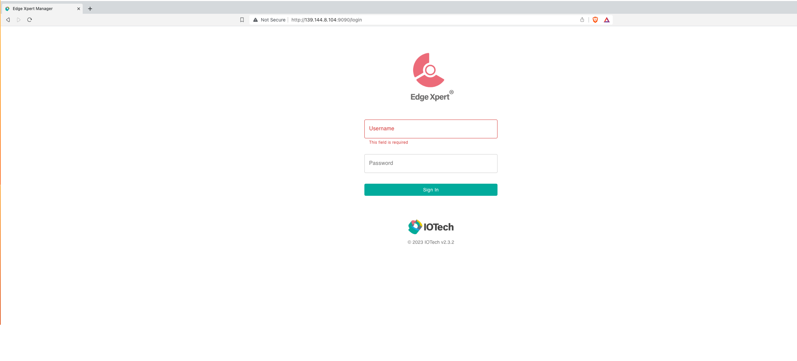

From the left-side menu, go to **App Services**:

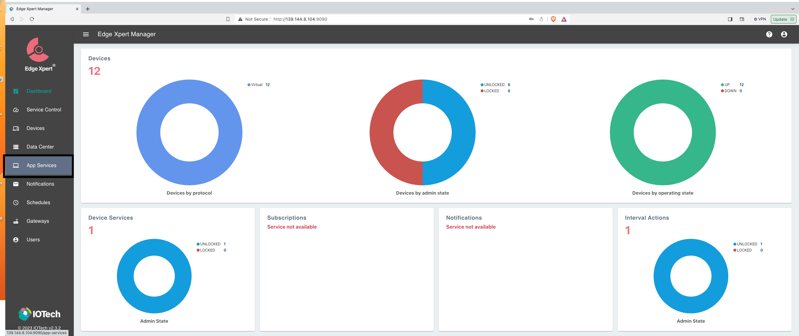

...then add a **Basic Service** from the right-side panel. The three transfer methods below all start from this
same Basic Service creation screen — what differs is how you configure it from there.

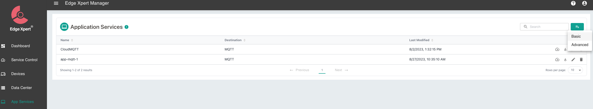

### Transferring data from EdgeX to AnyLog

EdgeXpert can transfer data into AnyLog using three methods:

- **REST PUT** — receives data without transformation; the database/table are fixed in the REST headers.
- **REST POST** — receives data with transformation; database/table can come from headers or be derived from
  the data itself via mapping rules.
- **AnyLog Message Broker** — transformation supported, delivered over MQTT instead of REST.

AnyLog can also be configured to receive data from third-party brokers (CloudMQTT, Eclipse Mosquitto, etc.) — the
same pattern as <a href="#option-b--third-party-broker" target="_blank">Option B</a> above.

#### Method 1: REST PUT (no transformation)

Configuration is done entirely on the EdgeXpert side; AnyLog just needs its REST service running with no mapping
rules. The database and table are specified in the REST headers, not derived from the data.

On your own machine, create a JavaScript transform that extracts the reading value EdgeXpert will send — a
<a href="https://raw.githubusercontent.com/AnyLog-co/documentation/master/deployments/Support/edgex_transformation.js" target="_blank">sample script</a>
is available:

```javascript
// file name: edgex_transformation.js
var outputObject = { value: inputObject.readings[0] };
return outputObject;
```

In the EdgeXpert GUI, configure the Basic App Service:
- **Basic Info** — Name; Destination: HTTP
  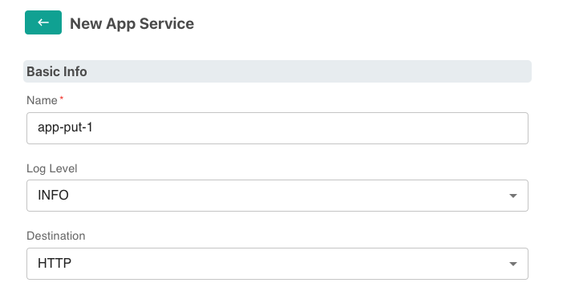
- **Address Info** — Method: PUT; URL (your AnyLog node's REST IP:port); headers: `type: json`, `dbms: <database>`, `table: <table>`, `mode: streaming`, `Content-Type: text/plain`
  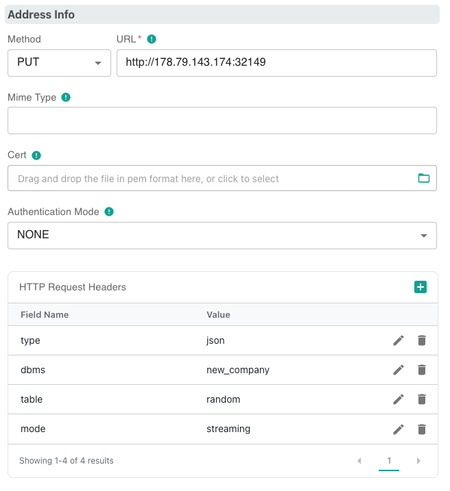
- **Data Format** — JavaScript Transform: `edgex_transformation.js`
  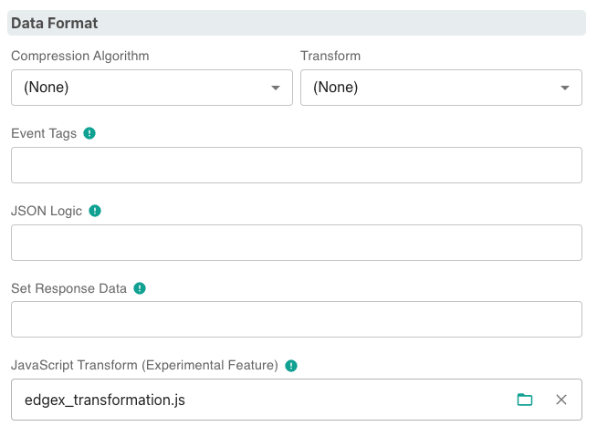
- **Filter** — Device Filter, as needed
  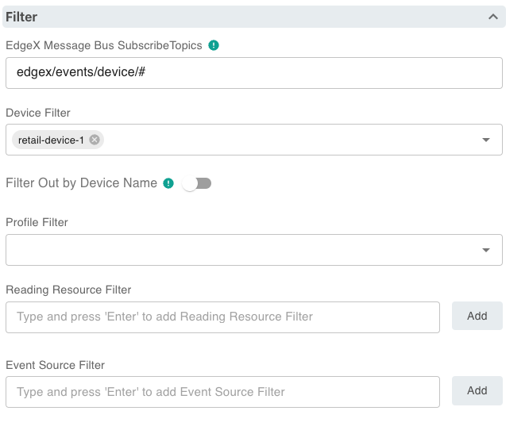

Once the service is saved, data should begin flowing into AnyLog via PUT.

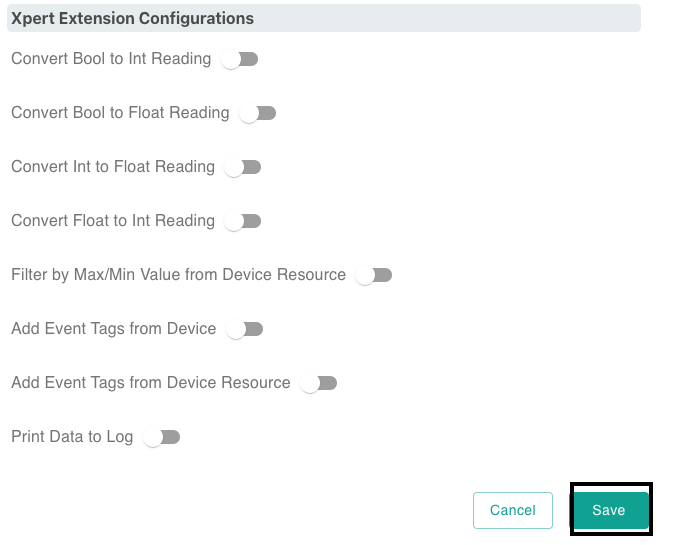

#### Method 2: REST POST (with transformation)

Here the transformation happens on the AnyLog side via mapping rules attached to a topic, and the database/table
can be derived from the incoming data itself rather than fixed in the headers. This uses the same underlying
mechanism as <a href="../02-%20Direct%20Connectors/02-%20Message%20Broker.md" target="_blank">running AnyLog as a message broker</a> —
mapping rules declared via a client service.

On the AnyLog operator node receiving the data, declare the mapping rules and start the client service:

```anylog
<run mqtt client where broker=rest and user-agent=anylog and log=false and topic=(
  name=anylogedgex-post and
  dbms=!company_name.name and
  table="bring [readings][0][resourceName]" and
  column.timestamp.timestamp=now and
  column.value=(type=float and value="bring [readings][0][value]"))>
```

> **Command name and syntax flagged, not corrected:** this example uses `run mqtt client` and the
> `column.x=(type=... and value=...)` mapping form, both as given in the original source. The rest of this page
> (Options A/B) uses `run msg client` and `column.x.type = "bring [...]"` instead. These may be equivalent
> aliases/forms, or one may be outdated — confirm against the actual command reference before relying on this
> exact syntax.

In the EdgeXpert GUI, configure the Basic App Service:
- **Basic Info** — Name; Destination: HTTP
  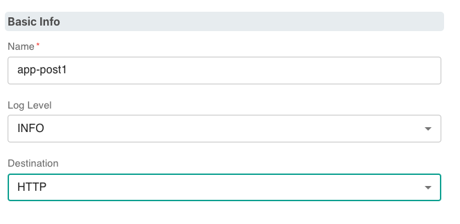
- **Address Info** — Method: POST; URL (your AnyLog node's REST IP:port); headers: `command: data`, `topic: anylogedgex-post`, `User-Agent: AnyLog/1.23`, `Content-Type: text/plain`
  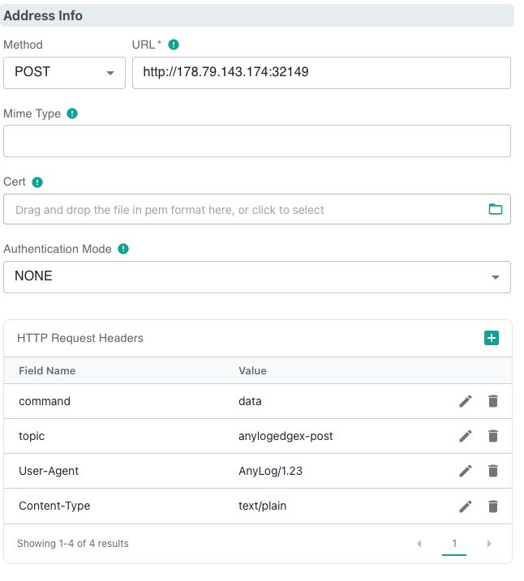
- **Filter** — Device Filter, as needed

Save the service; data should begin flowing into AnyLog via POST.

#### Method 3: AnyLog Message Broker (with transformation)

Same mapping-rule mechanism as Method 2, but delivered over MQTT to AnyLog's own broker rather than over REST.
The mapping rules must include the database and table, since there are no REST headers to supply them.

```anylog
<run mqtt client where broker=local and log=false and topic=(
  name=anylogedgex-mqtt and
  dbms=!default_dbms and
  table="bring [readings][0][resourceName]" and
  column.timestamp.timestamp=now and
  column.value=(type=float and value="bring [readings][0][value]"))>
```

(The same command-name/syntax caveat from Method 2 applies here.)

In the EdgeXpert GUI, configure the Basic App Service:
- **Basic Info** — Name; Destination: MQTT
  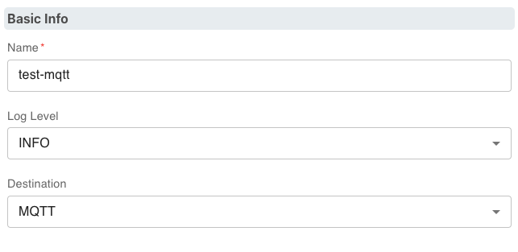
- **Address Info** — URL (your AnyLog node's Message Broker IP:port); Topic
  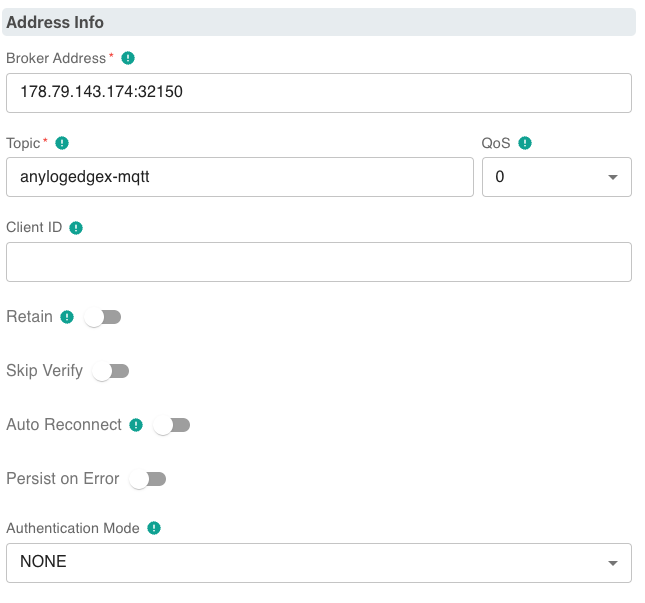
- **Filter** — Device Filter, as needed

Save the service; data should begin flowing into AnyLog via the message broker.

---

## Verifying data flow

### Check EdgeX is running and producing readings

```bash
# List devices (EdgeX v2/v3/v4 API)
curl http://localhost:59881/api/v3/device/all | jq

# View recent readings
curl http://localhost:59880/api/v3/reading/all?limit=10 | jq
```

### Check AnyLog is receiving data

```anylog
get msg clients                    # subscription status
get streaming                      # buffer status
get operator                       # ingestion status
get rows count where dbms = edgex  # confirm rows are landing
```

Query the data:
```anylog
run client () sql edgex format=table "select * from rand_data limit 10"
```

---

## Data mapping notes

Open-source EdgeX (Options A/B) publishes events in this structure:

```json
{
  "device": "my-sensor",
  "origin": 1700000000,
  "readings": [
    {
      "name": "temperature",
      "value": "23.5",
      "origin": 1700000000
    }
  ]
}
```

The `bring` expressions in the `run msg client` command extract values from this structure:

| AnyLog column | Mapping | Notes |
|---|---|---|
| `table` | `bring [device]` | Uses the device name as the table name |
| `timestamp` | `now` | Uses AnyLog ingestion time |
| `value` | `bring [readings][][value]` | First reading value |
| `name` | `bring [readings][][name]` | First reading name |

Adjust the mapping to match the actual structure of your EdgeX device readings. EdgeXpert's event structure
(Option C) uses different field names (`deviceName`, `sourceName`, `resourceName`) — see the payload example
under <a href="#option-c--edgexpert-gui-based" target="_blank">Option C</a> rather than reusing this table for that path.

---

## Deploying EdgeX

For a quick local **open-source EdgeX** deployment using the EdgeX compose builder:

```bash
git clone https://github.com/edgexfoundry/edgex-compose.git
cd edgex-compose/compose-builder

# Generate a compose file with MQTT support and no security (for dev/test)
make gen no-secty mqtt-broker ui

# Start EdgeX
docker compose up -d

# Verify services are running
docker ps
```

See the <a href="https://docs.edgexfoundry.org/latest/getting-started/quick-start/" target="_blank">EdgeX Quick Start</a> for full deployment 
instructions. EdgeXpert deployment is a separate, commercial process — see <a href="https://www.iotechsys.com/" target="_blank">IoTech System</a> / 
<a href="https://docs.iotechsys.com/" target="_blank">User Guide</a>.

---

## Appendix — Legacy EdgeX 1.3.1 Complete Example

This is a concrete deployment log against **EdgeX 1.3.1** — several major versions behind current EdgeX — using the
`AnyLog-co/lfedge-code` demo repo and the deprecated `v1` reading API (`/api/v1/reading`). Treat it as a snapshot of
an older release rather than current guidance: Options A/B above cover the same integration goal against current
EdgeX using the supported `edgex-compose` deployment path, and are the ones to follow for a new deployment.

The demo uses EdgeX's random data generator, with data sent over its `app-service-mqtt`. Fields that change between
deployments are set in **bold** below.

### Steps

1. Clone <a href="https://github.com/AnyLog-co/lfedge-code" target="_blank">lfedge-code</a>:
```shell
git clone https://github.com/AnyLog-co/lfedge-code 
cd lfedge-code/edgex 
```

2. Update configurations in the <a href="https://github.com/AnyLog-co/lfedge-code/blob/main/edgex/.env" target="_blank">.env</a> file:
   1. Update the MQTT params to match the credentials on your AnyLog operator node (e.g. `anylog-operator-node1`):
   ```dotenv
    MQTT_TOPIC=anylogedgex
    MQTT_IP_ADDRESS=10.0.0.50
    MQTT_PORT=32150
    MQTT_USER=""
    MQTT_PASSWORD=""
    ```
   2. If you're on ARM64, update the `ARCH` value on line 27:
   ```dotenv
    # default amd64 machine 
   ARCH=""
    # update to arm64 machine 
   ARCH=-arm64
   ```
3. Start the EdgeX instance:
```shell
cd lfedge-code/edgex 
docker-compose up -d
```

### Validate Deployment

1. Confirm nothing crashed: `docker ps -a | grep edgex`
```shell
root@edgex-operator2:~# docker ps -a | grep edgex
a13b169023b7   emqx/kuiper:1.1.1-alpine                                                   "/usr/bin/docker-ent…"   45 hours ago   Up 44 hours             127.0.0.1:20498->20498/tcp, 9081/tcp, 127.0.0.1:48075->48075/tcp                       edgex-kuiper
56a3482bdfc8   edgexfoundry/docker-sys-mgmt-agent-go:1.3.1                                "/sys-mgmt-agent -cp…"   45 hours ago   Up 44 hours             127.0.0.1:48090->48090/tcp                                                             edgex-sys-mgmt-agent
2740875f17a4   edgexfoundry/docker-app-service-configurable:1.3.1                         "/app-service-config…"   45 hours ago   Up 44 hours             48095/tcp, 127.0.0.1:48101->48101/tcp                                                  edgex-app-service-configurable-mqtt
32b749bbd104   edgexfoundry/docker-device-random-go:1.3.1                                 "/device-random --cp…"   45 hours ago   Up 44 hours             127.0.0.1:49988->49988/tcp                                                             edgex-device-random
e960f5ff00c5   edgexfoundry/docker-app-service-configurable:1.3.1                         "/app-service-config…"   45 hours ago   Up 44 hours             48095/tcp, 127.0.0.1:48100->48100/tcp                                                  edgex-app-service-configurable-rules
e50c8de4b879   edgexfoundry/docker-device-modbus-go:1.3.1                                 "/device-modbus --cp…"   45 hours ago   Up 44 hours             127.0.0.1:49991->49991/tcp                                                             edgex-device-modbus
e91cd4ad63fa   edgexfoundry/docker-core-command-go:1.3.1                                  "/core-command -cp=c…"   45 hours ago   Up 44 hours             127.0.0.1:48082->48082/tcp                                                             edgex-core-command
59464a3a976d   edgexfoundry/docker-core-data-go:1.3.1                                     "/core-data -cp=cons…"   45 hours ago   Up 44 hours             127.0.0.1:5563->5563/tcp, 127.0.0.1:48080->48080/tcp                                   edgex-core-data
b706d9584413   edgexfoundry/docker-core-metadata-go:1.3.1                                 "/core-metadata -cp=…"   45 hours ago   Up 44 hours             127.0.0.1:48081->48081/tcp                                                             edgex-core-metadata
13abb3559d2a   edgexfoundry/docker-support-notifications-go:1.3.1                         "/support-notificati…"   45 hours ago   Up 44 hours             127.0.0.1:48060->48060/tcp                                                             edgex-support-notifications
ff7d350ca3ba   edgexfoundry/docker-support-scheduler-go:1.3.1                             "/support-scheduler …"   45 hours ago   Up 44 hours             127.0.0.1:48085->48085/tcp                                                             edgex-support-scheduler
0346e264f6d6   edgexfoundry/docker-edgex-consul:1.3.0                                     "edgex-consul-entryp…"   45 hours ago   Up 44 hours             8300-8302/tcp, 8400/tcp, 8301-8302/udp, 8600/tcp, 8600/udp, 127.0.0.1:8500->8500/tcp   edgex-core-consul
fab7cbdcc29f   redis:6.0.9-alpine                                                         "docker-entrypoint.s…"   45 hours ago   Up 44 hours             127.0.0.1:6379->6379/tcp                                                               edgex-redis
f135b724626e   nexus3.edgexfoundry.org:10003/edgex-devops/edgex-modbus-simulator:latest   "/simulator"             45 hours ago   Up 44 hours             127.0.0.1:1502->1502/tcp                                                               edgex-modbus-simulator
```
2. Confirm data is coming in: `curl http://127.0.0.1:48080/api/v1/reading 2> /dev/null`
```json
[
  {
    "id": "000767a3-61bb-49e1-93ff-be4695eb5b43",
    "created": 1659412501505,
    "origin": 1659412501498780400,
    "device": "Random-Integer-Generator01",
    "name": "RandomValue_Int16",
    "value": "10380",
    "valueType": "Int16"
  },
  {
    "id": "000797b4-736b-48b9-bbe5-09594be7099f",
    "created": 1659403221133,
    "origin": 1659403221133020700,
    "device": "Random-Integer-Generator01",
    "name": "RandomValue_Int32",
    "value": "771919435",
    "valueType": "Int32"
  },
  {
    "id": "00079ae9-340a-4d70-9e0b-9a5a8b48e216",
    "created": 1659412541467,
    "origin": 1659412541463869400,
    "device": "Random-Integer-Generator01",
    "name": "RandomValue_Int8",
    "value": "27",
    "valueType": "Int8"
  },
  {
    "id": "0008d23e-7640-4974-aaeb-179e375566cb",
    "created": 1659425642023,
    "origin": 1659425642019472400,
    "device": "Random-Integer-Generator01",
    "name": "RandomValue_Int8",
    "value": "-87",
    "valueType": "Int8"
  },
  {
    "id": "000f547c-25b7-4d96-b862-67467345a74c",
    "created": 1659461623534,
    "origin": 1659461623530927000,
    "device": "Random-Integer-Generator01",
    "name": "RandomValue_Int8",
    "value": "-49",
    "valueType": "Int8"
  },
  ...
]
```

---

## Further reading

- <a href="https://docs.edgexfoundry.org/latest/" target="_blank">EdgeX Foundry documentation</a>
- <a href="https://wiki.edgexfoundry.org/display/FA/Device+Services" target="_blank">EdgeX Device Services — supported protocols</a>
- <a href="https://www.iotechsys.com/" target="_blank">IoTech System</a> / <a href="https://docs.iotechsys.com/" target="_blank">EdgeXpert User Guide</a>
- <a href="../02-%20Direct%20Connectors/02-%20Message%20Broker.md" target="_blank">Message Broker</a>
- <a href="../../06-%20Networking%20%26%20Security/04-%20Using%20REST.md" target="_blank">Using REST</a>