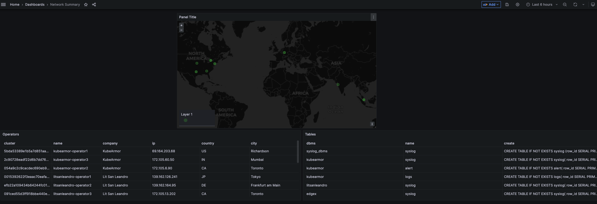
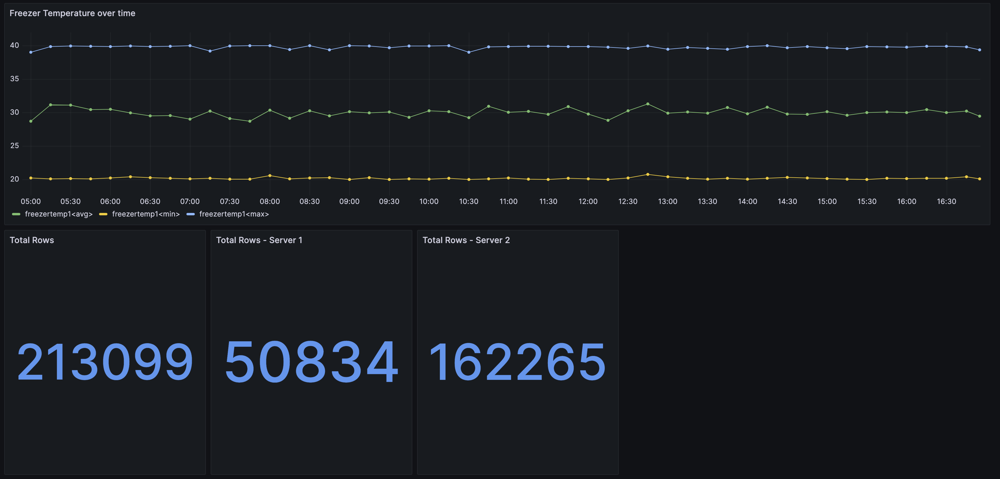
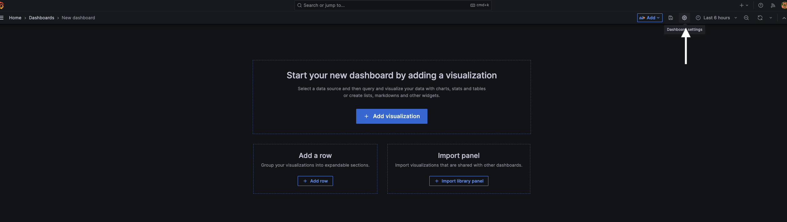
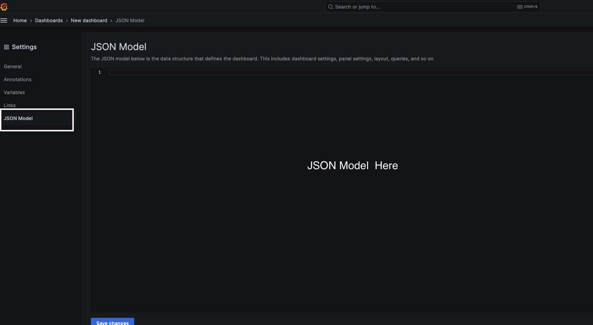
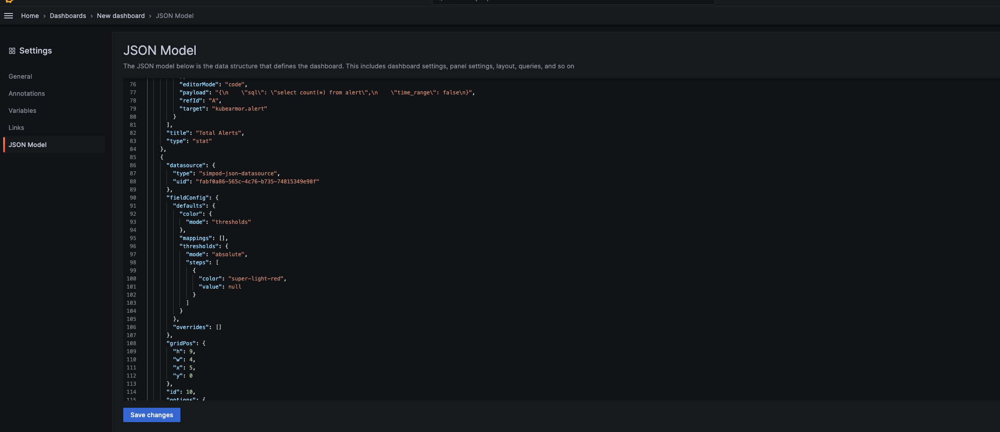
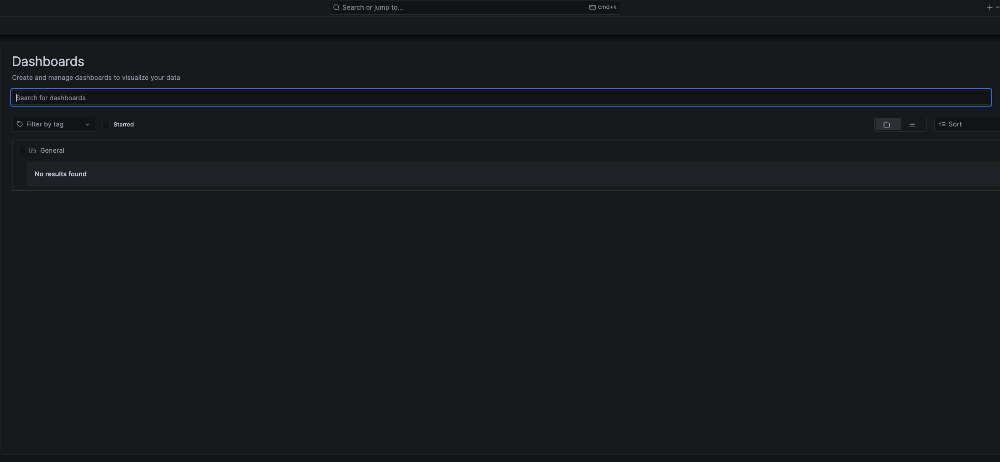
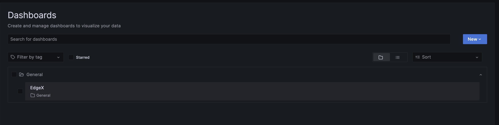

<!---
### 📜 Change Log

| **Date** | **Name** | **Change** |
|---|---|---|
| 2026-04-17 | | Created document |
| 2026-07-17 / 2026-07-20 | Eric Aquaronne | Added change log |
| 2026-07-25 | Ori Shadmon | Split from the deployment/connection content (now in **AnyLog & Grafana**) — this file
  covers what to do once Grafana is already connected. Backbone is "03-1 Connecting Grafana.md" (already a clean
  rewrite that added an Aggregations query type missing from the older docs), with the dropped screenshots restored
  from "Using Grafana.md" and the dashboard-import walkthrough merged in from "Importing Grafana Dashboard.md". Its
  duplicate, "03-2 Importing Grafana Dashboard.md", was corrupted (broken HTML from what looks like a bad export —
  stray `>text</a>` fragments after every image/link) and contributed nothing usable; excluded rather than repaired. |
--->

This assumes Grafana is already deployed and connected to an AnyLog node as a JSON data source — see
**AnyLog & Grafana** if you haven't done that yet.

Grafana can display AnyLog data in two ways: **Time Series** (values over time) and **Table** (rows and columns).
Queries are issued via the **Additional JSON Data** panel field, either using AnyLog's two optimized query types
(`increments`, `period`) or a plain SQL statement.


---

## Query types reference

| Field | Description |
|---|---|
| `type` | `increments` (default), `period`, `info`, `map`, `aggregations` |
| `sql` | Custom SQL statement |
| `details` | Any non-SQL AnyLog command |
| `where` | Additional WHERE condition appended to the query |
| `time_column` | Name of the timestamp column |
| `value_column` | Name of the value column |
| `functions` | List of aggregation functions to apply |
| `include` | Treat additional tables as part of the queried table |
| `extend` | Append node metadata to results (e.g. `@table_name`, `@ip`) |
| `timezone` | `utc` (default) or `local` |
| `time_range` | `true`/`false` — whether to apply the Grafana time range to the query |
| `servers` | Override network-determined nodes with a specific IP:Port list |
| `grafana.format_as` | `timeseries` or `table` |
| `grafana.data_points` | Approximate number of data points — auto-tunes the increments interval |

---

## Increments query (time-series)

The default query type. Divides the selected time range into intervals and returns min/max/avg/count per interval.

```json
{
  "type": "increments",
  "time_column": "timestamp",
  "value_column": "value",
  "grafana": {
    "format_as": "timeseries",
    "data_points": 1000
  }
}
```

Adding `data_points` lets AnyLog automatically calculate the optimal time interval/unit for the requested number of
buckets — balancing performance, readability, and visual resolution. If omitted, Grafana's own **Interval** setting
is used instead. Grafana's **limit** (Query Options) is also applied; if the result exceeds it, only a subset is
returned.

**With `include` and `extend`:**
```json
{
  "type": "increments",
  "time_column": "timestamp",
  "value_column": "value",
  "extend": ["@table_name"],
  "include": ["t98"],
  "grafana": { "format_as": "timeseries" }
}
```

`include` treats multiple tables as one logical source (querying `t99` with `include: ["t98"]` pulls and merges
data from both). `extend` appends source metadata to the result — `@table_name` groups results by their table of
origin, preserving context.

**With a WHERE filter:**
```json
{
  "type": "increments",
  "time_column": "timestamp",
  "value_column": "value",
  "where": "device_name='ADVA FSP3000R7'",
  "grafana": { "format_as": "timeseries" }
}
```

### Increments graph

1. Visualization: **Time series**
2. Metric: select the table to query
3. Payload:
```json
{
  "type": "increments",
  "time_column": "timestamp",
  "value_column": "value",
  "grafana": { "format_as": "timeseries" }
}
```
4. Under **Query Options**, set **Max data points** — otherwise min/max/avg collapse into what looks like a single line.


---

## Period query (latest value)

Returns the most recent value within the selected time range (or nearest to the end of it), then aggregates over a
window ending at that point.

```json
{
  "type": "period",
  "time_column": "timestamp",
  "value_column": "value",
  "grafana": { "format_as": "timeseries" }
}
```

**Without a time range** (all data, explicit functions):
```json
{
  "type": "period",
  "time_column": "timestamp",
  "value_column": "value",
  "time_range": false,
  "functions": ["min", "max", "avg", "count"],
  "grafana": { "format_as": "timeseries" }
}
```

### Period graph

1. Visualization: **Gauge**
2. Metric: select the table to query
3. Payload:
```json
{
  "type": "period",
  "time_column": "timestamp",
  "value_column": "value",
  "grafana": { "format_as": "timeseries" }
}
```
4. Under **Query Options**, set **Max data points** — same reason as above.


---

## Aggregations query

Pulls rolling aggregations — configured via `set aggregation` on the AnyLog side — directly into Grafana:

```json
{
  "servers": ["10.0.0.78:32149"],
  "type": "aggregations",
  "functions": ["min", "max", "avg", "count"],
  "table": "r_50",
  "timestamp_column": "timestamp",
  "value_column": ["filler_cyc_time", "run_hours"],
  "limit": 0
}
```

> `servers` must name a single operator node for aggregations queries.

---

## Network map (blockchain metadata)

Plot node locations on a world map.

1. Visualization: **Geomap**
2. Metric: any table (the map is populated from blockchain metadata, not table contents)
3. Payload:
```json
{
    "type" : "map",
    "member" : ["master", "query", "operator", "publisher"],
    "metric" : [0, 0, 0],
    "attribute" : ["name", "name", "name", "name"]
}
```


## Blockchain table

Display node metadata as a table.

1. Visualization: **Table**
2. Metric: any table
3. Payload:
```json
{
    "type": "info",
    "details": "blockchain get operator bring.json [*][cluster] [*][name] [*][company] [*][ip] [*][country] [*][state] [*][city]"
}
```


---

## Importing the sample dashboards

Rather than building panels one at a time as above, AnyLog provides pre-built dashboard JSON files you can import
wholesale:

* **[Network Map](../imgs/grafana_json/network_summary.json)** — a map of all nodes in the network, a list of
  operator nodes, and a list of tables supported across the network.

  

* **[EdgeX Diagram](../imgs/grafana_json/edgex_dashboard.json)** — a line graph of min/avg/max plus gauges for
  total and per-node row counts, fed from the EdgeX MQTT sample connection.

  

### Steps

1. In a new dashboard, go to **Settings**:

   

2. Go to **JSON Model** and paste in the desired model — the JSON object that defines the dashboard (e.g. the
   [EdgeX Dashboard](../imgs/grafana_json/edgex_dashboard.json) above):

   | Empty JSON Model | Filled JSON Model |
   |:---:|:---:|
   |  |  |

3. Save changes.

4. You should now see the new dashboard:

   | Before | After |
   |:---:|:---:|
   |  |  |

5. For each widget, update:
   * **Data Source**
   * **Metric value** (the AnyLog table name)

   | View when accessing Dashboard | Update Data Source | Update Metric Value | Outcome |
   |:---:|:---:|:---:|:---:|
   |  |  |  |  |

> **Note:** the sample `edgex_dashboard.json` bundled with this doc set had two panels ("Total Rows - Server 1/2")
> with real, non-placeholder IPs hardcoded into their query payloads. Anonymized before publishing — if you're
> pulling a fresh copy of this dashboard from elsewhere, check the `servers` field in those two panels before
> sharing it further.

---

## Exporting a dashboard

To share a dashboard you've built (or to save a copy of a customized sample dashboard):

1. Open the dashboard, then go to its **Settings** (gear icon).
2. Go to **JSON Model**.
3. Either:
   * **Copy** the JSON directly from the editor, or
   * Use **Export → Save to file** (Grafana 9+) to download it as a `.json` file.

The exported file is the same format used for import above — it can be handed to someone else, checked into a
repo as a versioned example (like `network_summary.json` / `edgex_dashboard.json`), or re-imported later via
**JSON Model** on a fresh dashboard.

> Before sharing an exported dashboard outside your team, check it for anything environment-specific — data
> source UIDs, hardcoded `servers` IPs in query payloads (see the note above), or table/database names — the
> same way you'd review any other exported config before publishing it.

---

## Tips

- Set **Max data points** in Query Options to control result density for time-series panels — without it, min/max/avg lines collapse into a single line.
- Use `format_as: timeseries` for time-series panels (Time series, Gauge) and `table` for table panels.
- See [Querying Data](../07-%20CLI/04-%20SQL.md) for the full `increments`/`period` reference and query options like `include`/`extend`.