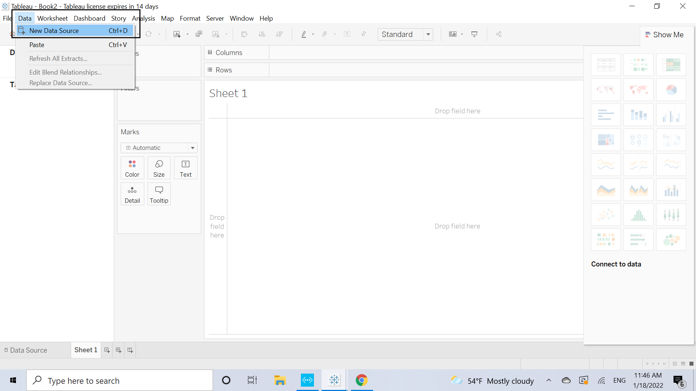
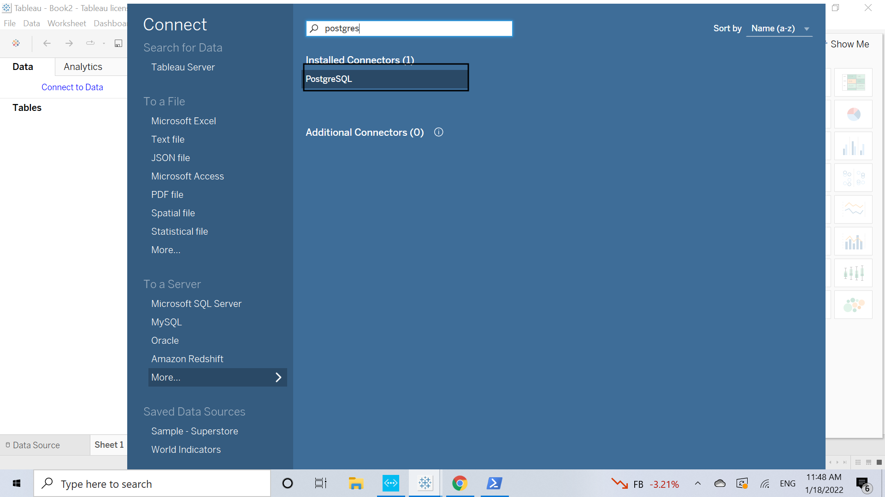
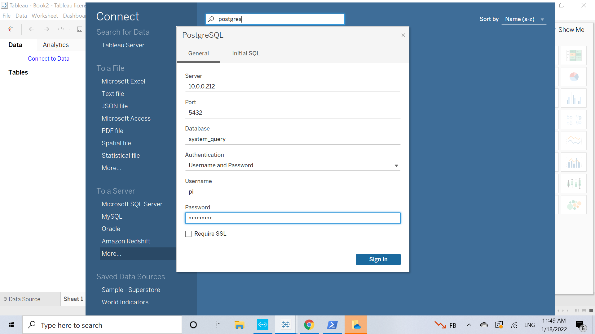
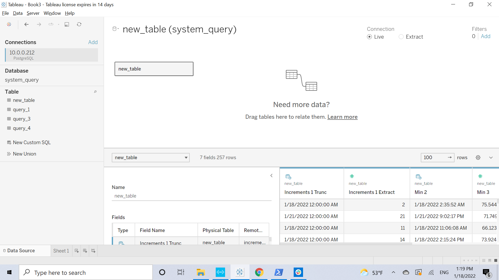
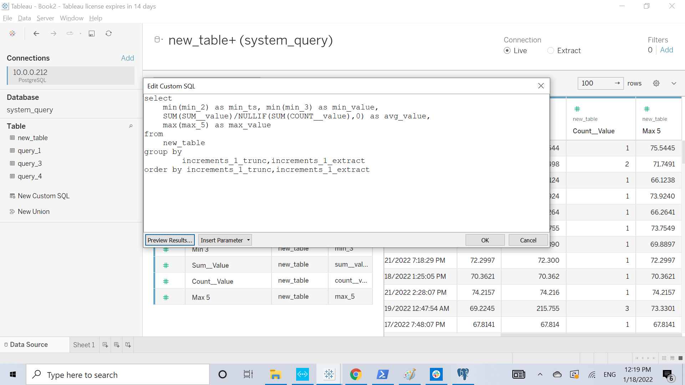
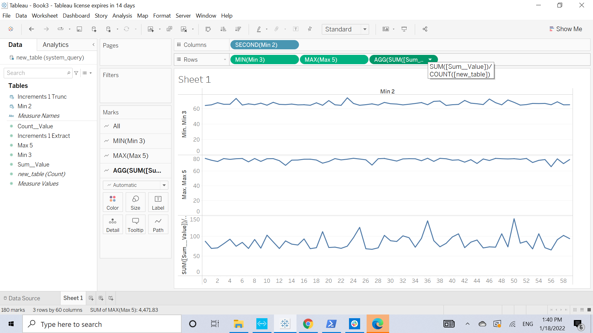

<!--
## Changelog PUT LATEST CHANGES AT THE TOP PLEASE
-
- 2026-08-07 | Eric Aquaronne | change log format adding ref version | 2.0.2606
- 2026-04-17 | Created document (as postgres-connector.md, Northbound Connectors)
- (unknown) | A second copy was created under 11- Extended Services/A- Databases/Postgres Connector.md — confirmed
              on comparison to be the same content, not a distinct storage-layer topic. That copy used working
              Markdown links/images; this one used broken Jekyll-era syntax. Retired the duplicate.
- 2026-07-14 | Merged into one file, kept in Northbound Connectors (this is a northbound/query-consumption
              topic — Tableau pulling query results — not about PostgreSQL as AnyLog's storage backend, which
              is a separate topic covered in Databases & Tables.md). Fixed the "Full list of SQL options" link
              to point at the current Query Data.md (the old queries.md this pointed to has been retired and
              merged there). Left the "to run in repeat" link flagged rather than guessed — "alerts and
              monitoring.md" doesn't exist anywhere in the current tree; it only survives inside the ORPHANS
              legacy subtree marked for deletion, so this was already a dead link before this merge.
- 2026-07-25 | "03 postgres-connector.md" resurfaced in a follow-up upload — confirmed it's the same broken-Jekyll-
              syntax duplicate described above (title "PostgresSQL Connector," `!<a href="{{ ... }}">` image links
              instead of real Markdown images, and the two dead/unfixed links this file already addresses). Nothing
              new to merge; excluded again.
- 2026-08 | ORi Shadmon | Paths issues 
-->

# PostgreSQL Connector & Tableau Visualization

For software that doesn't support REST requests, but does support a PostgreSQL connector, graphs can be
generated through the `system_query` database. To connect `system_query` to PostgreSQL:

```anylog
db_ip = 127.0.0.1
db_port = 5432
db_user = admin
db_passwd = passwd
connect dbms system_query where type=psql and ip=!db_ip and port=!db_port and user=!db_user and password=!db_passwd
```

## Setting up Postgres

0. <a href="https://www.postgresqltutorial.com/install-postgresql/" target="_blank">Install Postgres</a>

```bash
docker run -d --network host \
  --name anylog-psql \
  -e POSTGRES_USER=${DB_USR} \
  -e POSTGRES_PASSWORD=${DB_PASSWD} \
  -v pgdata:/var/lib/postgresql/data \
  --rm postgres:14.0-alpine
```

Update Postgres to support <a href="https://mellowhost.com/blog/how-to-allow-remote-user-access-in-postgresql.html" target="_blank">remote access</a> if the Postgres (north-bound) connector is on a separate machine.

1. Locate and open `data/postgresql.conf`:

    ```bash
    anylog@anylog-2004:~$ docker volume inspect pgdata
    [
        {
            "CreatedAt": "2022-01-18T00:46:23Z",
            "Driver": "local",
            "Labels": null,
            "Mountpoint": "/var/lib/docker/volumes/pgdata/_data",
            "Name": "pgdata",
            "Options": null,
            "Scope": "local"
        }
    ]

    anylog@anylog-2004:~$ sudo ls /var/lib/docker/volumes/pgdata/_data
    [sudo] password for anylog:
    base    pg_commit_ts  pg_hba.conf    pg_logical    pg_notify    pg_serial     pg_stat      pg_subtrans  pg_twophase  pg_wal   postgresql.auto.conf  postmaster.opts
    global  pg_dynshmem   pg_ident.conf  pg_multixact  pg_replslot  pg_snapshots  pg_stat_tmp  pg_tblspc    PG_VERSION   pg_xact  postgresql.conf       postmaster.pid

    anylog@anylog-2004:~$ sudo vim /var/lib/docker/volumes/pgdata/_data/postgresql.conf
    ```

2. Allow remote access — uncomment `listen_addresses` and set it to `*`:

    ```configs
    listen_addresses = '*'
                                        # comma-separated list of addresses;
                                        # defaults to 'localhost'; use '*' for all
    ```

3. Grant remote access — add the following line at the bottom of `data/pg_hba.conf`:

    ```configs
    host    all             new_user           27.147.176.2/32       md5
    ```

4. Restart the PostgreSQL instance:

    ```bash
    docker restart anylog-psql
    ```

## Executing a query

0. On AnyLog, connect `system_query` to the Postgres database:

```anylog
connect dbms psql anylog@127.0.0.1:demo 5432 system_query
```

1. Execute a query:

```anylog
AL aiops-single-node > run client () sql aiops format=table and table=new_table and drop=true "select increments(hour, 1, timestamp), min(timestamp), min(value), avg(value), max(value) from fic11_mv where timestamp >= NOW() - 1 day"
```

> To run a query like this on a repeating schedule, see repeatable queries — the original reference for this
> (`alerts and monitoring.md`) doesn't resolve in the current doc tree; confirm the current location before
> relying on this pointer.

2. Use `query explain` to see how the result was generated:

```anylog
AL aiops-single-node > query explain

07 Remote DBMS    : aiops
07 Remote Table   : fic11_mv
07 Source Command : select increments(hour, 1, timestamp), min(timestamp), min(value), avg(value), max(value) from fic11_mv where timestamp >= NOW() - 1 day
07 Remote Query   : select date_trunc('day',timestamp), (extract(hour FROM timestamp)::int / 1), min(timestamp), min(value), SUM(value), COUNT(value), max(value) from fic11_mv where timestamp >= '2022-01-17T18:31:31.442147Z' group by 1,2
07 Local Create   : create table new_table (increments_1_trunc timestamp without time zone, increments_1_extract integer, min_2 timestamp without time zone, min_3 double precision, SUM__value numeric, COUNT__value integer, max_5 double precision);
07 Local Query    : select min(min_2), min(min_3), SUM(SUM__value) /NULLIF(SUM(COUNT__value),0), max(max_5) from new_table group by increments_1_trunc,increments_1_extract order by increments_1_trunc,increments_1_extract
```

For the full list of SQL query options, see <a href="../03-%20Training%20%26%20Tutorials/03-%20Query%20Data.md#query-options" target="_blank">Query Data — Query options</a>.

## Extracting data into Tableau

1. <a href="https://www.tableau.com/products/desktop/download" target="_blank">Download & install Tableau</a>
2. Under **Data** → **Data Sources**, select the PostgreSQL connector type:

<table>
<tr><td></td><td></td></tr>
</table>

3. Fill out the connection information and press "OK":



4. Double-click on the table you want to use (in this case `new_table`) and go to the worksheet:



## Generating graphs

The `system_query` database gathers query results from the different AnyLog instances to generate a unified
dataset. Because of that, mapping the final result columns to something readable takes a little translation:

- **Min 2** is the `MIN(timestamp)` column
- **Min 3** is the `MIN(value)` column
- **SUM(SUM__VALUE) / COUNT(new_table_count)** is the `AVG(value)` column
- **Max 5** is the `MAX(value)` column



To generate a graph, use "Min 2" as **Columns** and all the others as **Rows**:

