<!---
### 📜 Change Log
 **Date**   | **Name** | **Change**       | **Version** |
 |------------|--|------------------|----------|
 | 2026-04-17 |  | created document |  |
 | 2026-07-20 | Eric Aquaronne | added change log | 2.0.2606 |
 | 2026-07-25 | Ori Shadmon | Deduped two identical copies of this file (differing only in changelog formatting).
   Excluded "05-1 Google example.md" — it's the same content using broken Jekyll-era image syntax
   (`!<a href="{{ ... }}">`) that the other two copies had already fixed, plus one image link in it was missing
   its `.png` extension. Nothing unique to restore. Filled in the empty frontmatter description. |
--->

# Google Drive

To extract data from AnyLog into Google Drive we recommend using a tool called <a href="https://workspace.google.com/marketplace/app/two_minute_reports/6804555176" target="_blank">Two Minute Reports</a>
which provides the ability to import data via REST, Database, Social Media and other SEO services. 

## Install 

1. Under _Extensions_ goto _Add-ons_ → _Get add-ons_
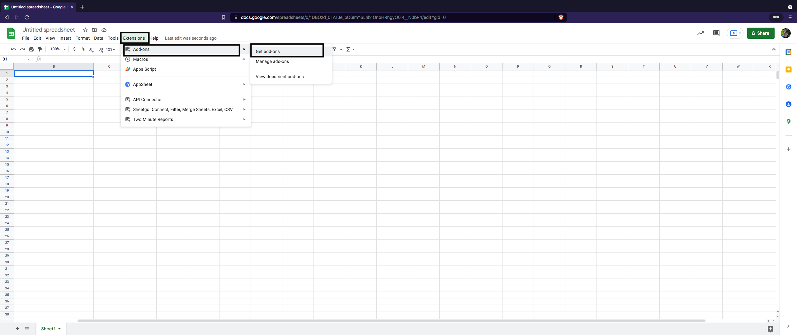

2. In the search bar look for "Two Minute Reports" & double click it
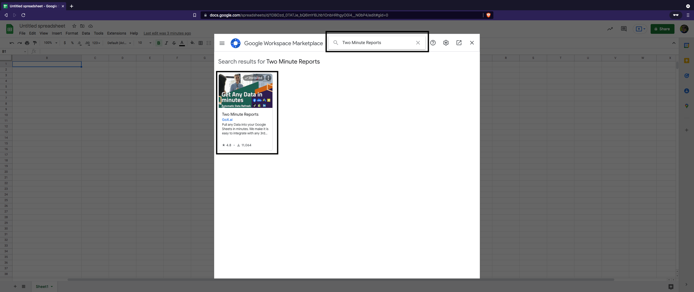

3. Install the add-on to your Google Sheets & press "continue"  

<table>
<tr><td>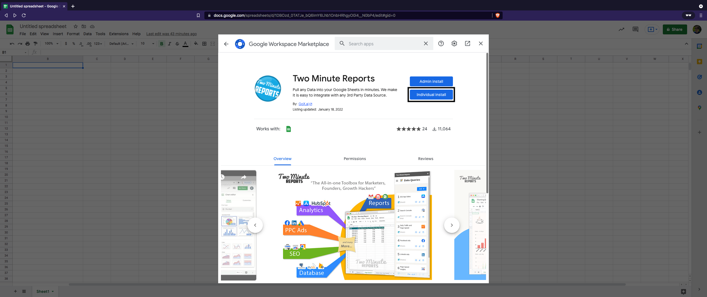</td><td>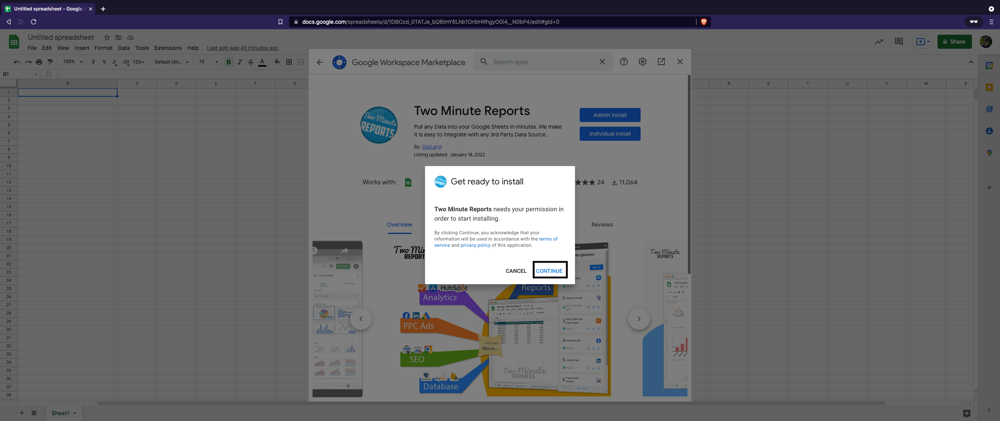</td></tr>
</table>

4. Google Requires users to confirm - click on the user you'd like to install the application on & press "Allow" 

<table>
<tr><td>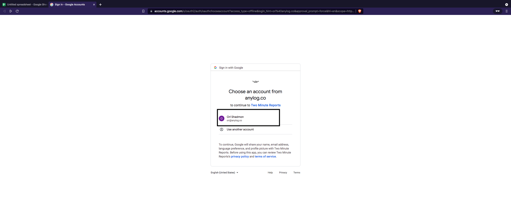</td><td>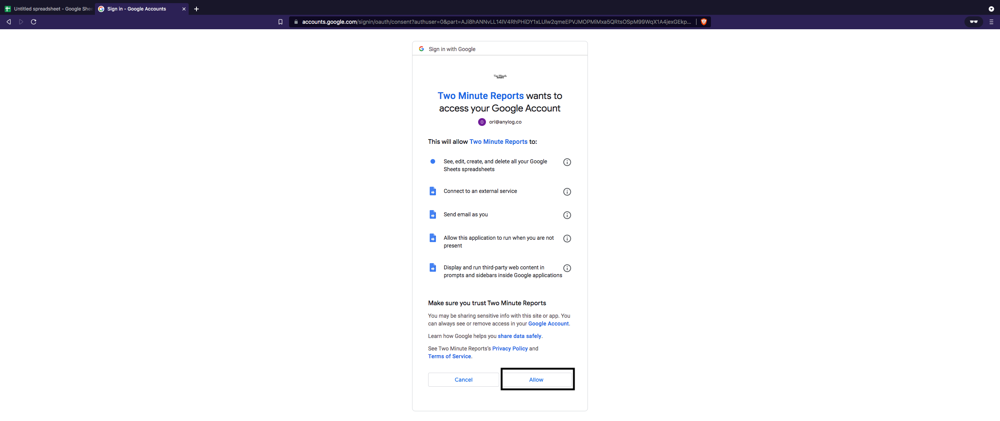</td></tr>
</table>

## Executing REST Request

1. Once that's completed launch _Two Minute Reports_: _Extensions_ → _Two Minute_Reports_ → Launch
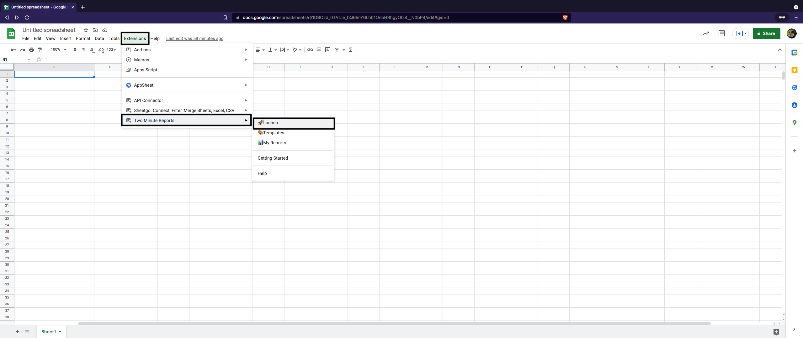
**Note**: _Two Minute Reports_ works best when only a single account is logged in.

2. Press "Add+" to connect to a new REST connection
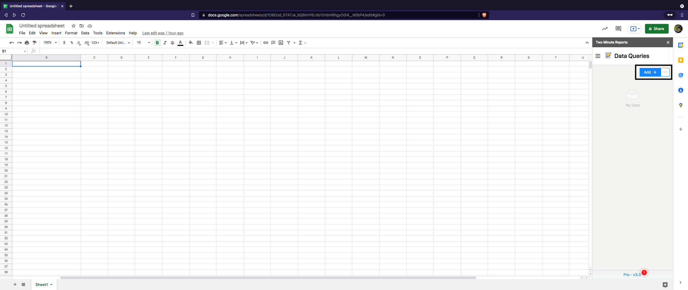

3. Under _Data Source_ set the Type to API Bridge & Fill-out the form

Notice that for the complete form user should specifiy: _Base URL_, _Authentication_ (if set) and headers.    
For demo purposes, I'm using a query that consists of and returns the data as a list of JSON values without statistics:

```sql
sql aiops format=json:list and stat=false "select increments(hour, 1, timestamp), min(timestamp) as timestamp, min(value) as min_value, avg(value) as avg_value, max(value) as max_value from sic1001_mv where timestamp >= NOW() - 1 week"
```

<table>
<tr><td>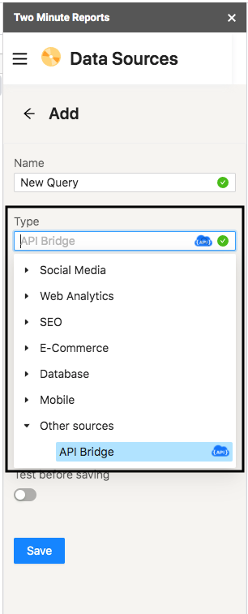</td><td>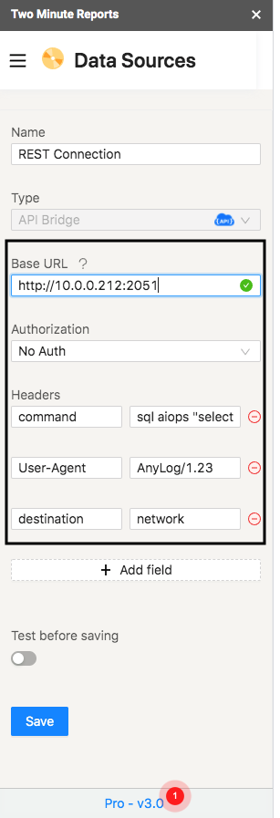</td></tr>
</table>

4. Once the form is complete, test and save the changes - this will validate that the request is valid

<table>
<tr><td>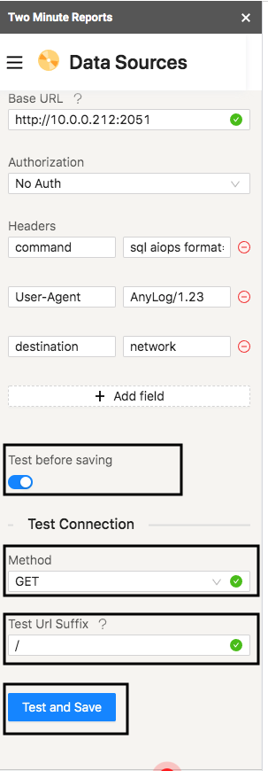</td><td>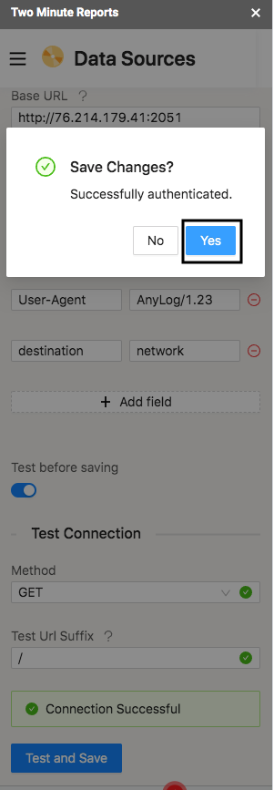</td></tr>
</table>

5. In menu, goto _Data Queries_

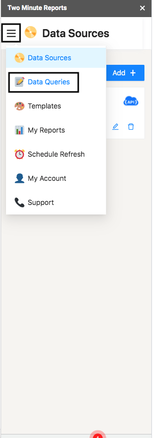

6. Press _Add+_ to create a new Query Form

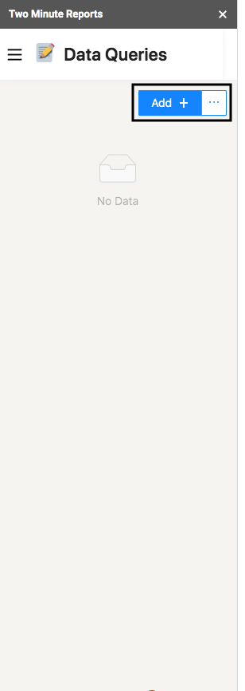

7. Fill-out the form, setting _Data Source_ to be the same as the the one created earlier & press "Run Query"

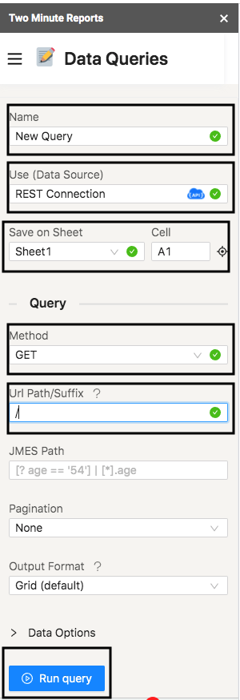

The steps mentioned above will ultimately result in a table similar to the one shown on the right of the image; with it
users can generate images and graphs as shown on the right side of the image, just like any other data set

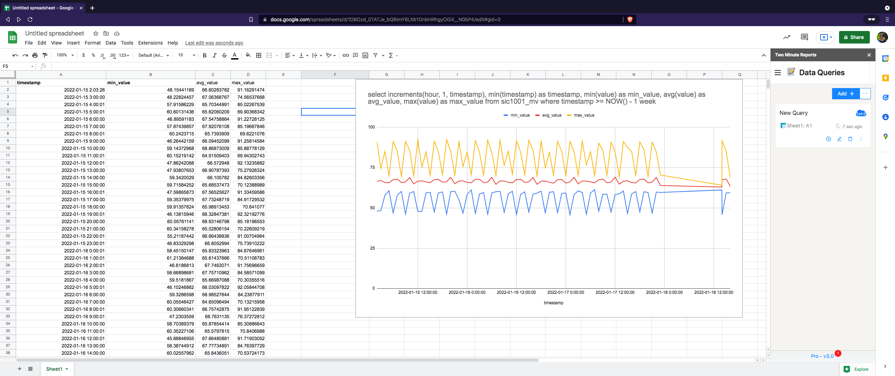