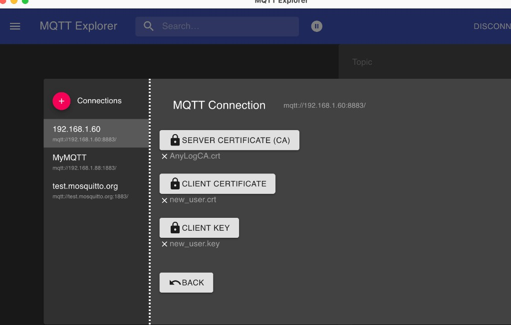

<!---
### Change Log
 **Date**   | **Name** | **Change** | **Version** |
 |------------|--|------------|----------|
 | 2026-07-24 | Massimiliano | Added MQTT TLS / mTLS broker setup example (PR #36). | |
 | 2026-08-14 | | Restored under Networking & Security and linked from MQTT Message Broker. | |
 | 2026-08-14 | | Start broker uses written `server-mqtt-op1` / `MQTT_CA_users` files; added section for external org certs. | |
 | 2026-08-14 | | Added Master + Operator remote-signing scenario. | |
--->

# Configure MQTT TLS and authentication

Full worked example for securing AnyLog's MQTT message broker with TLS and optional client certificates (mTLS). For the shorter overview, see [MQTT Message Broker — MQTT over TLS and mTLS](./05-%20MQTT%20Message%20Broker.md#mqtt-over-tls-and-mtls).

## Create CA Authority for self signed TLS certificates

```anylog
<id generate certificate authority where country = US and
  state = CA and locality = "Redwood City" and
  org = MQTT_CA_TLS and
  output_name = "MQTT_CA_TLS" and
  expiration_days = 3650
>
```

## Create certificate request

```anylog
<id generate certificate request where country = US and state = CA and locality = "Redwood City"
  and org = "Anylog MQTT broker TLS"
  and hostname = op1
  and alt_name = 192.168.1.60
  and ip = 192.168.1.60 and
  output_name = "server-mqtt-op1"
>
```

## Sign certificate with above CA

```anylog
<id sign certificate request where ca_org = MQTT_CA_TLS and ca_output_name = "MQTT_CA_TLS"
  and server_org = "Anylog MQTT broker TLS" and output_name = "server-mqtt-op1"
  and expiration_days = 3650
>
```

Writes under `!pem_dir`: `MQTT_CA_TLS.crt` / `.key`, `server-mqtt-op1.csr` / `.key` / `.pem`, then `server-mqtt-op1.crt`.

Notes:

- The server certificate requires IP address(es) and/or a domain name, for example:
  - `IPAddress:192.168.1.60`
  - `DNS:localhost`
- All commands in this self-signed walkthrough are issued on an operator node, say `op1`.
- **Optional:** if the CA private key must stay on a remote master (not on this operator), sign with
  `certificate_authority = !master_node` instead of a local CA key. See
  [Optional: remote signing with a master](./07-%20Security/01-%20Built-in%20Authentication/01-%20Authentication.md#optional-remote-signing-with-a-master-certificate_authority).
  Remote master signing is not required for this walkthrough.

## Create user certificates for an organization

If the organization that wants to connect to the AnyLog MQTT TLS broker does **not** have user certificates, create them and pass the following to the organization:

- `user*.crt` / `user*.key` (one pair per user; CN matches `allowed_users`, e.g. `user1`, `user2`)
- `MQTT_CA_TLS.crt` (broker TLS CA **public** key — so the client can trust the broker)

Do not share any other private key with the organization.

Example on the operator:

```anylog
<id generate certificate authority where country = US and
  state = CA and locality = "Redwood City" and
  org = MQTT_CA_users and
  output_name = "MQTT_CA_users" and
  hostname = MQTT_CA_users and
  expiration_days = 3650
>

<id generate certificate request where country = US and state = CA and locality = "Redwood City"
  and org = AnyLog and hostname = user1 and output_name = "user1"
>

<id sign certificate request where ca_org = MQTT_CA_users and ca_output_name = "MQTT_CA_users"
  and server_org = AnyLog and output_name = "user1" and expiration_days = 825
>

<id generate certificate request where country = US and state = CA and locality = "Redwood City"
  and org = AnyLog and hostname = user2 and output_name = "user2"
>

<id sign certificate request where ca_org = MQTT_CA_users and ca_output_name = "MQTT_CA_users"
  and server_org = AnyLog and output_name = "user2" and expiration_days = 825
>
```

Writes under `!pem_dir`: `MQTT_CA_users.crt` / `.key`, plus `user1` / `user2` `.csr` / `.key` / `.crt`.

Give the organization: `user1.crt` / `user1.key`, `user2.crt` / `user2.key`, and `MQTT_CA_TLS.crt` only. Keep all other keys and CA material on the AnyLog side.

## Start MQTT broker

Start the broker with the certificate files written above (`!pem_dir` is typically `./data/pem`):

```anylog
<run message broker where external_ip = 192.168.1.60 and external_port = 8883 and threads = 6
  and enable_tls = true
  and tls_cert = !pem_dir/server-mqtt-op1.crt
  and tls_key = !pem_dir/server-mqtt-op1.key
  and users_ca = !pem_dir/MQTT_CA_users.crt
  and allowed_users = (user1, user2)
>
```

`allowed_users` is optional. When set, `user1`, `user2`, etc. are the **CN** values in the client certificates that are allowed to connect.

`users_ca` (`MQTT_CA_users.crt`) authenticates MQTT clients (mTLS). It is not the same file as the broker listener CA (`MQTT_CA_TLS.crt`).

## Make use of existing certificate files, coming from an outside organization

If an outside organization already provides the broker TLS material and the client CA, put those files on the **Operator** under `!pem_dir` (or another path you choose). Use distinct names (for example an `ext_` prefix) so they are not confused with certificates generated in the sections above:

| Role | Example files |
|------|----------------|
| Broker listener certificate / key | `ext_server_tls.crt`, `ext_server_tls.key` |
| Client authentication CA (mTLS) | `ext_MQTT_CA_users.crt` |

```anylog
<run message broker where external_ip = 192.168.1.60 and external_port = 8883 and threads = 6
  and enable_tls = true
  and tls_cert = !pem_dir/ext_server_tls.crt
  and tls_key = !pem_dir/ext_server_tls.key
  and users_ca = !pem_dir/ext_MQTT_CA_users.crt
  and allowed_users = (user1, user2)
>
```

Requirements for the external server certificate:

- It must cover the broker IP and/or DNS name clients will use (for example `IPAddress:192.168.1.60` or `DNS:mqtt.example.com`).
- Clients need the matching CA (or trust chain) that signed `ext_server_tls.crt` so they can validate the broker.
- `users_ca` must be the CA that issued the client certificates whose CNs appear in `allowed_users`.

## Create local broker for ingestion

For a given topic (`my_topic`) or all topics:

```anylog
<run msg client where broker = local and
       topic = (name = my_topic and
       dbms = mydb and
       table = my_topic and
       column.payload.str = "bring [value]")
>
```

## Publish data from a client using TLS and user certificate

```bash
mosquitto_pub -p 8883 -h 192.168.1.60 \
  --cafile ./MQTT_CA_TLS.crt \
  --cert ./user1.crt \
  --key ./user1.key \
  -d \
  -m '{"value":"enabled"}' \
  -t test2
```

Note: `--cafile ./MQTT_CA_TLS.crt` may be required if the client application cannot trust the self-signed certificate used for the AnyLog broker TLS listener.

### MQTT Explorer client setup

In MQTT Explorer, configure the connection to `mqtt://192.168.1.60:8883/` with:

- **SERVER CERTIFICATE (CA):** `MQTT_CA_TLS.crt` (or the broker listener CA)
- **CLIENT CERTIFICATE:** e.g. `user1.crt` / `AnyLogUser1.crt`
- **CLIENT KEY:** e.g. `user1.key` / `AnyLogUser1.key`



## Share CA Users in the blockchain

Full example: create a custom client CA (`MQTT_CA_users`), publish its **public** certificate as a `ca` policy, then reuse it on Operators as `users_ca` (no file copy to every node).

### 1. Create `MQTT_CA_users` on the Master

```anylog
set master_node = 192.168.1.88:32048

<id generate certificate authority where country = US and
  state = CA and locality = "Redwood City" and
  org = MQTT_CA_users and
  output_name = "MQTT_CA_users" and
  hostname = MQTT_CA_users and
  expiration_days = 3650
>
```

Writes `!pem_dir/MQTT_CA_users.crt` and `!pem_dir/MQTT_CA_users.key`. Keep the `.key` on the Master only.

Optionally issue user certs signed by this CA (same as [Create user certificates for an organization](#create-user-certificates-for-an-organization)):

```anylog
<id generate certificate request where country = US and state = CA and locality = "Redwood City"
  and org = AnyLog and hostname = user1 and output_name = "user1"
>

<id sign certificate request where ca_org = MQTT_CA_users and ca_output_name = "MQTT_CA_users"
  and server_org = AnyLog and output_name = "user1" and expiration_days = 825
>
```

### 2. Add `MQTT_CA_users` to the blockchain

Publish the public certificate (contents of `!pem_dir/MQTT_CA_users.crt`) as a `ca` policy:

```anylog
# Paste the PEM text from !pem_dir/MQTT_CA_users.crt into the certificate field
<policy = {"ca":{
  "name": "MQTT_CA_users",
  "company": "AnyLog",
  "usage": "CA for mqtt_users",
  "certificate": "-----BEGIN CERTIFICATE-----\n...\n-----END CERTIFICATE-----\n"
}}
>

blockchain prepare policy !policy
blockchain insert where policy = !policy and local = true and master = !master_node
```

Do not put `MQTT_CA_users.key` in the policy — only the public certificate.

### 3. Verify the policy

```anylog
blockchain get ca where name = MQTT_CA_users
blockchain get ca where name = MQTT_CA_users bring [ca][certificate]
```

### 4. On an Operator — load `users_ca` from the blockchain

```anylog
users_ca = blockchain get ca where name = MQTT_CA_users bring [ca][certificate]

<run message broker where external_ip = 192.168.1.60 and external_port = 8883 and threads = 6
  and enable_tls = true
  and tls_cert = !pem_dir/server-mqtt-op1.crt
  and tls_key = !pem_dir/server-mqtt-op1.key
  and users_ca = !users_ca
  and allowed_users = (user1, user2)
>
```

If the listener certificate came from an outside organization instead, use those paths (for example `!pem_dir/ext_server_tls.crt` / `.key`) as in [Make use of existing certificate files](#make-use-of-existing-certificate-files-coming-from-an-outside-organization).

## Scenario: Master node + Operator with remote signing

Remote signing is **optional**. Use it when the CA private key must stay on the AnyLog **Master node**. Background:
[Optional: remote signing with a master](./07-%20Security/01-%20Built-in%20Authentication/01-%20Authentication.md#optional-remote-signing-with-a-master-certificate_authority).

**Operators do not get CA private keys** (`MQTT_CA_TLS.key`, `MQTT_CA_users.key`). For `users_ca`, either copy `MQTT_CA_users.crt` from the Master **or** load it from the blockchain (see below). MQTT clients get `MQTT_CA_TLS.crt`.

| Who | Gets |
|-----|------|
| Master | Keeps CA private keys; creates CAs and signs CSRs; can publish `MQTT_CA_users` to the blockchain |
| Operator | `server-mqtt-op1.crt` / `.key` (remote sign) + `users_ca` via file copy **or** blockchain |
| MQTT clients | `user*.crt` / `.key` and `MQTT_CA_TLS.crt` |

### Topology

| Node | IP:port (example) | Holds | Does |
|------|-------------------|--------|------|
| Master | `192.168.1.88:32048` | `MQTT_CA_TLS.key`, optionally `MQTT_CA_users.key` | Creates CAs; signs CSRs |
| Operator `op1` | `192.168.1.60` | `server-mqtt-op1.key` | Creates broker CSR; remote-signs; runs MQTT broker |
| MQTT clients | — | `user1.key` / `user2.key` | Publish with mTLS |

### On the Master — create broker CA once

```anylog
<id generate certificate authority where country = US and
  state = CA and locality = "Redwood City" and
  org = MQTT_CA_TLS and
  output_name = "MQTT_CA_TLS" and
  expiration_days = 3650
>
```

Keep `MQTT_CA_TLS.key` on the Master only.

Create the client CA and user certificates on the Master (local sign), then give clients only `user*.crt` / `user*.key` and `MQTT_CA_TLS.crt`:

```anylog
<id generate certificate authority where country = US and
  state = CA and locality = "Redwood City" and
  org = MQTT_CA_users and
  output_name = "MQTT_CA_users" and
  hostname = MQTT_CA_users and
  expiration_days = 3650
>

<id generate certificate request where country = US and state = CA and locality = "Redwood City"
  and org = AnyLog and hostname = user1 and output_name = "user1"
>

<id sign certificate request where ca_org = MQTT_CA_users and ca_output_name = "MQTT_CA_users"
  and server_org = AnyLog and output_name = "user1" and expiration_days = 825
>
```

Optional — publish `MQTT_CA_users.crt` to the blockchain for reuse on every Operator (same steps as [Share CA Users in the blockchain](#share-ca-users-in-the-blockchain)):

```anylog
set master_node = 192.168.1.88:32048

# Paste the PEM text from !pem_dir/MQTT_CA_users.crt into [certificate]
<policy = {"ca":{
  "name": "MQTT_CA_users",
  "company": "AnyLog",
  "usage": "CA for mqtt_users",
  "certificate": "-----BEGIN CERTIFICATE-----\n...\n-----END CERTIFICATE-----\n"
}}
>

blockchain prepare policy !policy
blockchain insert where policy = !policy and local = true and master = !master_node
```

### On the Operator — broker CSR + remote sign

```anylog
set master_node = 192.168.1.88:32048

<id generate certificate request where country = US and state = CA and locality = "Redwood City"
  and org = "Anylog MQTT broker TLS"
  and hostname = op1
  and alt_name = 192.168.1.60
  and ip = 192.168.1.60 and
  output_name = "server-mqtt-op1"
>

<id sign certificate request where ca_org = MQTT_CA_TLS and ca_output_name = "MQTT_CA_TLS"
  and server_org = "Anylog MQTT broker TLS" and output_name = "server-mqtt-op1"
  and expiration_days = 3650
  and certificate_authority = !master_node
>
```

Result on the Operator: `server-mqtt-op1.crt` under `!pem_dir`. The Operator never receives `MQTT_CA_TLS.key` or `MQTT_CA_users.key`.

### On the Operator — get `users_ca` (file copy **or** blockchain)

**Option A — copy the file from Master**

Copy `MQTT_CA_users.crt` from the Master's `!pem_dir` into the Operator's `!pem_dir`. Do not copy CA private keys.

```anylog
<run message broker where external_ip = 192.168.1.60 and external_port = 8883 and threads = 6
  and enable_tls = true
  and tls_cert = !pem_dir/server-mqtt-op1.crt
  and tls_key = !pem_dir/server-mqtt-op1.key
  and users_ca = !pem_dir/MQTT_CA_users.crt
  and allowed_users = (user1, user2)
>
```

**Option B — load from the blockchain** (after the Master published the `ca` policy above)

```anylog
users_ca = blockchain get ca where name = MQTT_CA_users bring [ca][certificate]

<run message broker where external_ip = 192.168.1.60 and external_port = 8883 and threads = 6
  and enable_tls = true
  and tls_cert = !pem_dir/server-mqtt-op1.crt
  and tls_key = !pem_dir/server-mqtt-op1.key
  and users_ca = !users_ca
  and allowed_users = (user1, user2)
>
```

Additional Operators repeat the CSR + remote-sign steps with their own `output_name` and IP (for example `server-mqtt-op2`), then use Option A or B for `users_ca`.

## Related

* [MQTT Message Broker](./05-%20MQTT%20Message%20Broker.md)
* [Authentication](./07-%20Security/01-%20Built-in%20Authentication/01-%20Authentication.md) — `id generate` / `id sign certificate`, including [optional remote master signing](./07-%20Security/01-%20Built-in%20Authentication/01-%20Authentication.md#optional-remote-signing-with-a-master-certificate_authority)
* [DNP3 TLS Setup Example](../04-%20Southbound%20Interfaces/04-%20Industrial%20Connectors/05-1%20DNP3/04-%20DNP3%20-%20TLS%20Setup%20Example.md) — same Master/Operator remote-sign pattern for DNP3

## Link to resources

- <a href="https://mosquitto.org/man/mosquitto-tls-7.html" target="_blank">mosquitto-tls man page</a>
- <a href="https://medium.com/@sonadorje/mosquitto-broker-tls-config-5f8bfaa5c047" target="_blank">Mosquitto broker TLS config (Medium)</a>
