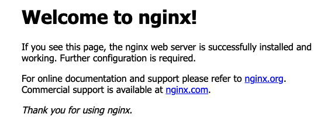

<!---
### 📜 Change Log
 **Date**   | **Name**       | **Change**            | **Version** |
 |------------|----------------|------------------|----------|
 | 2026-07-17 | Eric Aquaronne | added change log | 2.0.2606 |
 | 2026-07-25 | Ori Shadmon | Deduped three identical copies of this file. Fixed a real bug: the validation step
   used `https://` against a fresh Nginx install, which only serves HTTP by default — no SSL is configured
   anywhere in this doc, so `https://` would fail. Fixed `server_name;` (invalid — needs a value) to
   `server_name _;`, matching the catch-all pattern used in every other server block. Fixed "mimikube" →
   "minikube" (appeared twice). Clarified that the `${KUBE_APISERVER_IP}` blocks and the "example when
   kube-apiserver IP is 192.168.49.2" blocks are **alternatives** — the doc's original back-to-back
   presentation could easily read as "add both," which would mean two blocks listening on the same port.
   Fixed grammar throughout ("by not be needed" → "may not be needed," "needs to repeated" → "needs to be
   repeated," "seat on" → "sit on," "was need" → "was needed," double space after "IPs").
--->

# Install & Configure Nginx

Nginx is a web server that can also act as a reverse proxy. In front of AnyLog nodes, it provides a static IP
address instead of the virtual IP Kubernetes assigns a pod each time it's redeployed. Nginx (or another proxy
service) needs to be installed and configured on every machine that needs to communicate with these nodes.

## Installation

1. Install Nginx as a service:

```shell
sudo apt-get -y install nginx
sudo service nginx start
```

2. Validate Nginx is running by browsing to your local IP: `http://${LOCAL_IP}`

* Via cURL:

```commandline
curl http://${LOCAL_IP}

# Expected Output
<!DOCTYPE html>
<html>
<head>
<title>Welcome to nginx!</title>
<style>
    body {
        width: 35em;
        margin: 0 auto;
        font-family: Tahoma, Verdana, Arial, sans-serif;
    }
</style>
</head>
<body>
<h1>Welcome to nginx!</h1>
<p>If you see this page, the nginx web server is successfully installed and
working. Further configuration is required.</p>

<p>For online documentation and support please refer to
<a href="http://nginx.org/">nginx.org</a>.<br/>
Commercial support is available at
<a href="http://nginx.com/">nginx.com</a>.</p>

<p><em>Thank you for using nginx.</em></p>
</body>
</html>
```

* In a browser, it looks like this:



## Configuring

1. Remove the default files — we'll recreate them in the following steps:

```shell
sudo rm -rf /etc/nginx/sites-enabled/default
sudo rm -rf /etc/nginx/sites-available/default
```

2. Get the <a href="https://kubernetes.io/docs/reference/command-line-tools-reference/kube-apiserver/" target="_blank">kube-apiserver</a> IP address — required for a `minikube` deployment, but may not be needed for other 
Kubernetes deployment tools such as `kubeadm`:

```shell
minikube ip
```

3. Create a new file for REST communication:

```shell
sudo vim /etc/nginx/sites-enabled/anylog.conf
```

4. Add the following content to `/etc/nginx/sites-enabled/anylog.conf`. The two `server` blocks below are
   **alternatives** — use the `${KUBE_APISERVER_IP}` variable form generally, or the filled-in `192.168.49.2`
   form if you're on `minikube` specifically and already know that IP. Don't include both:

```editorconfig
# nginx default webpage - this generates the default nginx homepage
server {
  listen 80;
  server_name _;
}

# AnyLog Node - make sure the IP & REST Port are correct. This section needs to be repeated for each AnyLog node
# on the machine. Additionally, when using NGINX with docker, the listen port must be different from the
# proxy_pass port, since the two sit on the same network card when the docker host is configured to "network"
server {
  listen 32049;
  server_name _;
  location / {
    proxy_set_header Host            $host;
    proxy_set_header X-Forwarded-For $remote_addr;
    proxy_pass http://${KUBE_APISERVER_IP}:32049;
  }
}

# --- Alternative: filled in for when kube-apiserver IP is 192.168.49.2 (minikube) ---
server {
  listen 32049;
  server_name _;
  location / {
    proxy_set_header Host            $host;
    proxy_set_header X-Forwarded-For $remote_addr;
    proxy_pass http://192.168.49.2:32049;
  }
}
```

5. Update `/etc/nginx/nginx.conf` to support TCP and Message Broker (if set) communication. As above, the two
   `stream` blocks are **alternatives**, not both-at-once:

```editorconfig
# 1. Import the ngx_stream_module.so module at the top of the file.
# On Ubuntu 20.04 this import was needed; on later Ubuntu versions it wasn't.
include /usr/lib/nginx/modules/ngx_stream_module.so;

# 2. At the bottom, add a stream block — each AnyLog node (on the same machine) should have its own upstream &
# server process(es) within the stream section
stream {
    # AnyLog TCP Connection - repeat the next two blocks for each node
    upstream anylog_node {
        server ${KUBE_APISERVER_IP}:32048;
    }
    server {
        listen 32048 so_keepalive=on;
        proxy_pass anylog_node;
    }
    # AnyLog Message Broker Connection - repeat the next two blocks for each node
    upstream anylog_node_broker {
        server ${KUBE_APISERVER_IP}:32050;
    }
    server {
        listen 32050 so_keepalive=on;
        proxy_pass anylog_node_broker;
    }
}

# --- Alternative: filled in for when kube-apiserver IP is 192.168.49.2 (minikube) ---
stream {
    upstream anylog_node {
        server 192.168.49.2:32048;
    }
    server {
        listen 32048 so_keepalive=on;
        proxy_pass anylog_node;
    }
    upstream anylog_node_broker {
        server 192.168.49.2:32050;
    }
    server {
        listen 32050 so_keepalive=on;
        proxy_pass anylog_node_broker;
    }
}
```

6. After changing the Nginx configuration, reload and restart the service:

```shell
sudo service nginx reload
sudo service nginx restart
```
If the restart fails, it likely means the `include` line added in step 5 isn't needed on your Ubuntu version (see
the note in that step) — remove it and repeat step 6.

7. To reach the AnyLog node from outside the local network, open the corresponding port(s) on the router as well.