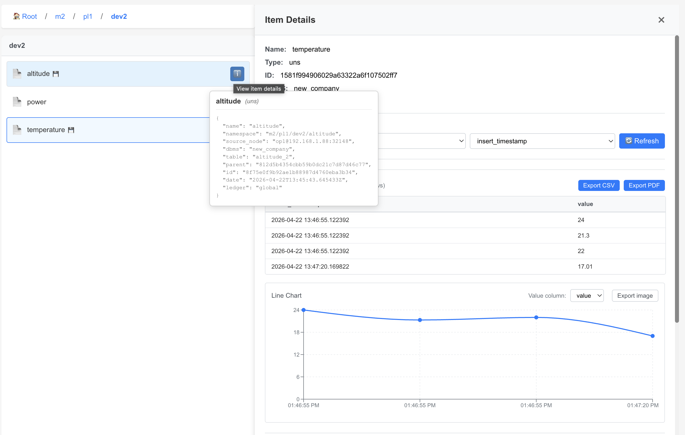

<!---
### 📜 Change Log
 **Date**   | **Name**       | **Change**       | **Version** |
 |------------|----------------|------------------|----------|
 | 2026-07-27 | Ori Shadmon    | Merged "01 UNS.md" and "UNS.md" into this single canonical file — they were near-duplicates, and "UNS.md" was already the more current of the two (its own changelog documents reconciling two *earlier* duplicate copies). Kept "UNS.md" as the base: it fixes a duplicated "see" and a stray `</a>>` artifact still present in "01 UNS.md", uses image paths matching the repo's actual `imgs/` folder (rather than "01 UNS.md"'s stale `/assets/img/` Jekyll-liquid paths), and includes an extra paragraph on why `id`/`parent` shouldn't be hand-defined for UNS policies that "01 UNS.md" was missing entirely. Flagged two open items inline: the mapping-policies cross-link path, and new evidence bearing on the `get msg client` singular/plural question raised in the Message Broker doc. | |
 | 2026-07-14 | Ori Shadmon    | Reconciled duplicate copies (13- UNS/UNS.md and 12- MCP & LLMs/ZZZ UNS.md) into one canonical version; fixed a duplicated "see" in the Auto-Generated vs. User-Defined section | |
 | 2026-04-25 |                | hyperlinks | |
 | 2026-04-18 |                | Created document; covers UNS concept, auto-generated vs user-defined, dynamic=true ingestion, and UNS policy structure | |
--->

# Unified Namespace

AnyLog's Unified Namespace (UNS) provides a logical, hierarchical view of distributed operational data.

The UNS does not require the underlying data to be reorganized, moved, or centralized. Instead, AnyLog uses metadata policies to map logical objects and relationships to operational data that remains distributed across edge nodes, databases, historians, brokers, devices, and other systems.

In AnyLog, the logical organization of data is decoupled from its physical organization. Operational data remains distributed where it is managed, while the metadata layer describes where the data is located, how it can be accessed, and how it is presented through logical views such as the UNS.

This separates two important concepts:

* Physical data organization — Operational data is distributed across AnyLog Operator nodes. Data streamed to these nodes is managed locally and does not need to be moved to or maintained in a centralized data store.
* Logical data organization — Defined by the metadata layer. The metadata describes the data and its relationships independently of where it is physically stored, allowing users, applications, and AI agents to navigate, understand, and access distributed data through a unified logical view.

As a result, the same distributed operational data can be represented through one or more logical hierarchies without changing the underlying systems.



---

## UNS Policies and Object Policies

AnyLog separates **what an object is** from **where that object appears in a logical namespace**.

These concepts are represented using two types of metadata policies:

- **Object policies** describe an object and its attributes — for example, a site, production line, machine, device, sensor, process, or other physical or logical asset.
- **UNS policies** define the logical namespace and the relationships that place objects within that hierarchy.

This separation allows an object to be described independently of a particular hierarchy and allows the same operational data to participate in different logical views.

By traversing these metadata relationships, AnyLog reconstructs the complete asset hierarchy and exposes it as a navigable UNS while the operational data remains distributed across edge systems, databases, historians, and devices.

---

## Creating a UNS

AnyLog supports three complementary ways to create a Unified Namespace. These methods can be used independently or together.

### 1. User-Defined UNS

Users can explicitly define the hierarchy using metadata policies.

For example:

```text
Enterprise
└── Site
    └── Production Line
        └── Machine
            └── Sensor
```

The hierarchy can follow a standard such as ISA-95 or any structure appropriate for the application.

This allows organizations to model operational data according to their business, engineering, or application requirements rather than being restricted by the physical organization of the source systems.

For examples of manually defined UNS policies, see [Custom UNS](./04-2%20UNS%20Custom%20Examples.md).

### 2. UNS from Existing Structures

AnyLog can derive the UNS from structures already present in operational systems and data streams.

Examples include:

- OPC-UA object hierarchies
- MQTT topic structures
- Broker topic hierarchies
- Device and sensor paths
- Existing mappings and source metadata

For example, an MQTT topic such as:

```text
M2/PL1/DEV1/power
```

already contains a hierarchy:

```text
M2
└── PL1
    └── DEV1
        └── power
```

AnyLog can use this existing structure to create the corresponding UNS metadata automatically.

### 3. AI-Generated UNS

AI can analyze available metadata, schemas, names, mappings, and operational structures and generate or extend the logical UNS.

This is particularly useful when operational data comes from multiple systems with different naming conventions or organizational models.

The resulting hierarchy is represented using the same AnyLog metadata policies as a user-defined or automatically derived UNS. AI is therefore another mechanism for creating and maintaining the metadata model rather than a separate UNS implementation.

---

## Dynamic UNS from Incoming Data

One way AnyLog derives a UNS from an existing structure is during data ingestion.

When `dynamic=true` is configured for an incoming MQTT stream, AnyLog uses the incoming topic hierarchy to dynamically create the corresponding tables and UNS metadata.

Because new metadata policies are generated, `master_node=!ledger_conn` identifies the Master Node to which those policies are published.

### Scalar Values

When no `column.*` mapping is provided, each incoming message carries a single scalar value. The MQTT topic path provides the hierarchy.

For example:

```anylog
<run msg client where
    broker = 192.168.1.88 and port = 1883 and
    master_node = !ledger_conn and
    topic = (
        name = M2/PL1/# and
        dbms = new_company and
        dynamic = true
    )>
```

Messages published to:

```text
M2/PL1/DEV1/power
M2/PL1/DEV1/active
M2/PL1/DEV1/status
```

produce a hierarchy such as:

```text
M2
└── PL1
    └── DEV1
        ├── power
        ├── active
        └── status
```

For testing with a Mosquitto broker:

```bash
mosquitto_pub -p 1883 -h 192.168.1.88 -m 98.3 -t M2/PL1/DEV1/power
mosquitto_pub -p 1883 -h 192.168.1.88 -m 1 -t M2/PL1/DEV1/active
mosquitto_pub -p 1883 -h 192.168.1.88 -m "stopped" -t M2/PL1/DEV1/status
```

### JSON Payloads with Column Mapping

If an incoming message contains multiple fields, `dynamic=true` can be combined with column mapping.

For example:

```anylog
<run msg client where
    broker=local and
    master_node=!ledger_conn and
    log=false and
    topic=(
        name=my-data and
        dbms="bring [dbms]" and
        dynamic=true and
        column.timestamp.timestamp="bring [timestamp]" and
        column.value.float="bring [value]"
    )>
```

In this case, AnyLog dynamically determines and creates the table while the `column.*` definitions determine how fields in the incoming JSON are mapped into that table.

For a detailed example of extending the incoming topic with application-specific table information, see [Dynamic Ingestion with Custom UNS](./04-1%20UNS%20Custom%20Dynamic%20Examples.md).

---

## Viewing a Dynamic UNS

The AnyLog GUI exposes the generated metadata as a navigable hierarchy.

For example, a dynamically generated hierarchy may appear as `Root / m2 / pl1 / dev2`, with measurements such as `altitude`, `power`, and `temperature`.

Selecting a measurement provides access to its data, while the associated `uns` policy identifies information such as its namespace, database, table, and source node.



The UNS therefore provides navigation and context while the underlying operational data continues to reside on the operator nodes.

---

## UNS Policy Structure

The logical hierarchy is represented using `uns` metadata policies.

A UNS policy can identify:

- the object's name,
- its complete namespace path,
- its parent in the hierarchy,
- and, where applicable, the database and table associated with the operational data.

For example, the following policies represent the hierarchy:

```text
Enterprise_C / tff / PCV7X / percent
```

### Enterprise

```json
{
  "uns": {
    "name": "Enterprise_C",
    "namespace": "Enterprise_C",
    "id": "b992dcf093661dc3dc966c6a420ac816",
    "date": "2026-02-16T19:13:14.831323Z",
    "ledger": "global"
  }
}
```

### Namespace

```json
{
  "uns": {
    "name": "tff",
    "namespace": "Enterprise_C/tff",
    "parent": "b992dcf093661dc3dc966c6a420ac816",
    "dbms": "manufacturing_historian",
    "table": "tff",
    "id": "2d8e35eaf0df9bfbdec0d112a410f24e",
    "date": "2026-02-16T19:13:33.860259Z",
    "ledger": "global"
  }
}
```

### Device

```json
{
  "uns": {
    "name": "PCV7X",
    "namespace": "Enterprise_C/tff/PCV7X",
    "parent": "2d8e35eaf0df9bfbdec0d112a410f24e",
    "dbms": "manufacturing_historian",
    "table": "tff_pcv7x",
    "id": "9a08e1c52440638803215c0c61b9d27d",
    "date": "2026-02-16T19:13:33.981368Z",
    "ledger": "global"
  }
}
```

### Sensor

```json
{
  "uns": {
    "name": "percent",
    "namespace": "Enterprise_C/tff/PCV7X/percent",
    "parent": "9a08e1c52440638803215c0c61b9d27d",
    "dbms": "manufacturing_historian",
    "table": "tff_pcv7x_percent",
    "id": "5862ae8e36ad8720baea8f3d10ea31a2",
    "date": "2026-02-16T19:13:34.098449Z",
    "ledger": "global"
  }
}
```

The `parent` attribute references the `id` of the policy above it, creating a traversable hierarchy.

AnyLog assigns the policy `id` automatically when the policy is prepared or inserted. Because `parent` references these IDs, users should normally allow AnyLog to assign them rather than manually creating IDs.

---

## Accessing Distributed Data

The UNS and SQL provide two complementary ways to access the same distributed operational data.

Users and applications can query the distributed data directly through SQL, or navigate the data through the logical UNS hierarchy.

```text
                 Users / Applications / AI
                           │
                ┌──────────┴──────────┐
                │                     │
               SQL                   UNS
                │                     │
                └──────────┬──────────┘
                           │
                  Distributed Data
```

Both approaches operate on the same underlying data.

SQL provides direct analytical access, while the UNS provides contextual navigation through logical assets and relationships.

The UNS therefore adds organization and context without requiring the operational data to be duplicated or centralized.

---

## Multiple Logical Views

Because the UNS is defined through metadata rather than by the physical organization of the data, the same operational data can participate in multiple logical views.

For example, a pump could appear in a physical hierarchy:

```text
Enterprise
└── Site A
    └── Line 2
        └── Pump 101
```

and also in an equipment-oriented hierarchy:

```text
Equipment
└── Pumps
    └── Centrifugal Pumps
        └── Pump 101
```

Both hierarchies can reference the same underlying operational data.

This allows the logical organization of the data to evolve without restructuring databases, changing ingestion pipelines, or moving the operational data.

---

## Why This Matters

AnyLog separates the **logical organization of operational data** from its **physical organization and location**.

Operational data can remain distributed across edge systems, databases, historians, brokers, and devices while the metadata provides a common description of:

- what objects exist,
- how those objects relate to one another,
- where their data is located,
- and how users, applications, and AI agents can access it.

The UNS provides the contextual navigation layer over this distributed environment, while AnyLog's distributed query capabilities provide direct access to the underlying data.

Together, they provide a unified view of operational data and context without requiring the data to be centralized.


<!---
# Unified Namespace

A <a href="https://www.iiot.university/blog/what-is-uns%3F" target="_blank">Unified Namespace (UNS)</a> is a modeling tool for organizing and
representing physical or logical assets in a structured hierarchy — similar in purpose to Historian Asset
Frameworks, but designed for decentralized, real-time operational environments.

Unlike traditional architectures where operational data must be centralized before it becomes broadly accessible,
AnyLog's UNS enables systems to interact with data as it is generated across the network. This creates a single,
consistent view of operational data that can be accessed by multiple applications simultaneously — without
requiring large-scale data movement.

From AnyLog's point of view, a UNS is metadata about the actual data stored on the blockchain. It is up to the
user to decide how and where to use it within their infrastructure.


---

## Auto-Generated vs. User-Defined

AnyLog supports two approaches to UNS creation, which can be used independently or together.

**Auto-generated UNS** — when data arrives dynamically via MQTT, OPC-UA, or other formats, AnyLog builds a
hierarchical structure automatically from the topic or path of the incoming data. This lets users drill down
the namespace tree to find any data point without any manual configuration.

**User-defined UNS** — users can define their own hierarchical structure explicitly. This supports data sources
that don't arrive dynamically and gives teams the ability to model assets in a way that reflects their own
organizational or project structure. This is an ability most historians do not support.

The UNS structure can follow a rigid standard like <a href="https://www.isa.org/standards-and-publications/isa-standards/isa-95-standard" target="_blank">ISA-95</a>,
or a more flexible project-defined hierarchy. Because AnyLog treats the UNS as a type of metadata, both approaches
can coexist — a dynamically generated namespace can be extended or paralleled with additional user-defined context.

For a working example of hand-authored UNS policies (ex. ISA-95 metadata), see
<a href="./04-2%20UNS%20Custom%20Examples.md" target="_blank">Custom UNS (data stream, ISA-95)</a>.

---

## Ingesting Data with `dynamic=true`

`dynamic=true` in a `run msg client` command replaces specifying a fixed `table=...` — instead of you naming the
destination table, AnyLog derives and auto-creates it, and generates a UNS structure for it as part of the
blockchain's metadata. That's independent of whether you also provide column mapping (`column.*`); there are two
distinct cases depending on the shape of the incoming payload.

Because `dynamic=true` always needs to publish the auto-generated table/UNS policy to the blockchain, every example
below includes `master_node = !ledger_conn` — that's required for `dynamic=true` specifically, unlike plain inline
or policy-based mapping, which don't create new policies and so don't need it.

### Case 1: no column mapping — single scalar value per message

When no `column.*` mapping is given, AnyLog expects each incoming message to carry a **single scalar value**
(integer, float, string, or boolean) rather than a full JSON payload — similar to how OPC-UA data is handled. The
topic path itself becomes the namespace, and each topic segment gets its own table.

```anylog
<run msg client where
    broker = 172.104.228.251 and port = 1883 and
    user = anyloguser and password = mqtt4AnyLog! and
    master_node = !ledger_conn and log = false and
    topic = (
        name = "Enterprise C/tff/PCV7X/#" and
        dbms = !default_dbms and
        dynamic = true
    )>
```

In the example above, the `#` wildcard subscribes to all topics under `Enterprise C/tff/PCV7X`.

Each arriving message — for example `Enterprise C/tff/PCV7X/percent` with value `50` — is stored directly using the
topic path as the namespace address, with no mapping policy required.

### Case 2: with column mapping — a JSON payload with multiple key/value pairs

If the incoming JSON instead carries multiple fields, combine `dynamic=true` with explicit column mapping. Instead
of exploding the topic hierarchy into many single-value tables, this produces one (dynamically named/created) table
per topic holding all the mapped columns.

Instead of the fixed-table, inline-mapping form:
```anylog
<run msg client where 
  broker=local and 
  log=false and topic=(
   name=my-data and
   dbms="bring [dbms]" and
   table="bring [sensor]" and
   column.timestamp.timestamp="bring [timestamp]" and
   column.value.float="bring [value]"
)>
```

`table="bring [sensor]"` is replaced with `dynamic=true`, and `master_node` is added (per the note above):
```anylog
<run msg client where 
  broker=local and master_node = !ledger_conn and
  log=false and topic=(
   name=my-data and
   dbms="bring [dbms]" and
   dynamic=true and
   column.timestamp.timestamp="bring [timestamp]" and
   column.value.float="bring [value]"
)>
```

If the topic itself carries multiple distinct measurements (rather than one clean value per topic), `dynamic=true`
alone would collapse them into a single table per topic — since it only knows how to walk the topic string segment
by segment. To split them into separate tables, extract a per-row `table` field from the payload and let it act as
one more segment beyond the raw topic; see
<a href="./04-1%20UNS%20Custom%20Dynamic%20Examples.md" target="_blank">Dynamic Ingestion with Custom UNS — Factory Floor Example</a> for a full traced
walkthrough of exactly how that works, down to the blockchain queries showing where the raw topic ends and the
personalized `table` field takes over.

### Example: ProveIt virtual factory (authenticated MQTT)

The **ProveIt** demo MQTT broker **`virtualfactory.proveit.services`** exposes read-only credentials. Point
**`master_node`** at your AnyLog master (here **`192.168.1.88:32048`**). Use **`dynamic=true`** on topic
**`Enterprise B/Metric/input/#`** and logical DBMS **`new_company_b`** (connect that DBMS on the operator before
starting the client, if needed).

```anylog
<run msg client where
    broker = virtualfactory.proveit.services and port = 1883 and
    user = proveitreadonly and password = proveitreadonlypassword and
    master_node = !ledger_conn and
    topic = (
        name = "Enterprise B/Metric/input/#" and
        dbms = new_company_b and
        dynamic = true
    )>
```

### Example: Mosquitto (dev) on a LAN broker

<a href="https://mosquitto.org/" target="_blank">Mosquitto</a> is a common MQTT broker for local development. In this pattern, Mosquitto
listens on **`192.168.1.88:1883`**, and the AnyLog **master** (ledger) is reachable at **`192.168.1.88:32048`**.
Connect the logical DBMS on the operator, then start the message client with **`dynamic=true`** so topic paths
under **`M2/PL1/`** drive auto-generated UNS and storage under **`new_company`**.

```anylog
connect dbms new_company where type = sqlite
```

```anylog
<run msg client where
    broker = 192.168.1.88 and port = 1883 and
    master_node = !ledger_conn and
    topic = (
        name = M2/PL1/# and
        dbms = new_company and
        dynamic = true
    )>
```

With the <a href="https://mosquitto.org/download/" target="_blank">Mosquitto clients</a> installed, you can publish scalar payloads to the
same broker for testing (`-m` is the message body, `-t` is the topic):

```bash
mosquitto_pub -p 1883 -h 192.168.1.88 -m 98.3 -t M2/PL1/DEV1/power
mosquitto_pub -p 1883 -h 192.168.1.88 -m 1 -t M2/PL1/DEV1/active
mosquitto_pub -p 1883 -h 192.168.1.88 -m "stopped" -t M2/PL1/DEV1/status
```

On the operator, **`get msg client`** shows the subscription, message counters, and how **`dynamic=true`**
materialized topics into tables under **`new_company`**:

```text
AL op1 > get msg client

Subscription ID: 0001
User:         unused
Broker:       192.168.1.88:1883
Connection:   Connected

     Messages    Success     Errors      Last message time    Last error time      Last Error
     ----------  ----------  ----------  -------------------  -------------------  ----------------------------------
             32          32           0  2026-04-22 13:41:43

     Subscribed Topics:
     Topic                Dynamic QOS DBMS        Table      Column name Column Type Mapping Function Optional Policies
     --------------------|-------|---|-----------|----------|-----------|-----------|----------------|--------|--------|
     M2/PL1/#            |True   |  0|new_company|          |           |           |                |        |        |
     M2/PL1/DEV1         |True   |  0|new_company|dev1_1    |           |           |                |        |        |
     M2/PL1/DEV1/power   |True   |  0|new_company|power_1   |           |           |                |        |        |
     M2/PL1/DEV1/active  |True   |  0|new_company|active_1  |           |           |                |        |        |
     M2/PL1/DEV1/status  |True   |  0|new_company|status_1  |           |           |                |        |        |
     M2/PL1/DEV1/altitude|True   |  0|new_company|altitude_1|           |           |                |        |        |

AL op1 >
```
> **Note:** this transcript runs `get msg client` (singular, no `where` filter) and gets the full unfiltered
> subscription list back. That's worth reconciling with the Message Broker doc, where the unfiltered/list-all form
> was changed to `get msg clients` (plural) based on the Background Processes doc's convention — this real captured
> session is evidence the singular form may work fine unfiltered too. Worth settling in one place rather than each
> doc guessing independently.

**`get streaming`** shows streaming statistics for the same dynamic tables (rows staged, buffer fill, time until
the next process cycle):

```text
AL op1 > get streaming

Statistics
                       Put    Put     Streaming Streaming Cached Counter    Threshold   Buffer   Threshold  Time Left Last Process
DBMS-Table             files  Rows    Calls     Rows      Rows   Immediate  Volume(KB)  Fill(%)  Time(sec)  (Sec)     HH:MM:SS
----------------------|------|-----|-|---------|---------|------|----------|-----------|--------|----------|---------|------------|
new_company.power_1   |     0|    0| |       17|       17|     0|         0|         10|     0.0|        10|       10|00:01:19    |
new_company.active_1  |     0|    0| |        3|        3|     0|         0|         10|     0.0|        10|       10|00:06:33    |
new_company.status_1  |     0|    0| |        2|        2|     0|         0|         10|     0.0|        10|       10|00:07:00    |
new_company.altitude_1|     0|    0| |       10|       10|     0|         0|         10|     0.0|        10|       10|00:01:16    |

AL op1 >
```

In the **Remote GUI**, the same dynamic hierarchy appears as a drill-down tree — for example
**`Root / m2 / pl1 / dev2`** with leaves such as **`altitude`**, **`power`**, and **`temperature`**. **Item
Details** shows recent scalar samples and a chart for the selected metric. Hovering a leaf surfaces the **`uns`**
policy: **`namespace`** (for example **`m2/pl1/dev2/altitude`**), **`dbms`** (**`new_company`**), **`table`**
(**`altitude_2`**), and **`source_node`** (**`op1@192.168.1.88:32148`**), consistent with ingestion from the
operator on **`192.168.1.88`**.


The **`#`** multi-level wildcard subscribes to every topic under `M2/PL1/` (for example `M2/PL1/temperature` with
a scalar payload). Replace host, ports, topic prefix, **`dbms`**, and **`master_node`** with the values for your
environment (you can use **`master_node = !ledger_conn`** if that is already set in the dictionary).

| Mode | Input format | Schema required | Table | UNS generated |
|:---|:---:|:---:|:---:|:---:|
| Inline mapping | Full JSON | Yes (inline) | Fixed (`table=...`) | No |
| Policy mapping | Full JSON | Yes (policy) | Fixed (`table=...`) | No |
| `dynamic=true`, no column mapping | Scalar value | No | Auto, per topic segment | Yes (auto) |
| `dynamic=true`, with column mapping | Full JSON | Yes (inline `column.*`) | Auto, per topic | Yes (auto) |

> For mapping-based ingestion, see <a href="../04-%20Southbound%20Interfaces/02-%20Mapping%20Policy.md" target="_blank">Mapping Policy</a>.
> **To verify:** the prior draft of this link pointed at `../06- Data Management/A- Data Ingestion/Mapping Data to
> Tables.md` instead — a different path entirely. Pointed this at the Mapping Policy doc built this session since
> it covers the same ground, but neither path is confirmed against the current repo layout — check before shipping.

---

## UNS Policy Structure

Whether auto-generated or user-defined, each level of the namespace hierarchy is represented as a `uns` policy
stored on the blockchain. Each policy captures the node's name, its full namespace path, its level in the
hierarchy, and — at the lower levels — the database and table where the data lives.

### Hierarchy levels

A typical UNS follows four levels:

| Level | Description |
|:---|:---|
| `enterprise` | Top-level organizational unit |
| `namespace` | A system, process, or site within the enterprise |
| `device` | A physical or logical device within the namespace |
| `sensor` | An individual measurement point on a device |

### Example policies

The following shows the UNS policies generated for `Enterprise C / tff / PCV7X / percent`:

**Enterprise level:**
```json
{
    "uns": {
        "name": "Enterprise_C",
        "namespace": "Enterprise_C",
        "id": "b992dcf093661dc3dc966c6a420ac816",
        "date": "2026-02-16T19:13:14.831323Z",
        "ledger": "global"
    }
}
```

**Namespace level** — links to a database and table:
```json
{
    "uns": {
        "name": "tff",
        "namespace": "Enterprise_C/tff",
        "parent": "b992dcf093661dc3dc966c6a420ac816",
        "dbms": "manufacturing_historian",
        "table": "tff",
        "id": "2d8e35eaf0df9bfbdec0d112a410f24e",
        "date": "2026-02-16T19:13:33.860259Z",
        "ledger": "global"
    }
}
```

**Device level:**
```json
{
    "uns": {
        "name": "PCV7X",
        "namespace": "Enterprise_C/tff/PCV7X",
        "parent": "2d8e35eaf0df9bfbdec0d112a410f24e",
        "dbms": "manufacturing_historian",
        "table": "tff_pcv7x",
        "id": "9a08e1c52440638803215c0c61b9d27d",
        "date": "2026-02-16T19:13:33.981368Z",
        "ledger": "global"
    }
}
```

**Sensor level** — the leaf node where data is ultimately stored:
```json
{
    "uns": {
        "name": "percent",
        "namespace": "Enterprise_C/tff/PCV7X/percent",
        "parent": "9a08e1c52440638803215c0c61b9d27d",
        "dbms": "manufacturing_historian",
        "table": "tff_pcv7x_percent",
        "id": "5862ae8e36ad8720baea8f3d10ea31a2",
        "date": "2026-02-16T19:13:34.098449Z",
        "ledger": "global"
    }
}
```

Each policy links to its parent via `parent` (the parent policy's `id`), forming a traversable tree. Because
these policies live on the blockchain, the hierarchy is immutable and consistent for any consumer — whether
that's an analyst, a monitoring dashboard, or an AI agent — regardless of whether the underlying device has
changed its name, IP address, or hardware vendor.

The id on each policy is assigned automatically by AnyLog when the policy is signed and inserted, based on a hash of
the policy's own content. While it's technically possible to define id yourself, it's not recommended when working
with UNS — id is the connection between layers, and parent is nothing more than a copy of the level above's actual
assigned id. If a parent value is hand-typed, guessed, or reused from another policy's id, the UNS structure can end
up broken or incomplete. From a user's point of view, the UNS is simply its namespace hierarchy; underneath, that
hierarchy exists only because each level is wired to the next through id and parent.

---

## Why This Matters

The practical value of UNS becomes clearest when thinking about who/what is consuming the data.
People are generally forgiving about data formats, but AI and automation systems perform significantly better
when data is returned in a consistent, predictable structure.

AnyLog addresses this in two ways:

All data retrieval from nodes happens through SQL queries against the network. The interface is always the same
regardless of what's underneath — whether blob data stored in S3-compatible buckets or time-series data in
SQLite or PostgresSQL.

The UNS lives in the metadata layer on the blockchain, which means it is guaranteed to be present and
consistent for anyone querying the system. This allows both users and AI agents to reliably drill down to
information about a specific device or sensor — even if that device has changed its name, IP, or manufacturer
(for example, switching from a Siemens PLC to a Schneider).

Combining this with AnyLog's decentralized architecture removes the bottleneck of routing data through a
central platform, so analytics can happen where the data lives, at the speed it is being generated.

--->