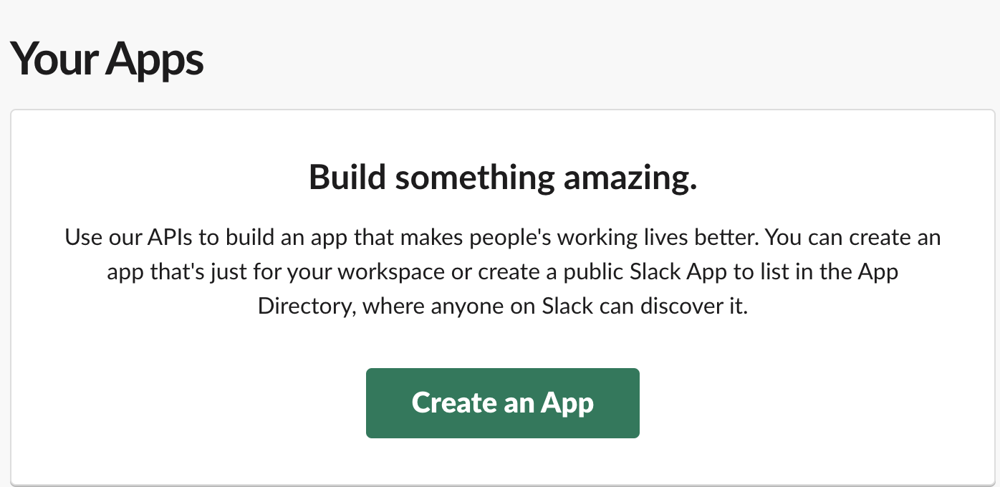
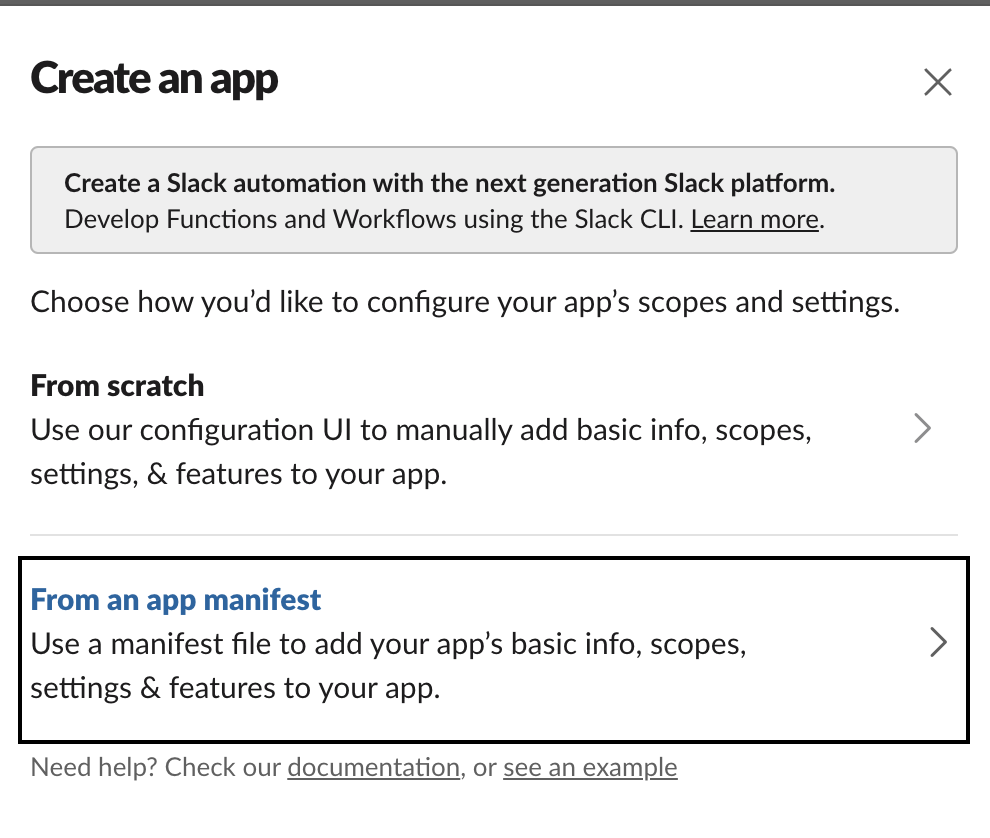
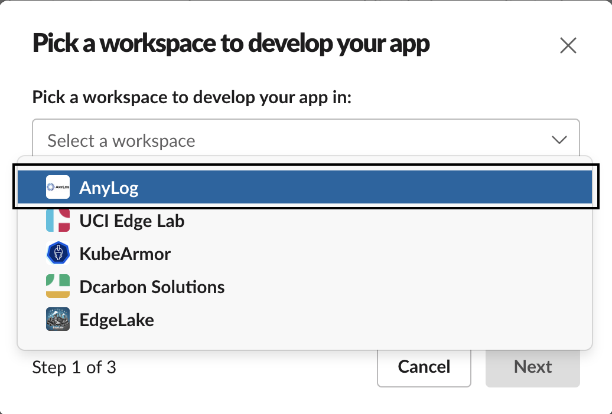
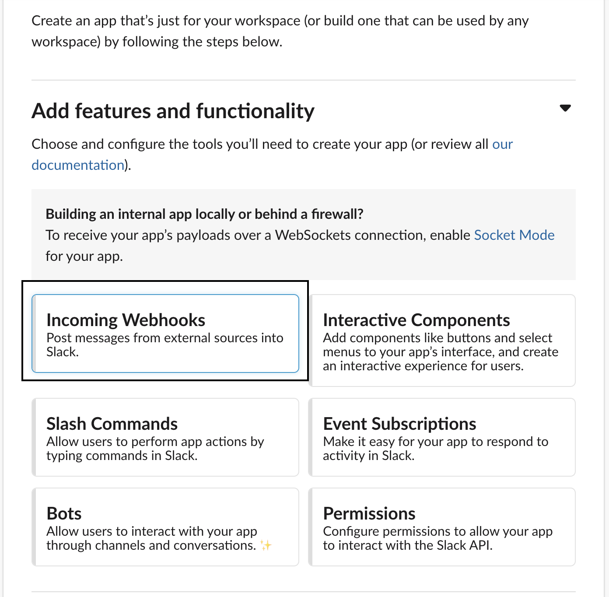
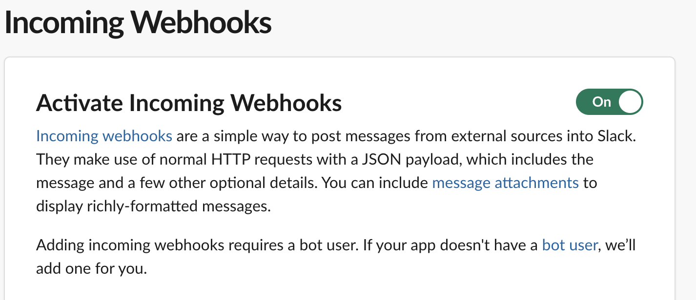
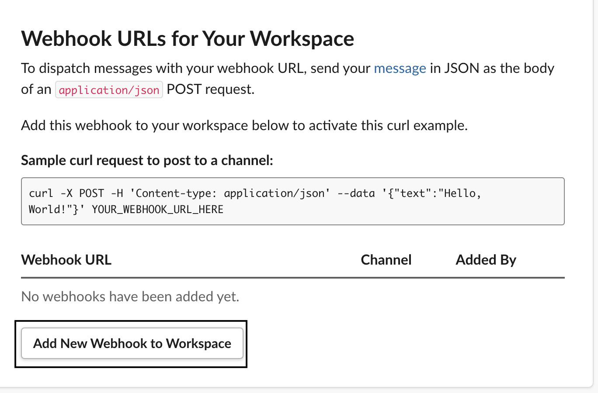
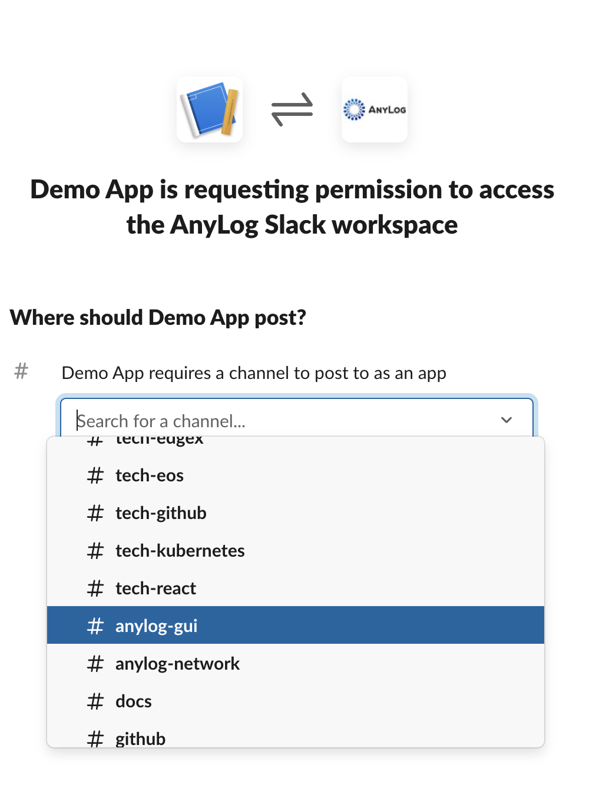
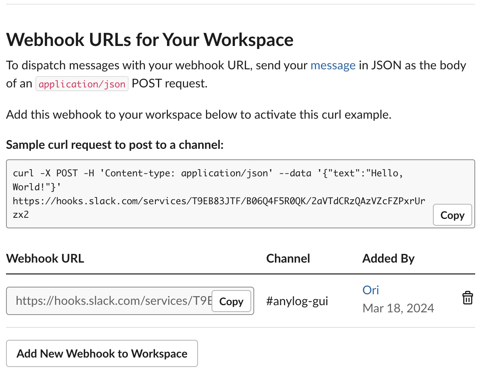

<!--
## Changelog
- 2026-04-17 | Created document
- 2026-07-07 | Merged with legacy Notifications.md; added Automating Notifications with Scripts section
--> 

AnyLog provides services like _REST_, _SMS_ and _STMP_ (eMail) in order allow your network to send notifications regarding 
the system; this can be things like CPU utilization, data not coming in or simply when ever a partition is being dropped / created.


## Setting up Webhooks

_Webhooks_ are user-defined _HTTP_ callbacks that enable real-time communication between web applications; they are the
simplest and fastest way to send messages into third-party applications as it simply uses a _REST_ (post) request as 
opposed to needing to develop a full application for messaging.

* [Slack](https://api.slack.com/messaging/webhooks)
* [Telegram](https://core.telegram.org/bots/api)
* [Pushover](https://pushover.net/api)
* [Discord](https://docs.gitlab.com/ee/user/project/integrations/discord_notifications.html#create-webhook)
* [Microsoft Teams](https://learn.microsoft.com/en-us/microsoftteams/platform/webhooks-and-connectors/how-to/add-incoming-webhook?tabs=newteams%2Cdotnet)
* [Google Hangouts](https://developers.google.com/workspace/chat/quickstart/webhooks)


### Steps
<ol>
  <li>
    Go to <a href="https://api.slack.com/apps/" target="_blank">https://api.slack.com/apps/</a>.
  </li>
  <li>
    Under <i>Create</i>, create an app from manifest.
    <table>
      <tr>
        <td align="center"></td>
        <td align="center"></td>
      </tr>
    </table>
  </li>
  <li>
    Select the preferred channel.
    <br />
    
  </li>
  <li>Press continue / next till the end.</li>
  <li>
    Select <i>Incoming Webhooks</i>.
    <br />
    
  </li>
  <li>
    Enable Webhooks.
    <br />
    
  </li>
  <li>
    At the bottom, add <i>Webhook</i> to the workspace.
    <br />
    
  </li>
  <li>
    Select which channel in Slack to send messages to.
    <br />
    
  </li>
  <li>
    When done, you should see a <i>webhook</i> URL. This will be used as part of your REST request in AnyLog.
    <br />
    
  </li>
</ol>


**Generated URL**: 
```URL
https://hooks.slack.com/services/T9EB83JTF/B06Q4F5R0QK/<token> 
```

## Send Notifications via AnyLog

### Slack Webhooks
AnyLog allows to send cURL requests the <a href="{{ '/docs/Querying-Data-Northbound/anylog%20commands/#rest-command' | relative_url }}">_rest_ command</a>. Since _Webhooks_ are 
essentially URLs to send messages into a system, we'll be using the _rest_ command to send notifictaions from AnyLog into
Slack.

1. Create webhook URL as a variable 
```anylog
webhook_url = "https://hooks.slack.com/services/T9EB83JTF/<token>"
```

2. get percentage of CPU used and current timestamp  
```anylog
cpu_percent = get node info cpu_percent
date_time = python "datetime.datetime.utcnow().strftime('%Y-%m-%d %H:%M:%S.%f')"
```

3. Create payload
```anylog
text_msg = !date_time + "  CPU usage: " + !cpu_percent 
payload = json {"text": !text_msg}
```

4. Publish information to Slack via _REST_
```anylog
rest post where url = !webhook_url and body = !payload and headers = "{'Content-Type': 'application/json'}" 
```

Once sent, an output would appear in the proper Slack channel


**Note**: _Google Hangouts_, _Discord_ and _Microsoft Teams_ use `content` for the _payload_ key as opposed to `text`. 

### Telegram

Create a bot via <a href="https://t.me/BotFather" target="_blank">@BotFather</a> to obtain an `API_TOKEN`. Use your `CHAT_ID` (or a group chat ID) as the destination for messages.

```anylog
rest post where url = https://api.telegram.org/bot[API_TOKEN]/sendMessage and headers = {"Content-Type": "application/json"} and body = {"chat_id":"[CHAT_ID]","text":"Door ALARM"}
```

The `text` field in the body can be any alert message. Use this command directly, in a scheduled task, or as the action in a <a href="{{ '/docs/Monitoring-Operations/node-monitoring/#streaming-conditions-real-time-alerts' | relative_url }}">streaming condition</a>.

**Note**: the example above uses a literal (hard-coded) body, which is safe to post as-is. If you build the body from
variables instead (as the scripts below do), assign it with the `json` keyword rather than a bare `{...}` literal:

```anylog
telegram_body = json {"chat_id": !chat_id, "text": !message}
rest post where url = !msg_url and headers = {"Content-Type": "application/json"} and body = !telegram_body
```

Without the `json` prefix, `!telegram_body` is stored as a literal string containing the unresolved `!chat_id` / 
`!message` tokens rather than their actual values. AnyLog's own error log won't show anything wrong — the request still 
goes out — but Telegram will silently reject it since the body isn't valid JSON with real values. Always check the 
variable back (e.g. `!telegram_body`, or `json !telegram_body`) before relying on it in a script.

### Pushover

Register at <a href="https://pushover.net/" target="_blank">pushover.net</a> to obtain an application `API_TOKEN` and a user or group `USER/GROUP_ID`.

```anylog
rest post where url = https://api.pushover.net/1/messages.json and headers = {"Content-Type":"application/json"} and body = {"token":"[API_TOKEN]","user":"[USER/GROUP_ID]","message":"Test 1"}
```

Replace `message` with your alert text. Pushover also supports optional fields such as `title`, `priority`, and 
`sound` — see the <a href="https://pushover.net/api#messages" target="_blank">Pushover API</a> for the full list. 
The same `json {...}` assignment note above applies here too if you're building the body from variables.


## Automating Notifications with Scripts

The examples above are one-off or manually-triggered `rest post` calls. In practice, notifications are usually driven
by a **scheduled script** that queries data on a Query node (via `system_query`, since it needs to scan across
operator node(s)) and only sends a message when something looks wrong.

As such, while the process could be automated, the configurations need to be manually defined per script /
`process` as status regarding different types of information may need to be sent to different people.

For example, insight regarding the amount of space left on the disk would probably need a notification to the IT
department, while a faucet being turned off would need to notify a water engineer.

* <a href="https://github.com/AnyLog-co/deployment-scripts/blob/os-dev/sample-scripts/notifications/row_count.al" target="_blank">Row Count</a> - Scan all the tables on the blockchain (based on the metadata) and check the row count
* <a href="https://github.com/AnyLog-co/deployment-scripts/blob/os-dev/sample-scripts/notifications/smart_city_sensor_state.al" target="_blank">Check sensor</a> - If a sensor is expected to return a static value, send a notification if said value changes

### The Script

1. Define params — these need to be defined per process

```anylog
:set-params:
# logical database and/or table to check
alert_dbms = ""
alert_table = ""
# value a result is expected to match (or deviate from) to trigger an alert
expected_value = ""

# publish msg configs
# which notification backend to use: "telegram" or "pushover"
msg_type = ""

# REST endpoint for the notification service (Telegram/Pushover API URL)
msg_url = ""
# Telegram chat ID to send the alert message to (telegram only)
chat_id = ""
# Pushover application token (pushover only)
msg_token = ""
# Pushover user key (pushover only)
msg_user = ""
```

2. Get result from query — the query itself is specific to whatever's being checked (a row count, a sensor reading, a
disk-space metric, etc.), but the shape of running it and waiting on it is the same regardless

```anylog
query_result = run client () sql !alert_dbms format=json:list and stat=false "select ... from !alert_table where ..."

# there's a need to wait for a response before continuing with result analysis
wait 30 for !query_result        # Wait up to 30 seconds
```

3. Iterate through the results returned and check the returned versus expected value — note that when multiple
columns are returned we can skip the keys that are less important for data analysis

```anylog
for loop start where list = !query_result
    keys = json !query_result[+] keys
    for loop start where list = !keys
        value = ""
        key = !keys[+]
        if !key != row_id and !key != insert_timestamp and !key != tsd_name and !key != tsd_id and !key != timestamp then
        do value = from !query_result[+] bring [!key]
        if !value != "" and !value != !expected_value then
        do message = "ALERT name=" + !key + " value=" + !value
        do call send-msg
    for loop end
for loop end
```

4. If a value doesn't match, send the message via Pushover or Telegram

```anylog
:send-msg:
if !msg_type == telegram then
do on error goto telegram-err
do telegram_body = json {"chat_id": !chat_id, "text": !message}
do rest post where url = !msg_url and headers = {"Content-Type": "application/json"} and body = !telegram_body

else if !msg_type == pushover then
else do on error goto pushover-err
else do pushover_body = json {"token": !msg_token, "user": !msg_user, "message": !message}
else do rest post where url = !msg_url and headers = {"Content-Type": "application/json"} and body = !pushover_body
```

5. Run it once, or register it as a recurring scheduled task — a query only reflects data as of the moment it runs, so
the check needs to repeat on an interval matched to how quickly the underlying condition (a staleness window, a
sensor flipping state, disk space filling up) could change and go unnoticed between checks

```anylog
# Run once, ad-hoc:
process !local_scripts/smart-city/wp_digital_notification.al

# Or register as a recurring scheduled task:
schedule name = wp-digital-alert and time = 15 minutes and task process !local_scripts/smart-city/wp_digital_notification.al
```

### A note on running multiple copies

Because AnyLog script variables are shared/global on a node, every deployed copy of this script needs its own
variable namespace if more than one copy runs concurrently — for example, one script per table, or the same table
routed to two different destinations. Prefix every variable in a given copy (`alert_dbms`, `alert_table`,
`expected_value`, `msg_type`, `msg_url`, `chat_id`, `msg_token`, `msg_user`, and the working variables `query_result`,
`keys`, `value`, `message`) with something unique to that deployment, e.g. `wp_alert_dbms`, `wwp_alert_dbms`. Rename
consistently across the entire script — `set-params`, the query/analysis loop, and `send-msg` all need to agree — and
avoid reusing another deployed script's prefix, even if it happens to point at the same destination.
