# AnyLog with PowerBI + Microsoft Office Suite 

The following provides insight as to how to generate graphs and images using [Microsoft PowerBI](https://powerbi.microsoft.com/en-us/downloads/) with data from AnyLog. 
The same process can be done with _Excel_ and other Microsoft tools. 

## Sample REST request
In order to support PowerBI, return data as a list of JSON values without the statistical information.


**Sample cURL request**
```bash
 curl -X GET 10.1.2.10:2149 \
    -H 'command: sql aiops format=json:list and stat=false "SELECT date(timestamp) as timestamp, min(value) as min, avg(value) as avg, max(value) as max FROM lic1_mv group by timestamp ORDER by timestamp limit 10"' \
    -H "User-Agent: AnyLog/1.23" \ 
    -H "destination: network" -w "\n"
```

**Sample Output** (the data is returned as a list of JSON objects).
```json
[
    {"timestamp": "2021-12-17", "min": 16.07562231854013, "avg": 16.07562231854013, "max": 16.07562231854013},
    {"timestamp": "2021-12-18", "min": 0.7819949317261932, "avg": 37.58098167042068, "max": 85.13897566679766},
    {"timestamp": "2021-12-22", "min": 3.545549704985503, "avg": 44.07391736121831, "max": 75.688516046041},
    {"timestamp": "2021-12-23", "min": 30.13388089233143, "avg": 54.983077931262265, "max": 84.77061503184196},
    {"timestamp": "2021-12-29", "min": 17.614363625825547, "avg": 47.44901351353519, "max": 79.27651061410472},
    {"timestamp": "2021-12-30", "min": 12.324781800659816, "avg": 45.14157473898287, "max": 78.54948001563031},
    {"timestamp": "2022-01-01", "min": 19.389259167237835, "avg": 62.144516285293186, "max": 98.28053568049772},
    {"timestamp": "2022-01-02", "min": 50.596673938692426, "avg": 50.596673938692426, "max": 50.596673938692426},
    {"timestamp": "2022-01-08", "min": 53.17291222256768, "avg": 78.21358089166576, "max": 93.42429844531414},
    {"timestamp": "2022-01-09", "min": 54.664901456750904, "avg": 75.73146536262269, "max": 96.79802926849446}
]
```

## Using PowerBI

1. Under _Get Data_ open _Web_
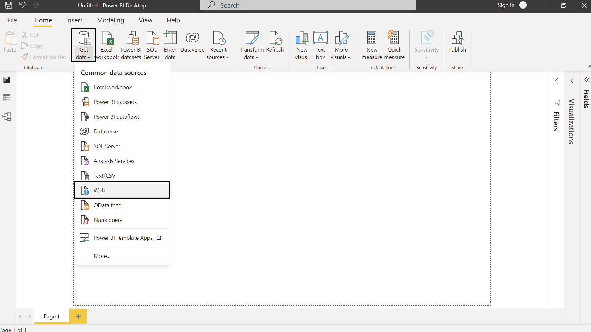


2. In the Advanced option fill-out the _URL_, and _HEADER_ Parameters with "command", "User-Agent" and "destination".
Once the form is filled out press "OK"
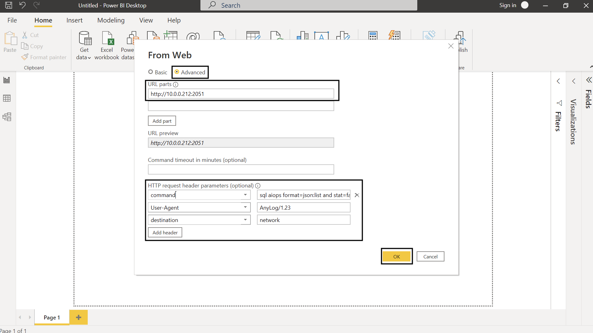


3. Right-click and & select JSON
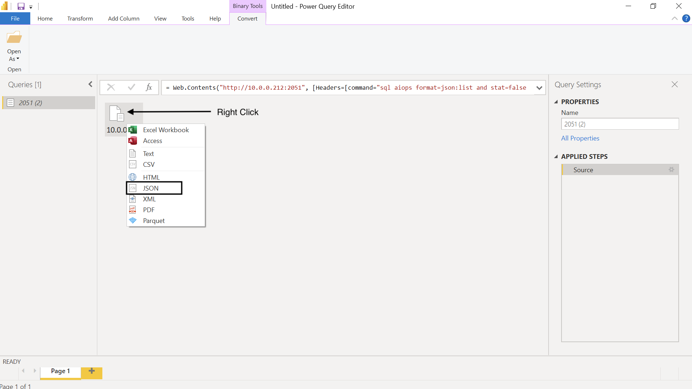


4. Right-click on **List** & select _To Table_


5. Keep defaults (None) and press "OK"
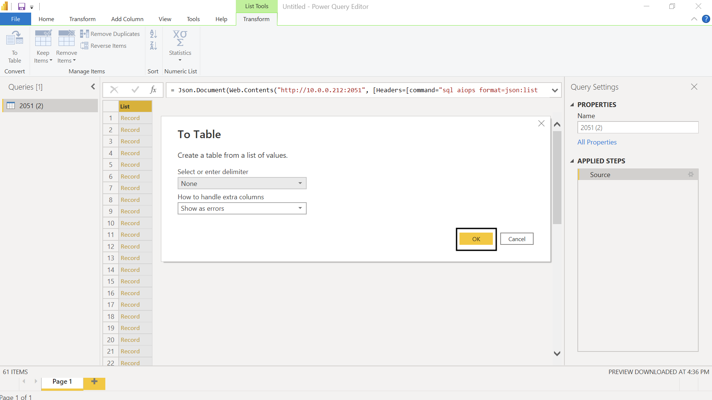


6. Press the button on the right of the column to view list of columns. 
This will show the different JSON keys that’ll be converted to table columns

| 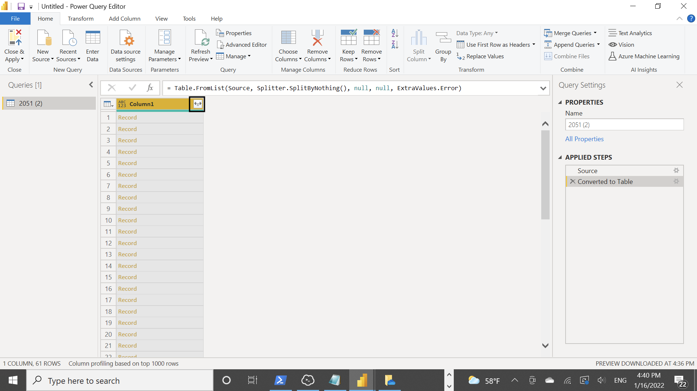 | 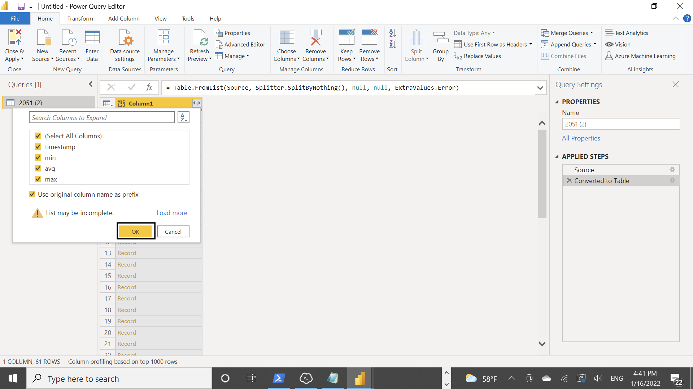 |
| --- | --- |

7. For each column, you should update to the correct data-type otherwise PowerBI will assume the data type is string
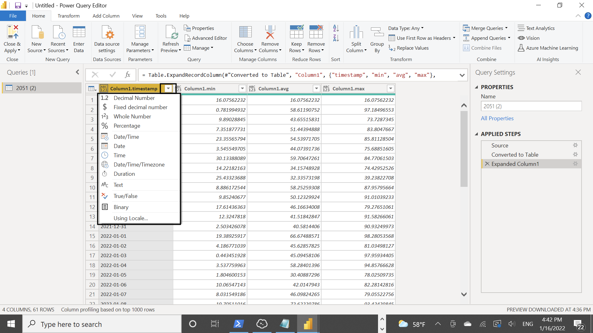


8. Once updated press Close & Apply
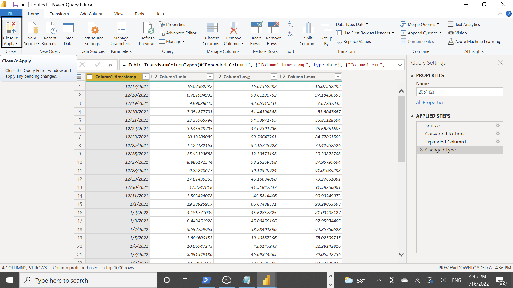


9. From this point you should be able to draw tables & graphs with the data
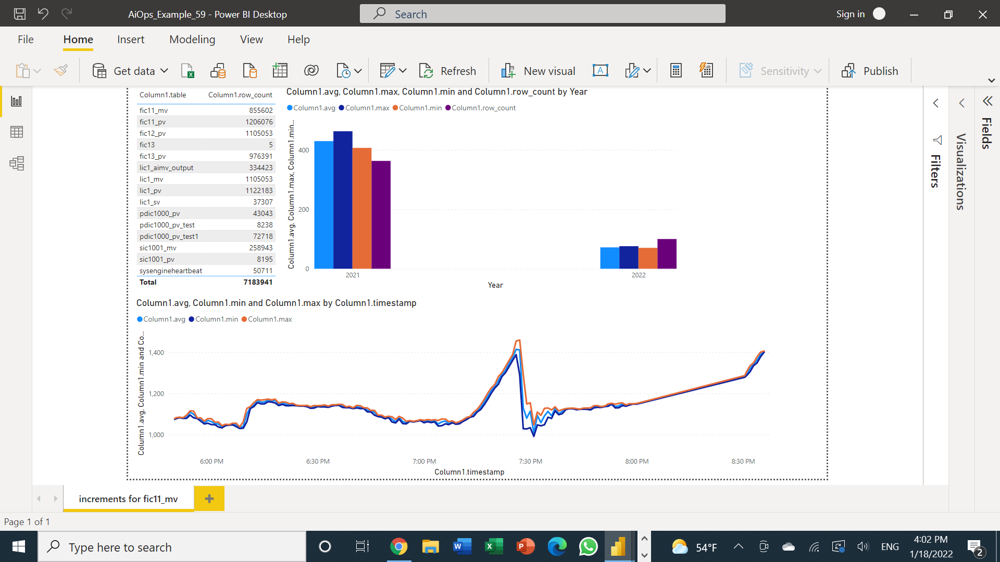
The following shows 3 diagrams, each is assigned to its own query
   * The table shows number of rows per table in the database
   * The bar graph shows _MIN_, _MAX_, _AVG_ and _Row Count_ difference between 2021 and 2022. 
   * The line graph uses [increments function](queries.md#the-increment-function) to _MIN_, _MAX_ and _AVG_ over time 


## Using Excel and other Microsft Office tools to view data
1. Under the _Data_ tab select the "Web" Data Source
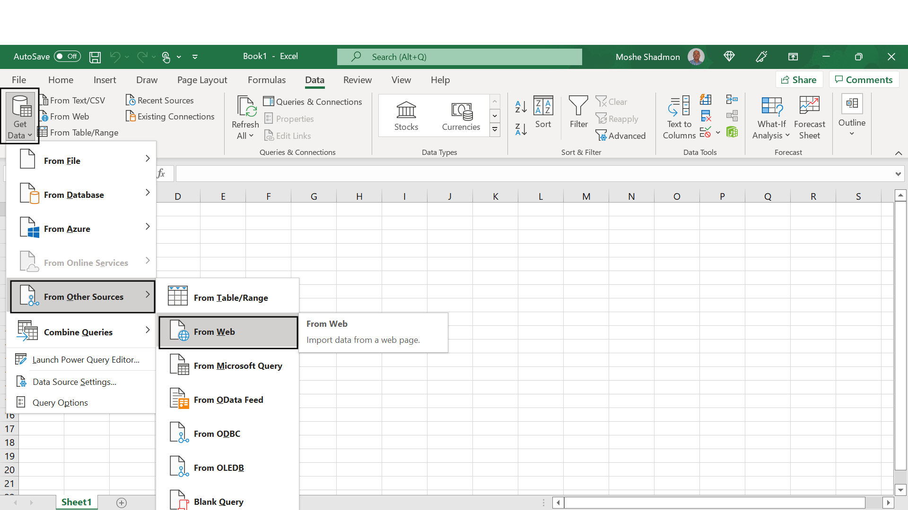

2. In the Advanced option fill-out the _URL_, and _HEADER_ Parameters with "command", "User-Agent" and "destination".
Once the form is filled out press "OK"
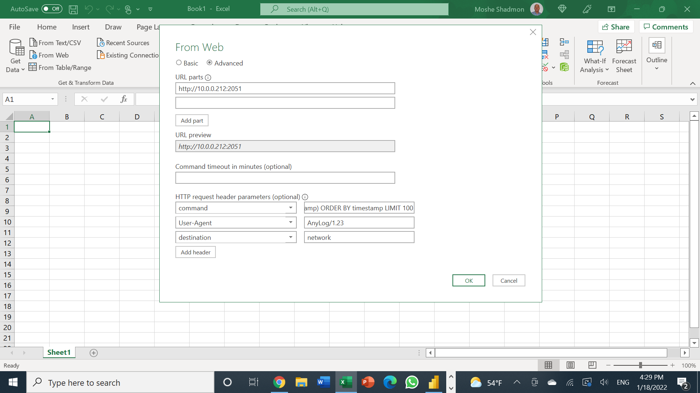

3. Right-click on **List** & select _To Table_


4. Keep defaults (None) and press "OK"


5. Press the button on the right of the column to view list of columns. 
This will show the different JSON keys that’ll be converted to table columns

|  |  |
| --- | --- |


6. For each column, you should update to the correct data-type otherwise PowerBI will assume the data type is string


7. Once updated press Close & Apply


8. From this point you should be able to draw tables & graphs with the data 

The diagram uses a single query with [period function](queries.md#the-period-function) to generate both the table and graph


## Error Handling 
When converting raw content into _Text_, [PowerQuery Editor](https://docs.microsoft.com/en-us/power-query/power-query-ui)
will show results. However, it will not separate the JSON keys into seperate columns
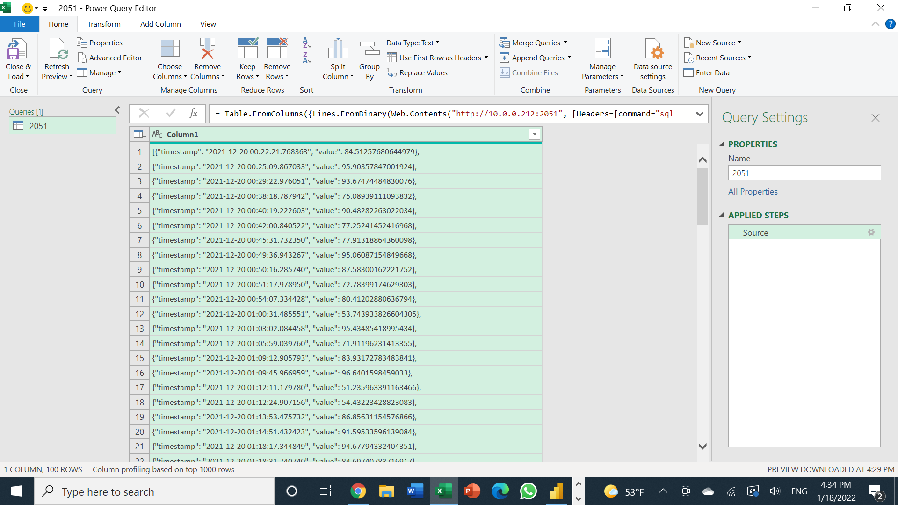