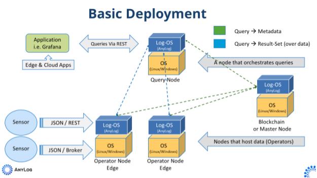

<!---
Large scale changes: 
  - June / July 2026    | Eric | reorged the documentation
  - July / August 2026  | Ori  | reorged the documentation 
  - July 24-Aug 25 2026 | Ori  | updated hyperlinks for URLs 
--->

  
 

 AnyLog is a Real-Time Visibility and Management platform for distributed edge data, 
applications, and infrastructure

AnyLog transforms the edge into a scalable data tier optimized for IoT and time-series data, enabling organizations to 
extract real-time insights for virtually any use case. Industries such as Manufacturing, Utilities, Oil & Gas, Retail, 
Robotics, Smart Cities, Automotive, and others can all benefit from this capability.

By deploying AnyLog at the edge, each node becomes part of a peer-to-peer (P2P) network that enables unified access to 
distributed IoT data—as if it were all managed on a single machine. This architecture introduces two key tiers
* **Tier 1**: A physical tier that automates data management directly on the edge nodes. 
* **Tier 2**: A virtualized tier that enables seamless access to the distributed data from a single point.

This setup delivers a cloud-like experience for the distributed edge—making IoT data accessible in real time, from 
anywhere, at any time, and for any use case. Importantly, it eliminates the need to move data or commit to specific 
cloud providers, applications, or hardware platforms.

To receive additional info, email to: [info@anylog.co](mailto:info@anylog.co)

  

  <strong>Figure:</strong> A sample AnyLog deployment showing two data storage operators, a query agent, and a metadata agent (master node)
  (which can be replaced by a blockchain layer). This setup delivers a cloud-like experience at the edge, making real-time
  IoT data accessible from anywhere, at any time, and for any use case—without the need to move data or commit to specific
  cloud providers, applications, or hardware.

<!-- TOC:START - auto-generated by generate_toc.py, do not hand-edit -->
## Table of Contents

- [Getting Started](01-%20Getting%20Started/)
  - [Introduction.md](01-%20Getting%20Started/01-%20Introduction.md)
  - [Prerequisite.md](01-%20Getting%20Started/02-%20Prerequisite.md)
  - [install.md](01-%20Getting%20Started/03-%20install.md)
- [Installation & Deployment](02-%20Installation%20%26%20Deployment/)
  - [Install.md](02-%20Installation%20%26%20Deployment/01-%20Install.md)
  - [Virtualization](02-%20Installation%20%26%20Deployment/02-%20Virtualization/)
    - [Docker.md](02-%20Installation%20%26%20Deployment/02-%20Virtualization/01-%20Docker.md)
    - [Installing the VM OVA.md](02-%20Installation%20%26%20Deployment/02-%20Virtualization/02-%20Installing%20the%20VM%20OVA.md)
    - [1 Data Persistence.md](02-%20Installation%20%26%20Deployment/02-%20Virtualization/02-1%20Data%20Persistence.md)
    - [Kubernetes.md](02-%20Installation%20%26%20Deployment/02-%20Virtualization/03-%20Kubernetes.md)
    - [Third-Party Apps.md](02-%20Installation%20%26%20Deployment/02-%20Virtualization/99-%20Third-Party%20Apps.md)
    - [02- Kubernetes](02-%20Installation%20%26%20Deployment/02-%20Virtualization/99-02-%20Kubernetes/)
      - [03 Kubernetes Networking.md](02-%20Installation%20%26%20Deployment/02-%20Virtualization/99-02-%20Kubernetes/03%20Kubernetes%20Networking.md)
    - [05- AnyLog as a Service.md](02-%20Installation%20%26%20Deployment/02-%20Virtualization/99-05-%20AnyLog%20as%20a%20Service.md)
    - [06- Pip Install.md](02-%20Installation%20%26%20Deployment/02-%20Virtualization/99-06-%20Pip%20Install.md)
  - [Orchestrators](02-%20Installation%20%26%20Deployment/03-%20Orchestrators/)
    - [Open Horizon.md](02-%20Installation%20%26%20Deployment/03-%20Orchestrators/01-%20Open%20Horizon.md)
    - [IBM IEAM (Edge Application Manager).md](02-%20Installation%20%26%20Deployment/03-%20Orchestrators/02-%20IBM%20IEAM%20%28Edge%20Application%20Manager%29.md)
    - [Barbara.md](02-%20Installation%20%26%20Deployment/03-%20Orchestrators/03-%20Barbara.md)
    - [DELL Distributed Private Cloud.md](02-%20Installation%20%26%20Deployment/03-%20Orchestrators/04-%20DELL%20Distributed%20Private%20Cloud.md)
    - [Zededa.md](02-%20Installation%20%26%20Deployment/03-%20Orchestrators/05-%20Zededa.md)
  - [Cloud Support](02-%20Installation%20%26%20Deployment/04-%20Cloud%20Support/)
    - [AWS Deployment.md](02-%20Installation%20%26%20Deployment/04-%20Cloud%20Support/01-%20AWS%20Deployment.md)
- [Training & Tutorials](03-%20Training%20%26%20Tutorials/)
  - [Training.md](03-%20Training%20%26%20Tutorials/01-%20Training.md)
  - [Basic Commands.md](03-%20Training%20%26%20Tutorials/02-%20Basic%20Commands.md)
  - [Query Data.md](03-%20Training%20%26%20Tutorials/03-%20Query%20Data.md)
  - [deployment-process.md](03-%20Training%20%26%20Tutorials/04-%20deployment-process.md)
  - [deployment-scripts.md](03-%20Training%20%26%20Tutorials/05-%20deployment-scripts.md)
  - [Nodes.md](03-%20Training%20%26%20Tutorials/06-%20Nodes.md)
- [Southbound Interfaces](04-%20Southbound%20Interfaces/)
  - [Southbound Interfaces.md](04-%20Southbound%20Interfaces/01-%20Southbound%20Interfaces.md)
  - [Direct Connectors](04-%20Southbound%20Interfaces/02-%20Direct%20Connectors/)
    - [REST.md](04-%20Southbound%20Interfaces/02-%20Direct%20Connectors/01-%20REST.md)
    - [Message Broker.md](04-%20Southbound%20Interfaces/02-%20Direct%20Connectors/02-%20Message%20Broker.md)
  - [Industrial Connectors](04-%20Southbound%20Interfaces/03-%20Industrial%20Connectors/)
    - [Modbus.md](04-%20Southbound%20Interfaces/03-%20Industrial%20Connectors/01-%20Modbus.md)
    - [OPC-UA.md](04-%20Southbound%20Interfaces/03-%20Industrial%20Connectors/02-%20OPC-UA.md)
    - [EtherIP.md](04-%20Southbound%20Interfaces/03-%20Industrial%20Connectors/03-%20EtherIP.md)
    - [DNP3.md](04-%20Southbound%20Interfaces/03-%20Industrial%20Connectors/04-%20DNP3.md)
    - [1 DNP3](04-%20Southbound%20Interfaces/03-%20Industrial%20Connectors/04-1%20DNP3/)
      - [DNP3 - Deploying Connector via Script.md](04-%20Southbound%20Interfaces/03-%20Industrial%20Connectors/04-1%20DNP3/01-%20DNP3%20-%20Deploying%20Connector%20via%20Script.md)
      - [DNP3 - Mapping-Policies.md](04-%20Southbound%20Interfaces/03-%20Industrial%20Connectors/04-1%20DNP3/02-%20DNP3%20-%20Mapping-Policies.md)
      - [DNP3 - TLS test certificates.md](04-%20Southbound%20Interfaces/03-%20Industrial%20Connectors/04-1%20DNP3/03-%20DNP3%20-%20TLS%20test%20certificates.md)
  - [Monitoring](04-%20Southbound%20Interfaces/04-%20Monitoring/)
    - [Node Monitoring.md](04-%20Southbound%20Interfaces/04-%20Monitoring/01-%20Node%20Monitoring.md)
    - [Syslog.md](04-%20Southbound%20Interfaces/04-%20Monitoring/02-%20Syslog.md)
  - [RPC & Media Streaming](04-%20Southbound%20Interfaces/05-%20RPC%20%26%20Media%20Streaming/)
    - [gRPC.md](04-%20Southbound%20Interfaces/05-%20RPC%20%26%20Media%20Streaming/01-%20gRPC.md)
    - [Video Streaming.md](04-%20Southbound%20Interfaces/05-%20RPC%20%26%20Media%20Streaming/02-%20Video%20Streaming.md)
  - [Third-Party](04-%20Southbound%20Interfaces/06-%20Third-Party/)
    - [node-RED.md](04-%20Southbound%20Interfaces/06-%20Third-Party/01-%20node-RED.md)
    - [Telegraf.md](04-%20Southbound%20Interfaces/06-%20Third-Party/02-%20Telegraf.md)
    - [EdgeX.md](04-%20Southbound%20Interfaces/06-%20Third-Party/03-%20EdgeX.md)
    - [Kubearmor.md](04-%20Southbound%20Interfaces/06-%20Third-Party/04-%20Kubearmor.md)
  - [Data Ingestion.md](04-%20Southbound%20Interfaces/07-%20Data%20Ingestion.md)
- [Northbound Connectors](05-%20Northbound%20Connectors/)
  - [Northbound Connectors.md](05-%20Northbound%20Connectors/01-%20Northbound%20Connectors.md)
  - [Postman Integration.md](05-%20Northbound%20Connectors/02-%20Postman%20Integration.md)
  - [Grafana.md](05-%20Northbound%20Connectors/03-%20Grafana.md)
  - [Postgres Connector (Tableau).md](05-%20Northbound%20Connectors/04-%20Postgres%20Connector%20%28Tableau%29.md)
  - [Microsoft (PowerBI).md](05-%20Northbound%20Connectors/05-%20Microsoft%20%28PowerBI%29.md)
  - [Google.md](05-%20Northbound%20Connectors/06-%20Google.md)
  - [Qlik.md](05-%20Northbound%20Connectors/07-%20Qlik.md)
  - [Data Forwarding.md](05-%20Northbound%20Connectors/08-%20Data%20Forwarding.md)
- [Networking & Security](06-%20Networking%20%26%20Security/)
  - [Networking & Security.md](06-%20Networking%20%26%20Security/01-%20Networking%20%26%20Security.md)
  - [Network Processing.md](06-%20Networking%20%26%20Security/02-%20Network%20Processing.md)
  - [Securing the Network.md](06-%20Networking%20%26%20Security/03-%20Securing%20the%20Network.md)
  - [Using REST.md](06-%20Networking%20%26%20Security/04-%20Using%20REST.md)
  - [Message Broker.md](06-%20Networking%20%26%20Security/05-%20Message%20Broker.md)
  - [1 Connectors To Data Sources.md](06-%20Networking%20%26%20Security/05-1%20Connectors%20To%20Data%20Sources.md)
  - [Network](06-%20Networking%20%26%20Security/06-%20%20Network/)
    - [Intro Overlay Network.md](06-%20Networking%20%26%20Security/06-%20%20Network/01-%20Intro%20Overlay%20Network.md)
    - [Nebula.md](06-%20Networking%20%26%20Security/06-%20%20Network/02-%20Nebula.md)
    - [1 Nebula Certifications.md](06-%20Networking%20%26%20Security/06-%20%20Network/02-1%20Nebula%20Certifications.md)
    - [NGINX.md](06-%20Networking%20%26%20Security/06-%20%20Network/03-%20NGINX.md)
  - [Security](06-%20Networking%20%26%20Security/07-%20Security/)
    - [Built-in Authentication](06-%20Networking%20%26%20Security/07-%20Security/01-%20Built-in%20Authentication/)
      - [Authentication.md](06-%20Networking%20%26%20Security/07-%20Security/01-%20Built-in%20Authentication/01-%20Authentication.md)
      - [Authentication-policies.md](06-%20Networking%20%26%20Security/07-%20Security/01-%20Built-in%20Authentication/02-%20Authentication-policies.md)
    - [Trusted Platform Module (TPM)](06-%20Networking%20%26%20Security/07-%20Security/02-%20Trusted%20Platform%20Module%20%28TPM%29/)
      - [TMP Configuration.md](06-%20Networking%20%26%20Security/07-%20Security/02-%20Trusted%20Platform%20Module%20%28TPM%29/01-%20TMP%20Configuration.md)
      - [Software TPM.md](06-%20Networking%20%26%20Security/07-%20Security/02-%20Trusted%20Platform%20Module%20%28TPM%29/02-%20Software%20TPM.md)
- [CLI](07-%20CLI/)
  - [CLI.md](07-%20CLI/01-%20CLI.md)
  - [Background Processes.md](07-%20CLI/02-%20Background%20Processes.md)
  - [1 Nodes.md](07-%20CLI/02-1%20Nodes.md)
  - [Get & Set.md](07-%20CLI/03-%20Get%20%26%20Set.md)
  - [SQL.md](07-%20CLI/04-%20SQL.md)
  - [1 Notification](07-%20CLI/04-1%20Notification/)
    - [SMTP.md](07-%20CLI/04-1%20Notification/01-%20SMTP.md)
    - [REST.md](07-%20CLI/04-1%20Notification/02-%20REST.md)
    - [1 Webhooks.md](07-%20CLI/04-1%20Notification/02-1%20Webhooks.md)
  - [JSON Data Transformation.md](07-%20CLI/05-%20JSON%20Data%20Transformation.md)
  - [Test & Node Status.md](07-%20CLI/06-%20Test%20%26%20Node%20Status.md)
  - [Monitoring & Notifications.md](07-%20CLI/07-%20Monitoring%20%26%20Notifications.md)
  - [Conditional Execution and Control Flow.md](07-%20CLI/08-%20Conditional%20Execution%20and%20Control%20Flow.md)
  - [File Commands.md](07-%20CLI/09-%20File%20Commands.md)
- [Blockchain & Metadata](08-%20Blockchain%20%26%20Metadata/)
  - [Blockchain.md](08-%20Blockchain%20%26%20Metadata/01-%20Blockchain.md)
  - [Policy & Metadata.md](08-%20Blockchain%20%26%20Metadata/02-%20Policy%20%26%20Metadata.md)
  - [1 ANMP Policy.md](08-%20Blockchain%20%26%20Metadata/02-1%20ANMP%20Policy.md)
  - [Blockchain Commands.md](08-%20Blockchain%20%26%20Metadata/03-%20Blockchain%20Commands.md)
  - [1 Blockchain Full Circle.md](08-%20Blockchain%20%26%20Metadata/03-1%20Blockchain%20Full%20Circle.md)
  - [Mapping Policy.md](08-%20Blockchain%20%26%20Metadata/04-%20Mapping%20Policy.md)
  - [Unitfied Namespace.md](08-%20Blockchain%20%26%20Metadata/05-%20Unitfied%20Namespace.md)
  - [1 UNS Custom Dynamic Examples.md](08-%20Blockchain%20%26%20Metadata/05-1%20UNS%20Custom%20Dynamic%20Examples.md)
  - [2 UNS Custom Examples.md](08-%20Blockchain%20%26%20Metadata/05-2%20UNS%20Custom%20Examples.md)
- [Data Management](09-%20Data%20Management/)
  - [Data Management.md](09-%20Data%20Management/01-%20Data%20Management.md)
  - [Databases.md](09-%20Data%20Management/02-%20Databases.md)
  - [1 Databases](09-%20Data%20Management/02-1%20Databases/)
    - [SQL Storage.md](09-%20Data%20Management/02-1%20Databases/01-%20SQL%20Storage.md)
    - [Blob Storage.md](09-%20Data%20Management/02-1%20Databases/02-%20Blob%20Storage.md)
    - [NoSQL (MongoDB).md](09-%20Data%20Management/02-1%20Databases/03-%20NoSQL%20%28MongoDB%29.md)
    - [Bucket Storage.md](09-%20Data%20Management/02-1%20Databases/04-%20Bucket%20Storage.md)
    - [MilvusDB.md](09-%20Data%20Management/02-1%20Databases/05-%20MilvusDB.md)
  - [2 Data Aggregations.md](09-%20Data%20Management/02-2%20Data%20Aggregations.md)
  - [High Availability.md](09-%20Data%20Management/03-%20High%20Availability.md)
  - [1 HA Support.md](09-%20Data%20Management/03-1%20HA%20Support.md)
  - [File Processing.md](09-%20Data%20Management/04-%20File%20Processing.md)
  - [Query Profiling.md](09-%20Data%20Management/06-%20Query%20Profiling.md)
  - [OLTP Data.md](09-%20Data%20Management/99-%20OLTP%20Data.md)
- [Edge Data Manager](10-%20Edge%20Data%20Manager/)
  - [EDM.md](10-%20Edge%20Data%20Manager/01-%20EDM.md)
  - [[deprecated] Remote CLI .md](10-%20Edge%20Data%20Manager/99-%20%5Bdeprecated%5D%20Remote%20CLI%20.md)
- [Extended Services](11-%20Extended%20Services/)
  - [01 LLM Dashboard Generation.md](11-%20Extended%20Services/01%20LLM%20Dashboard%20Generation.md)
  - [01 mcp.md](11-%20Extended%20Services/01%20mcp.md)
  - [federated learning (demo).md](11-%20Extended%20Services/03-%20federated%20learning%20%28demo%29.md)
- [Examples & Use Cases](12-%20Examples%20%26%20Use%20Cases/)
  - [Examples & Use Cases.md](12-%20Examples%20%26%20Use%20Cases/01-%20Examples%20%26%20Use%20Cases.md)
- [Support & Troubleshooting](13-%20Support%20%26%20Troubleshooting/)
  - [FAQ.md](13-%20Support%20%26%20Troubleshooting/01-%20FAQ.md)
  - [troubleshooting.md](13-%20Support%20%26%20Troubleshooting/02-%20troubleshooting.md)
  - [MTU Network Issue.md](13-%20Support%20%26%20Troubleshooting/03-%20MTU%20Network%20Issue.md)
  - [Third-Party Support](13-%20Support%20%26%20Troubleshooting/04-%20Third-Party%20Support/)
    - [Docker & K8s Commands.md](13-%20Support%20%26%20Troubleshooting/04-%20Third-Party%20Support/01-%20Docker%20%26%20K8s%20Commands.md)
    - [MinIO.md](13-%20Support%20%26%20Troubleshooting/04-%20Third-Party%20Support/02-%20MinIO.md)
    - [MilvusDB.md](13-%20Support%20%26%20Troubleshooting/04-%20Third-Party%20Support/03-%20MilvusDB.md)
  - [Data Generator.md](13-%20Support%20%26%20Troubleshooting/05-%20Data%20Generator.md)
<!-- TOC:END -->
