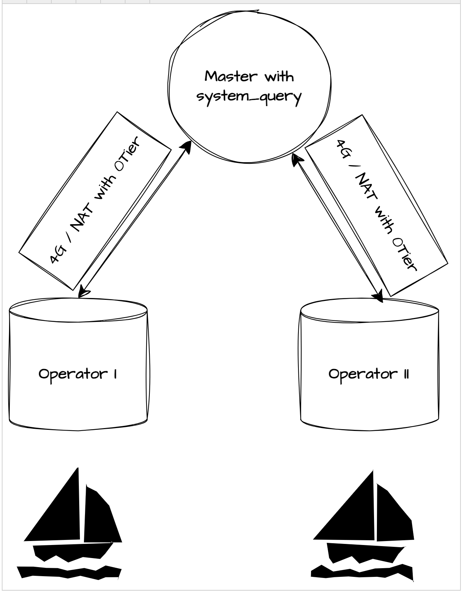

# MTU Size Issue

The following issue appeared to a customer that manages data at the edge with limited network connectivity, using ZeroTier
to generate a static IP address.




## Use Case
The deployment uses AnyLog to manage data on boats: the ‘floating’ edges run _Operators_ and connect to a central DC 
(where the _Master_ and _Query_ agenst are located). Communication is done through 4G, which may cause network inconsistencies,  
and [ZeroTier](https://www.zerotier.com/) VPN is used to secure communications and have static IP addresses.

## Problem Symptoms 
When the Operator nodes are started, they are able to communicate with the central Master. This can be seen as the two 
share the same blockchain content. However, after about 5 minutes, the nodes fail to communicate between one another 
(the Master sends a frame, get the local ‘transmitted’ info but in fact nothing flows to the Operator) . This caused an 
inability to execute queries against the network.
 
## Problem Description
It was clear from the start that this is a networking related issue, however, we had thought the issue ws from either the 
Docker, Firewall or ZeroTier configurations -- when running each component separately the issue still persisted. 

As it turned out, the root problem was infact relating to ZeroTier, but instead of the regular configurations we were 
looking at, the issue was the maximum transmission units. 

**Maximum Transmission Unit** (MTU) are the maximum size of each packet in a given transmission. With ZeroTier the default 
value was set to 1,320 bytes; however, AnyLog requires an MTU >=2,009 bytes.

## Problem Fix
Override MTU Manually

* **Linux**
```shell
sudo ip link set dev zt<interfaceID> mtu 2009
```
* **Mac OSX**
```shell
sudo ifconfig zt<interfaceID> mtu 1400
```
* **Windows**
```cmd
netsh interface ipv4 set subinterface "ZeroTier One [<interfaceID>]" mtu=1400 store=persistent
```


