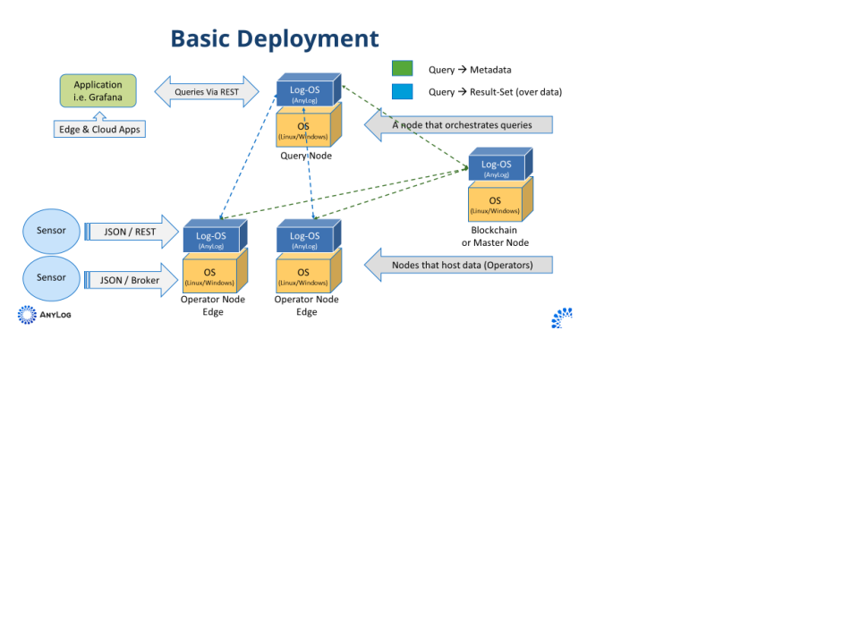

## AnyLog Deployment

This document describes how to deploy and configure an AnyLog Network. The example provides directions to: 
* Deploy an  AnyLog Network consisting of  4 nodes (2 operators, 1 query, 1 master) 
* Configure EdgeX as a data source  
* Configure Grafana to visualize the data 

## Deployment
**Note Types**:
* Master – A node that manages the shared metadata (if a blockchain platform is used, this node is redundant).
* Operator – A node that hosts the data. For this deployment we will have 2 Operator nodes.
* Query – A node that coordinates the query process. 

**Deployment Diagram**: 


## Prerequisites
Our [deployment repository](https://github.com/AnyLog-co/deployments/) provides the scripts and YAML files needed to 
deploy AnyLog (and other related tools - such as _PostgreSQL_ and _Grafana_) as either docker or helm package. In 
addition, the repository contains a shortened version of the shared directions depending on the deployment type.

1. 4 Physical or Virtual machines.
2. Each machine with docker & docker-compose installed and logged in. 
    * Docker Password: **XXXX-XXXX-XXXX-XXXX**
```commandline
# directions to install docker & docker-compose on Ubuntu 

# update / upgrade env
for CMD in update upgrade update 
do 
    sudo apt-get -y ${CMD} 
done

# install docker & docker-compose 
sudo apt-get -y install docker.io docker-compose 

# Grant user permission to docker 
USER=`whoami` 
sudo groupadd docker 
sudo usermod -aG docker ${USER} 
newgrp docker

# log into docker for access to AnyLog
docker login -u anyloguser -p ${DOCKER_PASSWORD}
```
