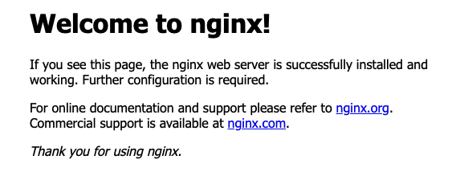

# Install & Configure Nginx 
Nginx is a web server that can act as a proxy. Nginx allows static IP addresses, rather than virtual IPs  that Kubernetes 
generates each time the pod gets deployed. Nginx (or other proxy service) needs to be installed and configured on all 
machines, so that nodes can communicate with one another.

## Installation 
1. Install Nginx as a service
```shell
sudo apt-get -y install nginx
sudo service nginx start 
```

2. Using the browser try going into your local IP: [https://${LOCAL_IP}]() to validate Nginx is running
* via cURL
```commandline
curl https://${LOCAL_IP} 

# Expected Output
<!DOCTYPE html>
<html>
<head>
<title>Welcome to nginx!</title>
<style>
    body {
        width: 35em;
        margin: 0 auto;
        font-family: Tahoma, Verdana, Arial, sans-serif;
    }
</style>
</head>
<body>
<h1>Welcome to nginx!</h1>
<p>If you see this page, the nginx web server is successfully installed and
working. Further configuration is required.</p>

<p>For online documentation and support please refer to
<a href="http://nginx.org/">nginx.org</a>.<br/>
Commercial support is available at
<a href="http://nginx.com/">nginx.com</a>.</p>

<p><em>Thank you for using nginx.</em></p>
</body>
</html> 
```
* Using the browser the output would look something like this


## Configuring 
1. Remove default files – we will recreate them in the following steps 
```commandline
sudo rm -rf /etc/nginx/sites-enabled/default 
sudo rm -rf /etc/nginx/sites-available/default
```

2. Get [kube-apiserver](https://kubernetes.io/docs/reference/command-line-tools-reference/kube-apiserver/) IP address - 
this step is required for a _minikube_ deployment, but by not be needed for other Kubernetes deployment tools such as 
_kubeadm_.
```commandline
minikube ip 
```

3. Create a new file called `/etc/nginx/sites-enabled/anylog.conf` for REST communication
```commandline
sudo vim /etc/nginx/sites-enabled/anylog.conf 
```

4. Add the following content in `/etc/nginx/sites-enabled/anylog.conf`
```editorconfig
# nginx default webpage - this generates the default nginx homepage 
server {
  listen 80;
  server_name;
}

# AnyLog Node - make sure the IP & REST Port are correct. This section needs to repeated for each AnyLog node on the 
# machine. 
server {
  listen 32049;
  server_name _;
  location / {
    proxy_set_header Host            $host;
    proxy_set_header X-Forwarded-For $remote_addr;
    proxy_pass http://${KUBE_APISERVER_IP}:32049;
  }
}

# --- Example for when kube-apiserver IP is set to 192.168.49.2 (mimikube) ---
server {
  listen 32049;
  server_name _;
  location / {
    proxy_set_header Host            $host;
    proxy_set_header X-Forwarded-For $remote_addr;
    proxy_pass http://192.168.49.2:32049;
  }
}
```

5. Update `/etc/nginx/nginx.conf` to support both TCP & Message broker (if set) communication
```editorconfig
# 1. import ngx_stream_module.so module at the top of the file.
# With Ubuntu 20.04 this step was need. However, with later version of Ubuntu it was not. 
include /usr/lib/nginx/modules/ngx_stream_module.so;

# 2. At the bottom add stream process - each AnyLog node (on the same machine) should have its own upstream & server 
# process(es) within the stream section
stream {
    # AnyLog TCP Connection - repeat the next two steps for each node
    upstream anylog_node {
        server ${KUBE_APISERVER_IP}:32048;
    }
    server {
        listen 32048 so_keepalive=on;
        proxy_pass anylog_node;
    }
    # AnyLog Message Broker Connection - repeat the next two steps for each node 
    upstream anylog_node_broker {
        server ${KUBE_APISERVER_IP}:32050;
    }
    server {
        listen 32050 so_keepalive=on;
        proxy_pass anylog_node_broker;
    }
}

# --- Example for when kube-apiserver IP is set to 192.168.49.2 (mimikube) ---
stream {
    # AnyLog TCP Connection - repeat the next two steps for each node
    upstream anylog_node {
        server 192.168.49.2:32048;
    }
    server {
        listen 32048 so_keepalive=on;
        proxy_pass anylog_node;
    }
    # AnyLog Message Broker Connection - repeat the next two steps for each node 
    upstream anylog_node_broker {
        server 192.168.49.2:32050;
    }
    server {
        listen 32050 so_keepalive=on;
        proxy_pass anylog_node_broker;
    }
}
```

6. After making changes to the nginx configurations, you need to `reload` & `restart` the service. 
```commandline
sudo service nginx reload 
sudo service nginx restart
```
If fails to restart, then there’s no need for the “include” portion in step 5. Remove the added “include” line and repeat 
step 6.

7. In order to communicate with the AnyLog node from the outside of the local network, the user needs to open access on 
the router side. 

