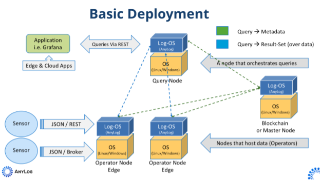

## AnyLog Deployment

This document describes how to deploy and configure an AnyLog Network. The example provides directions to:
* Deploy an  AnyLog Network consisting of  4 nodes (2 operators, 1 query, 1 master) 
* Deploy our Remote CLI - an open source web interface used for querying data 
* Configure EdgeX as a data source  
* Configure Grafana to visualize the data 

## Deployment
**Note Types**:
* Master – A node that manages the shared metadata (if a blockchain platform is used, this node is redundant).
* Operator – A node that hosts the data. For this deployment we will have 2 Operator nodes.
* Query – A node that coordinates the query process. 
* Publisher - A node that supports distribution of data from device(s) to operator nodes. This node is not part of the
deployment diagram. However, is often used in large scale projects. 

**Deployment Diagram**:

## AnyLog Versions
AnyLog has 3 major versions, each version is built on both _Ubuntu:20.04_ with _python:3.9-alpine_. 
* develop - is a stable release that's been used as part of our Test Network for a number of weeks, and gets updated every 4-6 weeks.
* predevelop - is our beta release, which is being used by our Test Network for testing purposes.
* testing - Any time there's a change in the code we deploy a "testing" image to be used for (internal) testing purposes. Usually the image will be Ubuntu based, unless stated otherwise.

| Build | Base Image | CPU Architecture | Pull Command | Size | 
|---|---|---|---|---|
| develop | Ubuntu:20.04 | amd64,arm/v7,arm64 | `docker pull anylogco/anylog-network:develop` | 664MB | 
| develop-alpine | python:3.9-alpine | amd64,arm/v7,arm64 | `docker pull anylogco/anylog-network:develop-alpine` | 460MB| 
| predevelop | Ubuntu:20.04 | amd64,arm/v7,arm64 | `docker pull anylogco/anylog-network:predevelop` | ~245MB | 
| predevelop-alpine | python:3.9-alpine | amd64,arm/v7,arm64 | `docker pull anylogco/anylog-network:predevelop-alpine` | ~178MB | 
| testing | Ubuntu:20.04 | amd64,arm/v7,arm64 | `docker pull anylogco/anylog-network:testing` |

By default, the AnyLog image is configured to run as a _REST_ node, which means that the TCP and REST options 
are running, but no other process is enabled. This allows for users to play with the system with no other services 
running in the background, but already having the default network configurations. The deployment command is: 
`docker run --network host -it --detach-keys="ctrl-d" --name anylog-node --rm anylogco/anylog-network:develop`  

## Table of Content
**[Docker](Docker)**
* [Preparing Machine(s) for Deployment](Docker/Prerequisites.md)
* [Install PostgreSQL](Docker/Postgres.md)
* [Install Master Node](Docker/master_node.md)
  * [Deployment Process](Docker/master_node_deployment_process.md)
* [Install Operator Node I](Docker/operator_node.md)
  * [Deployment Process](Docker/operator_node_deployment_process.md)
* [Install Operator Node II](Docker/operator2_node.md)
  * [Deployment Process](Docker/operator_node_deployment_process.md)
* [Install Query Node](Docker/query_node.md)
  * [Deployment Process](Docker/query_node_deployment_process.md)
* [Install Publisher Node](Docker/publisher_node.md)
  *  [Deployment Process](Docker/publisher_node_deployment_process.md)
* [Install Grafana](Docker/AnyLog_Support_Tools.md#grafana)
* [Install Remote CLI](Docker/AnyLog_Support_Tools.md#remote-cli)
* [Setting Up EdgeX](Docker/EdgeX.md)
* [Docker Volumes & Creating AnyLog Scripts](Docker/docker_volumes.md)

**[Kubernetes](Kubernetes)**
* [Preparing Machine(s) for Deployment](Kubernetes/Prerequisites.md)
* [Understanding Kubernetes Networking for AnyLog](Kubernetes/Networking.md)
  * [Install & Configure Nginx](Kubernetes/nginx.md)
* [Install PostgreSQL](Kubernetes/Postgres.md)
* [Install Master Node](Kubernetes/master_node.md)
  * [Deployment Process](Kubernetes/master_node_deployment_process.md)
* [Install Operator Node I](Kubernetes/operator_node.md)
  * [Deployment Process](Kubernetes/operator_node_deployment_process.md)
* [Install Operator Node II](Kubernetes/operator2_node.md)
  * [Deployment Process](Kubernetes/operator_node_deployment_process.md)
* [Install Query Node](Kubernetes/query_node.md)
  *  [Deployment Process](Kubernetes/query_node_deployment_process.md)

