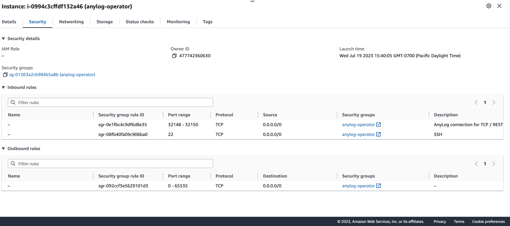

# AWS Setup

The following provides directions for using an EC2 AWS instance(s) to configure and deploy AnyLog.  

Directions for [deploying an AnyLog Node](../deploying_node.md) 

**Terminology**:
* Node - An AnyLog node that's part of the network (ex. Master, Operator, Query)
* Instance - An AWS EC2 machine  

## Create a new AWS instance
0. Create an account and/or log into [AWS](https://aws.amazon.com/) 

1. Create a [key pair](https://docs.aws.amazon.com/AWSEC2/latest/UserGuide/create-key-pairs.html) for SSH access into the node. 

2. Create a [new security group](https://docs.aws.amazon.com/vpc/latest/userguide/security-groups.html) per node type. 

The image below, shows sample configuration for an AnyLog (Operator) node; this includes _SSH_ access, _TCP_ and _REST_, as well 
as _Broker_ if configured for Operator or Publisher node. 
* **Master Node** - Default TCP: 32048 | Default REST: 32049 
* **Query Node** - Default TCP: 32348 | Default REST: 32349
* **Remote-CLI** which usually seats on the same physical machine as the Query node requires port 31800 to be open. 
* **Operator Node** - Default TCP: 32148 | Default REST: 32149 | (Default) Broker: 32150
* **Publisher Node**: Default TCP: 32248 | Default REST: 32249 | (Default) Broker: 32250
* **Generic / REST Node**: Default TCP: 32548 | Default REST: 32549 | (Default) Broker: 32550

 


3. Create a new [EC2 instance](https://docs.aws.amazon.com/AWSEC2/latest/UserGuide/EC2_GetStarted.html) that's associated with the corresponding _security group_.  

4. Configure a static IP address 

    a. Create an [Elastic IP](https://docs.aws.amazon.com/AWSEC2/latest/UserGuide/elastic-ip-addresses-eip.html). 
This is very important as AWS provides a new IP each time an instance is rebooted (unless _elastic IP_ is configured).

    b. [Associate Elastic IP with Instance](https://docs.aws.amazon.com/vpc/latest/userguide/vpc-eips.html)

5. Repeat steps 3 and 4 for each new AWS instance. 

When using [different regions](https://docs.aws.amazon.com/AmazonRDS/latest/UserGuide/Concepts.RegionsAndAvailabilityZones.html) for the AnyLog nodes, the TCP binding needs to be disabled. 

**Sample Config**: The example shows a subsection of the anylog_configs.env file, with the `TCP_BIND` option disabled. 
```.env
...
ANYLOG_SERVER_PORT=32048
# Port address used by AnyLog's REST protocol
ANYLOG_REST_PORT=32049
# Port value to be used as an MQTT broker, or some other third-party broker
#ANYLOG_BROKER_PORT=<NETWORKING_ANYLOG_BROKER_PORT>
# A bool value that determines if to bind to a specific IP and Port (a false value binds to all IPs)
TCP_BIND=false 
...
```

 


