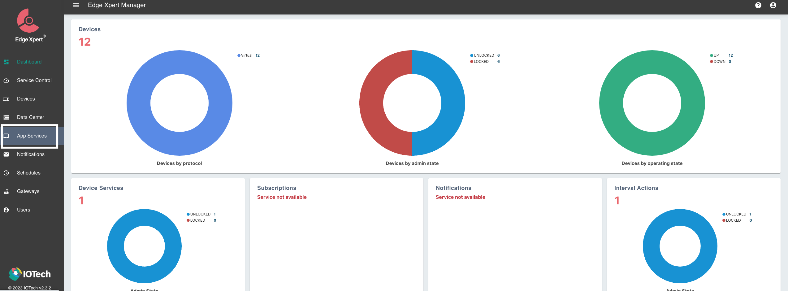

# Publishing Data via EdgeXpert Manager

EdgeX (Foundry) is an Open-Source framework that serves as a foundation for building and deploying Internet of Things (IoT)
edge computing solutions. While EdgeXpert is an enterprise version of _EdgeX_, provided by IoTech System. 

This document demonstrates how to publish data into AnyLog via EdgeXpert Management tool.   

* [EdgeX Foundry](https://www.edgexfoundry.org/)
* [IoTech System](https://www.iotechsys.com/)
* [User Guide](https://docs.iotechsys.com/)
* [Manual Deployment of EdgeX](EdgeX.md)


For demonstration, the examples used is **retail-1** data source, provided by IoTech System.  
```json
{
  "apiVersion":"v2",
  "id":"ff3013c3-2f96-48b6-ac06-5eeb4cde1ecf",
  "deviceName":"retail-device-1",
  "profileName":"RetailVirtualDevice",
  "sourceName":"FreezerTemp1",
  "origin":1694737678685722461,
  "readings":[{
    "id":"000a2227-0ff8-4534-8131-310a7efcdd47",
    "origin":1694737678685722461,
    "deviceName":"retail-device-1",
    "resourceName":"FreezerTemp1",
    "profileName":"RetailVirtualDevice",
    "valueType":"Float32",
    "units":"F",
    "value":"3.140839e+01"
  }]
}
{
  "apiVersion":"v2",
  "id":"e60989ad-ab59-456e-bb00-b90518ca83e1",
  "deviceName":"retail-device-1",
  "profileName":"RetailVirtualDevice",
  "sourceName":"PeopleCount",
  "origin":1694737678704913648,
  "readings":[{
    "id":"e789d093-0392-4a4e-9890-eee615f647f2",
    "origin":1694737678704913648,
    "deviceName":"retail-device-1",
    "resourceName":"PeopleCount",
    "profileName":"RetailVirtualDevice",
    "valueType":"Int32",
    "value":"48"
  }]
}	
```

### Creating an Application Service
1. Install EdgeX and EdgeXpert Management tools

2. In browser goto EdgeXpert login page
   * **URL**: `https://${YOUR_IP}:9090` 
   * **Username**: `admin` | **Password**: `admin`


3. On the left-side of the screen, press _App Services_



4. On the right-side of the screen add a _Basic Service_


From this point, configure the application service(s) based on the way by which to process the data on AnyLog.

## Publishing Data
Edgex can transfer data into AnyLog using the following calls:
* Using REST PUT - this option receives data from Edgex and stores the data in AnyLog without data transformation.
* Using REST POST - this option receives data from Edgex and stores the data in AnyLog with data transformation.
* Using Message Broker - AnyLog receives data as a message broker and allows data transformation.

### Publishing Data into AnyLog via PUT

From an AnyLog perspective, receiving data via REST _PUT_ requires minimal effort.

For REST _PUT_, the decision regarding which database and table the data will be stored in is based on the header 
information provided. This means that all data coming through the same EdgeXpert app-service will be stored in the same 
database and table.

Since AnyLog does not perform any data transformation when data comes in via REST PUT, it is up to the user to decide 
what is sent to AnyLog on the EdgeXpert side. Otherwise, AnyLog will store the data as is.

1. Locally, create a JavaScript script that selects the data generated in EdgeXpert to be sent into AnyLog. The provided 
[sample script](https://raw.githubusercontent.com/AnyLog-co/documentation/master/deployments/Support/edgex_transformation.js) 
extracts reading values from EdgeXpert, and them sent into AnyLog.
```javascript
// file name: edgex_transformation.js
var outputObject = { value: inputObject.readings[0] };
return outputObject;
```

2. As shown above, [Create Basic Application Service](#creating-an-application-service)

3. Update Basic App Service
* **Basic Info** 
  * Name
  * Destination: HTTP


* **Address Info**
  * Method: PUT 
  * URL (operator REST service IP and Port)
  * HTTP Request Headers
    * type: _json_
    * dbms (database to store data in)
    * table (table name)
    * mode: _streaming_
    * Content-Type: _text/plain_


* **Data Format**
  * JavaScript Transform: edgex_transformation.js 

 

* **Filter**
  * Device Filter


3. Once the changes are saved (at the bottom of the screen), data should automatically be sent into AnyLog via PUT.


### Publishing Data into AnyLog via POST

Publishing data into AnyLog via REST _POST_ allows the data to be transformed locally within AnyLog. After the data is 
transformed, it is stored on the AnyLog operator node(s). Because AnyLog processes the data, data from a single EdgeX 
app-service can be sent to separate databases and tables.

Unlike _PUT_, when using _POST_, it is necessary to execute the message broker client (as described in [run mqtt client](../../message%20broker.md)) 
on the AnyLog side for the node to accept incoming data.
  

1. On AnyLog (operator) side, execute `run mqtt client` - Note, no two MQTT clients (on the same network service) 
can have the same topic name.  
```anylog 
# POST 
<run mqtt client where broker=rest and user-agent=anylog and log=false and topic=(
  name=anylogedgex-post and 
  dbms=!company_name.name and 
  table="bring [readings][0][resourceName]" and 
  column.timestamp.timestamp=now and 
  column.value=(type=float and value="bring [readings][0][value]"))>
```

2. As shown above, [Create Basic Application Service](#creating-an-application-service)

3. Update Basic App Service
* **Basic Info** 
  * Name
  * Destination: HTTP
  


* **Address Info**
  * Method: POST 
  * URL (operator REST service IP and Port)
  * HTTP Request Headers
    * command: data 
    * topic: anylogedgex-post
    * User-Agent: AnyLog/1.23
    * Content-Type: text/plain


  
* **Filter**
  * Device Filter


4. Once the changes are saved (at the bottom of the screen), data should automatically be sent into AnyLog via POST.


### Publishing Data into AnyLog via Message Broker

The AnyLog _message broker_ service can act both as its own server (via `run message broker`) and client, or just as a 
client for third-party brokers such as CloudMQTT and Eclipse Mosquitto.

Publishing data into AnyLog via the _message broker_ allows the data to be transformed locally within AnyLog. Once the 
data is transformed, it is stored on the AnyLog operator node(s). Because AnyLog processes the data, data from a single 
EdgeX app-service can be stored in separate databases and tables.

Similar to _POST_, when using the _message broker_, you need to execute the MQTT client (as described in run 
[mqtt client](../../message%20broker.md)) on the AnyLog side for the node to accept incoming data. However, unlike REST 
_POST_, the connection information can either be the node itself (acting as both server and client) or connecting to a 
third-party server (such as CloudMQTT or Eclipse Mosquitto), with the service functioning solely as a client.

1. On AnyLog (operator) side, execute `run mqtt client` - Note, no two MQTT clients (on the same network service) 
can have the same topic name. The example below runs as a local server-client message broker, while the 
[training script](https://github.com/AnyLog-co/deployment-scripts/blob/os-dev/scripts/training/mqtt_call.al) connects to 
a third party script.

```anylog
# MQTT  
<run mqtt client where broker=local and log=false and topic=(
  name=anylogedgex-mqtt and 
  dbms=!default_dbms and 
  table="bring [readings][0][resourceName]" and 
  column.timestamp.timestamp=now and 
  column.value=(type=float and value="bring [readings][0][value]"))>
```

2. As shown above, [Create Basic Application Service](#creating-an-application-service)

3. Update Basic App Service
* **Basic Info** 
  * Name
  * Destination: MQTT
  


* **Address Info** 
  * URL (operator Message Broker service IP and Port)
  * Topic


  
* **Filter**
  * Device Filter


4. Once the changes are saved (at the bottom of the screen), data should automatically be sent into AnyLog via POST.


