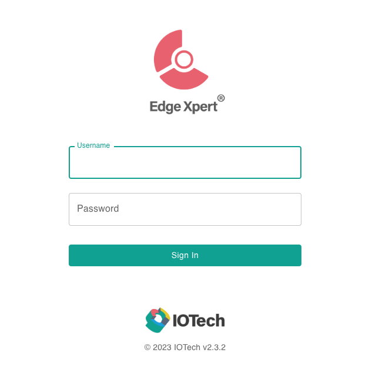

# Publishing Data via EdgeXpert Manager

EdgeX (Foundry) is an Open-Source framework that serves as a foundation for building and deploying Internet of Things (IoT)
edge computing solutions. While EdgeXpert is an enterprise version of _EdgeX_, provided by IoTech System. 

Note: a detailed explanation on how data is added to the AnyLog Network nodes is available at the [adding data](../../adding%20data.md) section.

This document demonstrates how to publish data into AnyLog via EdgeXpert Management tool.   

* [EdgeX Foundry](https://www.edgexfoundry.org/)
* [IoTech System](https://www.iotechsys.com/)
* [User Guide](https://docs.iotechsys.com/)
* [Manual Deployment of EdgeX](EdgeX.md)


For demonstration, the examples used is **retail-1** data source, provided by IoTech System.  
```json
{
  "apiVersion":"v2",
  "id":"ff3013c3-2f96-48b6-ac06-5eeb4cde1ecf",
  "deviceName":"retail-device-1",
  "profileName":"RetailVirtualDevice",
  "sourceName":"FreezerTemp1",
  "origin":1694737678685722461,
  "readings":[{
    "id":"000a2227-0ff8-4534-8131-310a7efcdd47",
    "origin":1694737678685722461,
    "deviceName":"retail-device-1",
    "resourceName":"FreezerTemp1",
    "profileName":"RetailVirtualDevice",
    "valueType":"Float32",
    "units":"F",
    "value":"3.140839e+01"
  }]
}
{
  "apiVersion":"v2",
  "id":"e60989ad-ab59-456e-bb00-b90518ca83e1",
  "deviceName":"retail-device-1",
  "profileName":"RetailVirtualDevice",
  "sourceName":"PeopleCount",
  "origin":1694737678704913648,
  "readings":[{
    "id":"e789d093-0392-4a4e-9890-eee615f647f2",
    "origin":1694737678704913648,
    "deviceName":"retail-device-1",
    "resourceName":"PeopleCount",
    "profileName":"RetailVirtualDevice",
    "valueType":"Int32",
    "value":"48"
  }]
}	
```

## AnyLog Prerequisites

* To send data to AnyLog via REST, configure the REST service. See details in the [REST Server](../../background%20processes.md#rest-requests) section. 
* To Treat AnyLog as a message broker, configure the Message Broker service. See details in the [Message Broker](../../background%20processes.md#message-broker) section. 

## Creating an Application Service in Edgex
1. Install EdgeX and EdgeXpert Management tools

2. In browser goto EdgeXpert login page
   * **URL**: `https://${YOUR_IP}:9090` 
   * **Username**: `admin` | **Password**: `admin`



3. On the left-side of the screen, press _App Services_


4. On the right-side of the screen add a _Basic Service_


From this point, configure the application service(s) based on the way by which to process the data on AnyLog.

## Publishing Data
Edgex can transfer data into AnyLog using the following calls:
* Using REST PUT - this option receives data from Edgex and stores the data in AnyLog without data transformation.
* Using REST POST - this option receives data from Edgex and stores the data in AnyLog with data transformation.
* Treating AnyLog as a Message Broker - data transformation is supported.

### Publishing Data into AnyLog via PUT

Using PUT, configuration is done only on the EdgeXpert platform.

Users specify the database and table assigned to the data in the REST message header. 

Since AnyLog does not perform any data transformation when data comes in via REST PUT, it is up to the user to decide 
what is sent to AnyLog on the EdgeXpert side. 

1. Locally, create a JavaScript script that selects the data generated in EdgeXpert to be sent into AnyLog. The provided 
[sample script](https://raw.githubusercontent.com/AnyLog-co/documentation/master/deployments/Support/edgex_transformation.js) 
extracts reading values from EdgeXpert, and them sent into AnyLog.
```javascript
// file name: edgex_transformation.js
var outputObject = { value: inputObject.readings[0] };
return outputObject;
```

2. As shown above, [Create Basic Application Service](#creating-an-application-service)

3. Update Basic App Service
* **Basic Info** 
  * Name
  * Destination: HTTP


* **Address Info**
  * Method: PUT 
  * URL (operator REST service IP and Port)
  * HTTP Request Headers
    * type: _json_
    * dbms (database to store data in)
    * table (table name)
    * mode: _streaming_
    * Content-Type: _text/plain_


* **Data Format**
  * JavaScript Transform: edgex_transformation.js 

 

* **Filter**
  * Device Filter


3. Once the changes are saved (at the bottom of the screen), data should automatically be sent into AnyLog via PUT.


### Publishing Data into AnyLog via POST

Publishing data into AnyLog via REST _POST_ allows the data to be transformed locally within AnyLog. After the data is 
transformed, it is stored on the AnyLog operator node(s).   

In the case of POST, the database and table can be determined from the headers or retrieved from the data received.

The transformation is triggered by associating mapping rules and data to a topic. When the data is recieved, the 
mapping rules are applied on the data.

This process is identical to the used when data is published on an AnyLog node as a message broker.  
The mapping rules are declared using a client service, and a description is available at the
[run mqtt client](../../message%20broker.md)) section. 


1. On AnyLog (operator) side, execute `run mqtt client` - Note, no two MQTT clients (on the same network service) 
can have the same topic name. This process declares the data mapping rules and the topic.
```anylog 
# POST 
<run mqtt client where broker=rest and user-agent=anylog and log=false and topic=(
  name=anylogedgex-post and 
  dbms=!company_name.name and 
  table="bring [readings][0][resourceName]" and 
  column.timestamp.timestamp=now and 
  column.value=(type=float and value="bring [readings][0][value]"))>
```

2. As shown above, [Create Basic Application Service](#creating-an-application-service)

3. Update Basic App Service
* **Basic Info** 
  * Name
  * Destination: HTTP
  


* **Address Info**
  * Method: POST 
  * URL (operator REST service IP and Port)
  * HTTP Request Headers
    * command: data 
    * topic: anylogedgex-post
    * User-Agent: AnyLog/1.23
    * Content-Type: text/plain


  
* **Filter**
  * Device Filter


4. Once the changes are saved (at the bottom of the screen), data should automatically be sent into AnyLog via POST.


### Publishing Data into AnyLog via Message Broker

The AnyLog _message broker_ service using the command `run message broker`.

Note that users can configure an AnyLog  node as a client for third-party brokers such as CloudMQTT and Eclipse Mosquitto.  
This option is detailed [here](../../u).

Publishing data into AnyLog via the _message broker_ allows the data to be transformed locally within AnyLog. Once the 
data is transformed, it is stored on the AnyLog operator node(s).

Make sure the following steps are done on each AnyLog node that provides the message broker service:

1. Declare the mapping rules associated to a topic. The rules need to include the database name and table name that are assigned to the data.
2. Similar to _POST_, when using the _message broker_ service, enable the mapping rules using the client service (described in run 
[mqtt client](../../message%20broker.md)). This service is enabled using the command: `run mqtt client` 

Note, no two MQTT clients (on the same network service) 
can have the same topic name. The example below runs as a local server-client message broker, while the 
[training script](https://github.com/AnyLog-co/deployment-scripts/blob/os-dev/scripts/training/mqtt_call.al) connects to 
a third party script.

```anylog
# MQTT  
<run mqtt client where broker=local and log=false and topic=(
  name=anylogedgex-mqtt and 
  dbms=!default_dbms and 
  table="bring [readings][0][resourceName]" and 
  column.timestamp.timestamp=now and 
  column.value=(type=float and value="bring [readings][0][value]"))>
```

2. As shown above, [Create Basic Application Service](#creating-an-application-service)

3. Update Basic App Service
* **Basic Info** 
  * Name
  * Destination: MQTT
  


* **Address Info** 
  * URL (operator Message Broker service IP and Port)
  * Topic


  
* **Filter**
  * Device Filter


4. Once the changes are saved (at the bottom of the screen), data should automatically be sent into AnyLog via POST.


