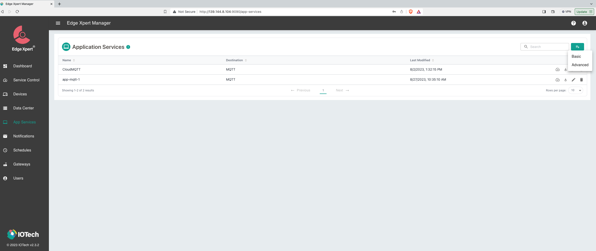

# Publishing Data via Edge Xpert Manager

EdgeX (Foundry) is an Open-Source framework that serves as a foundation for building and deploying Internet of Things (IoT)
edge computing solutions. While Edge Xpert is an enterprise version of _EdgeX_, provided by IoTech System. 

This document will show how to publish data into Anylog via Edge Xpert Management tool.   

* [EdgeX Foundry](https://www.edgexfoundry.org/)
* [IoTech System](https://www.iotechsys.com/)
* [User Guide](https://docs.iotechsys.com/)

### Creating an Application Service 
1. Make sure to install EdgeX and Edge Xpert Management tools

2. In browser goto EdgeXpert login page
   * **URL**: `https://${YOUR_IP}:9090` 
   * **Username**: `admin` | **Password**: `admin`

3. On the left-side of the screen, press _App Services_

4. On the right-side of the screen add a _Basic Service_ 

From this point, configure the service based on the way by which to process the data on AnyLog. 

## Publishing via PUT 

Sending data into AnyLog via _PUT_ is probably the easiest as  