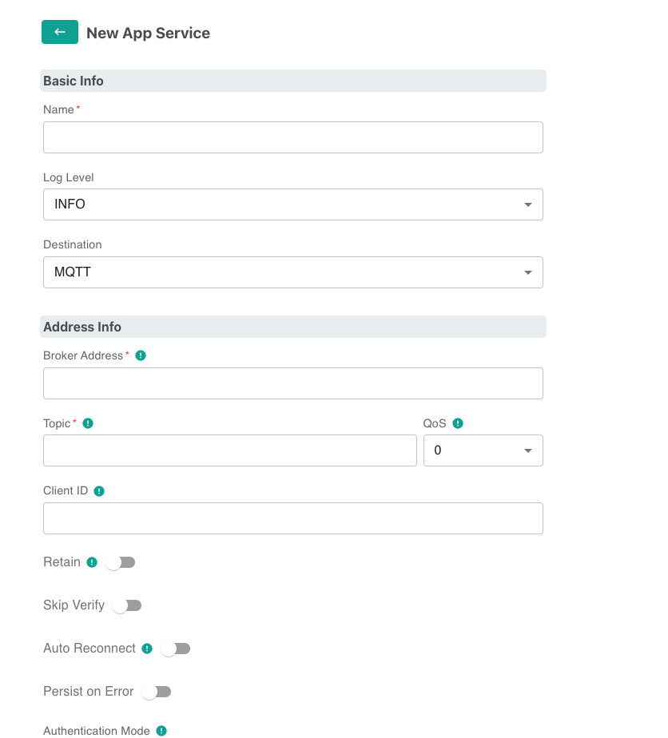
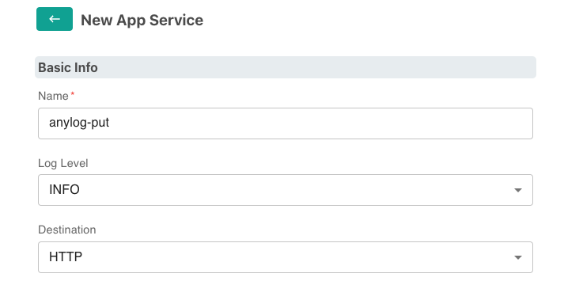
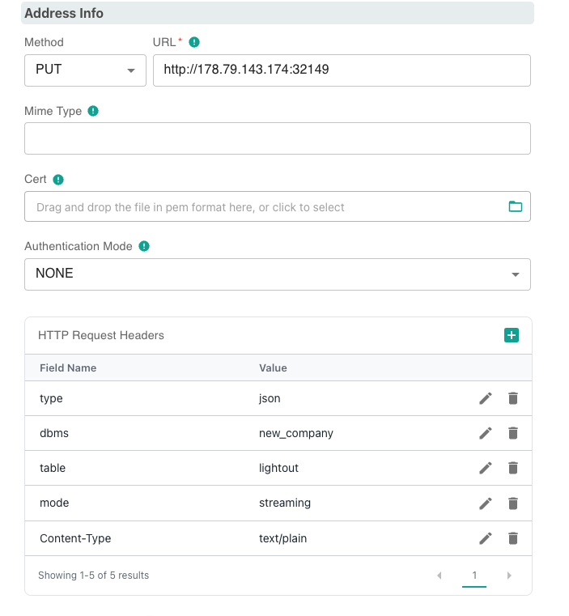
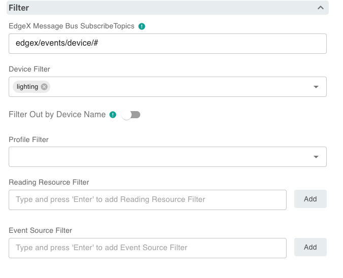

# Publishing Data via Edge Xpert Manager

EdgeX (Foundry) is an Open-Source framework that serves as a foundation for building and deploying Internet of Things (IoT)
edge computing solutions. While Edge Xpert is an enterprise version of _EdgeX_, provided by IoTech System. 

This document will show how to publish data into Anylog via Edge Xpert Management tool.   

* [EdgeX Foundry](https://www.edgexfoundry.org/)
* [IoTech System](https://www.iotechsys.com/)
* [User Guide](https://docs.iotechsys.com/)


For demonstration, the examples use LIGHTOUT data source, provided by IoTech System. 
```json
{
   "apiVersion":"v2",
   "id":"74c826c2-795c-4650-87bf-4027bdc16b69",
   "deviceName":"lighting",
   "profileName":"LIGHTING_ANYLOG",
   "sourceName":"LIGHTOUT2",
   "origin":1694727574230572072,
   "readings":[{
     "id":"72bb7f8d-30c6-4d96-a02f-1d83dcf32820",
     "origin":1694727574230572072,
     "deviceName":"lighting",
     "resourceName":"LIGHTOUT2",
     "profileName":"LIGHTING_ANYLOG",
     "valueType":"Int16",
     "value":"0"
   }]
}	 
```

### Creating an Application Service
1. Install EdgeX and Edge Xpert Management tools

2. In browser goto EdgeXpert login page
   * **URL**: `https://${YOUR_IP}:9090` 
   * **Username**: `admin` | **Password**: `admin`


3. On the left-side of the screen, press _App Services_


4. On the right-side of the screen add a _Basic Service_ 


From this point, configure the application service(s) based on the way by which to process the data on AnyLog.

## Publishing via PUT 

Sending data into AnyLog via _PUT_ is probably the easiest as there are no requirements on the AnyLog side. However,
unlike _POST_ and _MQTT_, the data wil not be analyzed but rather processed and stored as is. Additionally, each _resourceName_
should have its own _PUT_ process otherwise data will be merged into a single table. 

1. As shown above, [Create Basic Application Service](#creating-an-application-service)



2. Locally create EdgeX [transformation JavaScript file](edgex_transformation.js) that will send only reading values 
into AnyLog. 
```javascript 
var outputObject = { value: inputObject.readings[0] };
return outputObject;
```

3. Update Basic App Service
* **Basic Info** 
  * Name
  * Destination: HTTP
     


* **Address Info**
  * Method: PUT 
  * URL
  * HTTP Request Headers
    * type: _json_
    * dbms
    * table
    * mode: _streaming_
    * Content-Type: _text/plain_



* **Filter**
  * Device Filter 

   

3. Once the 


## Publishing via POST

Sending data into AnyLog via _POST_ allows for pre-processing of the data  