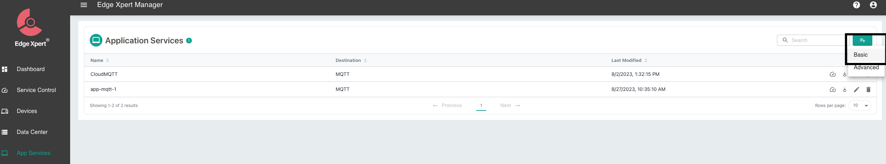
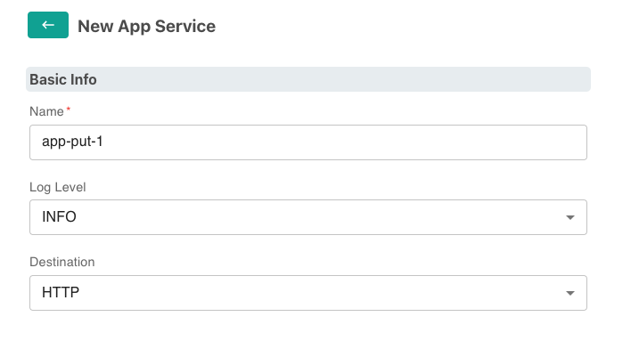
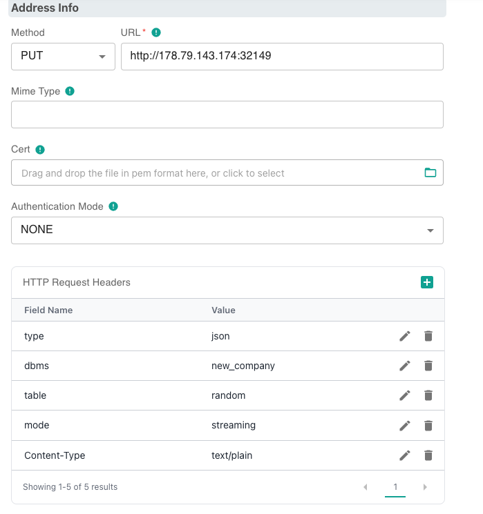
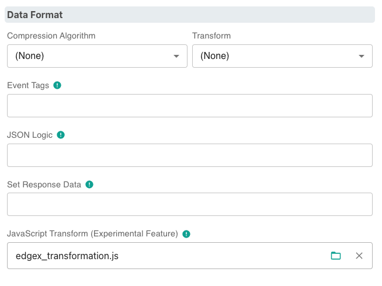

# Publishing Data via Edge Xpert Manager

EdgeX (Foundry) is an Open-Source framework that serves as a foundation for building and deploying Internet of Things (IoT)
edge computing solutions. While Edge Xpert is an enterprise version of _EdgeX_, provided by IoTech System. 

This document will show how to publish data into Anylog via Edge Xpert Management tool.   

* [EdgeX Foundry](https://www.edgexfoundry.org/)
* [IoTech System](https://www.iotechsys.com/)
* [User Guide](https://docs.iotechsys.com/)
* [Manual Deployment of EdgeX](EdgeX.md)


For demonstration, the examples used is **retail-1** data source, provided by IoTech System.  
```json
{
  "apiVersion":"v2",
  "id":"ff3013c3-2f96-48b6-ac06-5eeb4cde1ecf",
  "deviceName":"retail-device-1",
  "profileName":"RetailVirtualDevice",
  "sourceName":"FreezerTemp1",
  "origin":1694737678685722461,
  "readings":[{
    "id":"000a2227-0ff8-4534-8131-310a7efcdd47",
    "origin":1694737678685722461,
    "deviceName":"retail-device-1",
    "resourceName":"FreezerTemp1",
    "profileName":"RetailVirtualDevice",
    "valueType":"Float32",
    "units":"F",
    "value":"3.140839e+01"
  }]
}
{
  "apiVersion":"v2",
  "id":"e60989ad-ab59-456e-bb00-b90518ca83e1",
  "deviceName":"retail-device-1",
  "profileName":"RetailVirtualDevice",
  "sourceName":"PeopleCount",
  "origin":1694737678704913648,
  "readings":[{
    "id":"e789d093-0392-4a4e-9890-eee615f647f2",
    "origin":1694737678704913648,
    "deviceName":"retail-device-1",
    "resourceName":"PeopleCount",
    "profileName":"RetailVirtualDevice",
    "valueType":"Int32",
    "value":"48"
  }]
}	
```

### Creating an Application Service
1. Install EdgeX and Edge Xpert Management tools

2. In browser goto EdgeXpert login page
   * **URL**: `https://${YOUR_IP}:9090` 
   * **Username**: `admin` | **Password**: `admin`


3. On the left-side of the screen, press _App Services_


4. On the right-side of the screen add a _Basic Service_



From this point, configure the application service(s) based on the way by which to process the data on AnyLog.

## Publishing via PUT 

Sending data into AnyLog via _PUT_ is probably the easiest as there are no requirements on the AnyLog side. However,
unlike _POST_ and _MQTT_, the data wil not be analyzed but rather processed and stored as is. Additionally, all readings
that come through the same app-service (via _PUT_), will be stored on the same table. 

1. Locally create EdgeX transformation [JavaScript file](https://raw.githubusercontent.com/AnyLog-co/documentation/master/deployments/Support/edgex_transformation.js) that will send only reading values 
into AnyLog. 
```javascript
// file name: edgex_transformation.js
var outputObject = { value: inputObject.readings[0] };
return outputObject;
```

2. As shown above, [Create Basic Application Service](#creating-an-application-service)

3. Update Basic App Service
* **Basic Info** 
  * Name
  * Destination: HTTP



* **Address Info**
  * Method: PUT 
  * URL (operator REST service IP and Port)
  * HTTP Request Headers
    * type: _json_
    * dbms (database to store data in)
    * table (table name)
    * mode: _streaming_
    * Content-Type: _text/plain_



* **Data Format**
  * JavaScript Transform: edgex_transformation.js 

 

* **Filter**
  * Device Filter


3. Once the changes are saved (at the bottom of the screen), data should automatically be sent into AnyLog via PUT.


## Publishing via POST & MQTT 

Publishing data to AnyLog via _POST_ and _MQTT_ allows for more comprehensive processing within AnyLog. In other words,
AnyLog is able to break down the data into separate tables based on a specific key-value pair within the incoming data. 
However _PUT_, there's a need to execute [run mqtt client](../../message%20broker.md) on the AnyLog side in order for 
node to accept the data coming in.  

### POST data into AnyLog 
1. On AnyLog (operator) side, execute `run mqtt client` - Note, no two MQTT clients (on the same network service) 
can have the same topic name.  
```anylog 
# POST 
<run mqtt client where broker=rest and user-agent=anylog and log=false and topic=(
  name=anylogedgex-post and 
  dbms=!company_name.name and 
  table="bring [readings][0][resourceName]" and 
  column.timestamp.timestamp=now and 
  column.value=(type=float and value="bring [readings][0][value]"))>
```

2. As shown above, [Create Basic Application Service](#creating-an-application-service)

3. Update Basic App Service
* **Basic Info** 
  * Name
  * Destination: HTTP


* **Address Info**
  * Method: POST 
  * URL (operator REST service IP and Port)
  * HTTP Request Headers
    * command: data 
    * topic: anylogedgex-post
    * User-Agent: AnyLog/1.23,
    * Content-Type: text/plain


  
* **Filter**
  * Device Filter


4. Once the changes are saved (at the bottom of the screen), data should automatically be sent into AnyLog via POST.


### MQTT data into AnyLog 
1. On AnyLog (operator) side, execute `run mqtt client` - Note, no two MQTT clients (on the same network service) 
can have the same topic name.  
```anylog
# MQTT  
<run mqtt client where broker=local and log=false and topic=(
  name=anylogedgex-mqtt and 
  dbms=!company_name.name and 
  table="bring [readings][0][resourceName]" and 
  column.timestamp.timestamp=now and 
  column.value=(type=float and value="bring [readings][0][value]"))>
```

2. As shown above, [Create Basic Application Service](#creating-an-application-service)

3. Update Basic App Service
* **Basic Info** 
  * Name
  * Destination: MQTT


* **Address Info** 
  * URL (operator Message Broker service IP and Port)
  * Topic


  
* **Filter**
  * Device Filter


4. Once the changes are saved (at the bottom of the screen), data should automatically be sent into AnyLog via POST.


