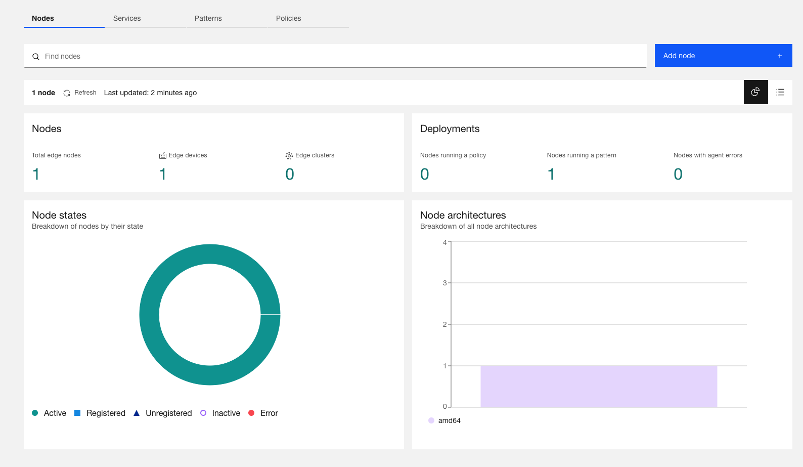
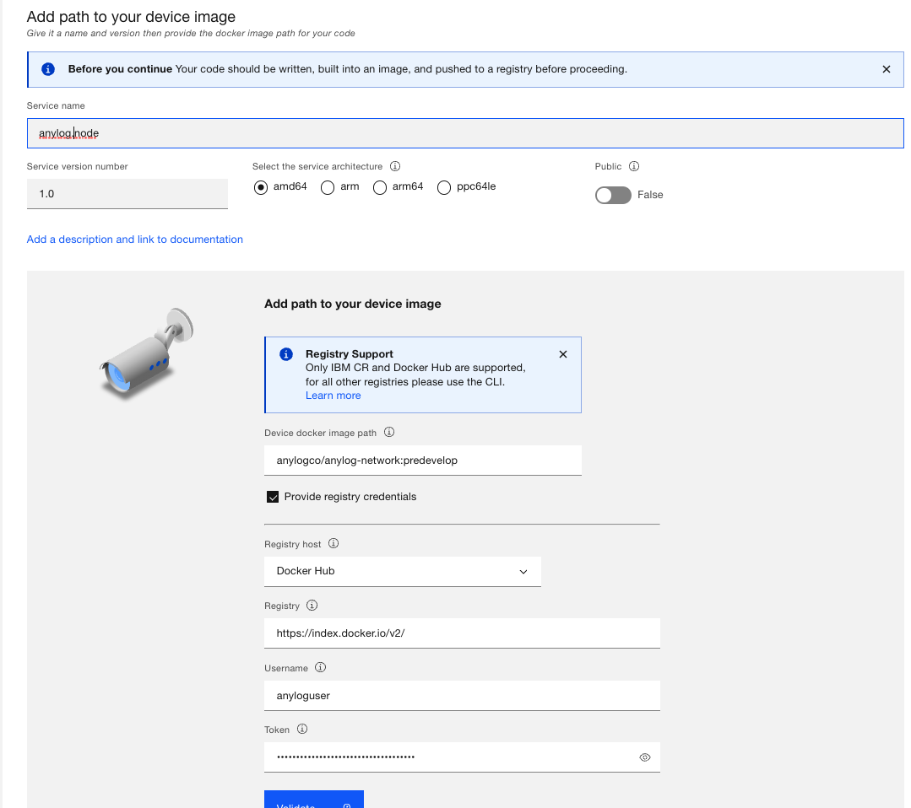
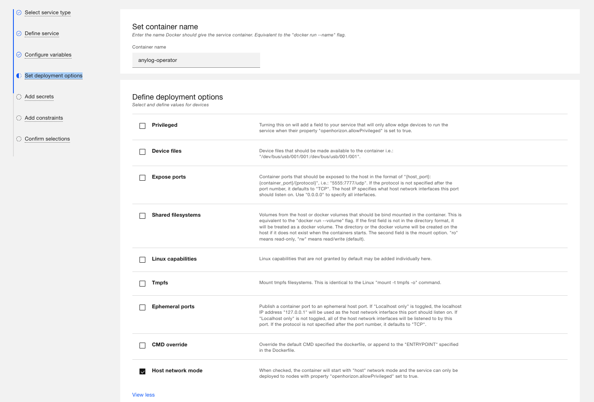
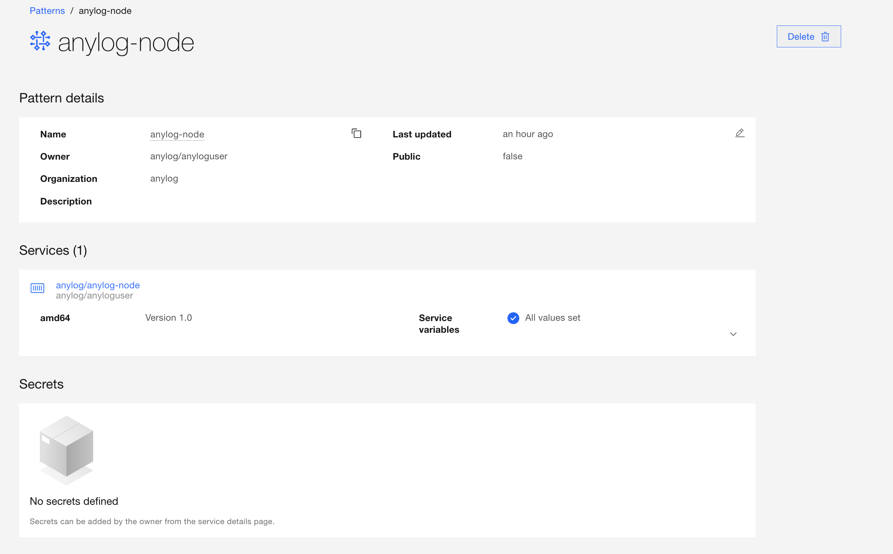

# Open Horizon 

Open Horizon is a platform for managing the service software lifecycle of containerized workloads and related machine 
learning assets. It enables autonomous management of applications deployed to distributed web scale fleets of edge 
computing nodes and devices without requiring on-premise administrators.

Open Horizon can be used to easily manage and deploy AnyLog node(s) through their interface.   

* [Open Horizon Website](https://www.lfedge.org/projects/openhorizon/)
* [IBM Documentation for Open Horizon](https://developer.ibm.com/components/open-horizon/)
* [Open Source Documentation](https://open-horizon.github.io/)


## Associate a Machine to Open Horizon
The following steps will associate a new machine with the Open Horizon management platform. The process will complete the 
following:  
* [Create an API key](https://www.ibm.com/docs/en/eam/4.3?topic=installation-creating-your-api-key) 
* [Install Horizon CLI](https://www.ibm.com/docs/en/eam/4.1?topic=cli-installing-hzn) (`hzn`)
* Install Docker 
* Validate Open Horizon is working by deploying an _Hello World_ package

1. On the node Update / Upgrade Node 
```shell
for cmd in update upgrade ; do sudo apt-get -y ${cmd} ; done 
```

2. [Create API Key](https://www.ibm.com/docs/en/eam/4.3?topic=installation-creating-your-api-key)

3. Declare env variables 
```shell
export HZN_ORG_ID=<COMPANY_NAME> 

export HZN_EXCHANGE_USER_AUTH="iamapikey:<API_KEY>"

export HZN_EXCHANGE_URL=<HZN_EXCHANGE_URL>

export HZN_FSS_CSSURL=<HZN_FSS_CSSURL>
```

4. Install _agent_ and provide admin privileges 
```shell
curl -u "${HZN_ORG_ID}/${HZN_EXCHANGE_USER_AUTH}" -k -o agent-install.sh ${HZN_FSS_CSSURL}/api/v1/objects/IBM/agent_files/agent-install.sh/data

chmod +x agent-install.sh

sudo -s -E ./agent-install.sh -i 'css:' -p IBM/pattern-ibm.helloworld -w '*' -T 120
```

5. Validate **helloworld** sample edge service is running 
```shell
hzn eventlog list -f

<<COMMENT  
"2022-06-13 21:27:13:   Workload service containers for IBM/ibm.helloworld are up and running."
<<COMMENT
```

6. Docker is already installed via HZN, however needs permissions to use not as root
```shell
USER=`whoami` 
sudo groupadd docker 
sudo usermod -aG docker ${USER} 
newgrp docker
```

At the end of the process the Open Horizon should show a new active node 



## Create AnyLog node as a Service on Open Horizon 

1. In the Edge Application Manager, goto _Services_ --> _Add service_ --> _Edge device_

2. Fill-out device image information. [Contact us](mailto:info@anylog.co) for Docker Username and password 



3. Configure variables - based on [configuration file](https://github.com/AnyLog-co/deployments/blob/master/docker-compose/anylog-operator/anylog_configs.env)
```dotenv
ANYLOG_PATH=/app
ANYLOG_LIB=/app/AnyLog-Network
ANYLOG_HOME_PATH=/app/AnyLog-Network
ANYLOG_ID_DIR=/app/AnyLog-Network/anylog
BLOCKCHAIN_DIR=/app/AnyLog-Network/blockchain
DATA_DIR=/app/AnyLog-Network/data
LOCAL_SCRIPTS=/app/deployment-scripts/scripts
TEST_DIR=/app/deployment-scripts/test

LICENSE_KEY=<YOUR_ANYLOG_LICENSE_KEY>
NODE_TYPE=operator
NODE_NAME=openhorizon-operator1
COMPANY_NAME=<YOUR_COMPANY_NAME>

ENABLE_AUTH=false
ENABLE_REST_AUTH=false

POLICY_BASED_NETWORKING=true
CONFIG_POLICY_NAME=openhorizon-network-config-policy
ANYLOG_SERVER_PORT=32148
ANYLOG_REST_PORT=32149
# for AWS, the TCP binding should be set to False  
TCP_BIND=true
TCP_THREADS=6
REST_BIND=false
REST_TIMEOUT=20
REST_THREADS=6
REST_SSL=false

DB_TYPE=sqlite
NOSQL_ENABLE=false
# for master use 127.0.0.1:${YOUR_PORT} and for everything, repalce 127.0.0.1 with the IP of the master node 
LEDGER_CONN=<LEDGER_CONN_INFO>
SYNC_TIME=30 seconds
BLOCKCHAIN_SOURCE=master
BLOCKCHAIN_DESTINATION=file

CLUSTER_NAME=openhorizon-cluster1
DEFAULT_DBMS=test
ENABLE_HA=false
ENABLE_PARTITIONS=true
TABLE_NAME=*
PARTITION_COLUMN=timestamp
PARTITION_INTERVAL=1 day
PARTITION_KEEP=14
PARTITION_SYNC=1 day
CREATE_TABLE=true
UPDAE_TSD_INFO=true
ARCHIVE=true
COMPRESS_FILE=true
OPERATOR_THREADS=3

DBMS_FILE_LOCATION=0
TABLE_FILE_LOCATION=1

ENABLE_MQTT=true
MQTT_LOG=false
MQTT_BROKER=driver.cloudmqtt.com
MQTT_PORT=18785
MQTT_USER=ibglowct
MQTT_PASSWD=MSY4e009J7ts
MQTT_TOPIC=anylogedgex-demo
MQTT_DBMS=test
MQTT_TABLE=bring [sourceName]
MQTT_TIMESTAMP_COLUMN=now
MQTT_VALUE_COLUMN_TYPE=float
MQTT_VALUE_COLUMN=bring [readings][][value]

DEPLOY_LOCAL_SCRIPT=false
WRITE_IMMEDIATE=true
THRESHOLD_TIME=60 seconds
THRESHOLD_VOLUME=10KB

MONITOR_NODES=true
MONITOR_NODE=query
MONITOR_NODE_COMPANY=<YOUR_COMPANY_NAME>
```

4. Under _Set deployment options_, declare container name and **enable** "Host network mode" 



5. Publish Service 


6. Create pattern for the generated service - use default values




## Deploy AnyLog node via Open Horizon
1. Unregister Node - this will reset the node from scratch 
```shell
hzn unregister -f
```

2. In the `$HOME` directory, create `privileged_node_policy.json` with the content shown below

File is based on [privileged_node_policy.json](https://github.com/open-horizon/anax/blob/master/cli/samples/privileged_node_policy.json)
```json
{
  "properties": [
    {
      "name": "openhorizon.allowPrivileged",
      "value": true
    }
  ],
  "constraints": [],
  "deployment": {
    "properties": [],
    "constraints": []
  },
  "management": {
    "properties": [],
    "constraints": []
  }
}
```

3. Start Node 
```shell
hzn register --pattern anylog-node --policy privileged_node_policy.json
```

4. Show output as node is being deployed
 ```shell
watch hzn agreement list
```

**Sample Output** - running node via _Open Horizon_
```json
[
  {
    "name": "anylog-node_anylog-node_anylog_amd64 merged with anylog-node_anylog-node_anylog_amd64",
    "current_agreement_id": "21f6ca1a48d9fd65d9777104ba97a71e27552a833103ec5b12c43d1c3bbf987c",
    "consumer_id": "IBM/agbot",
    "agreement_creation_time": "2023-08-10 01:52:52 +0000 UTC",
    "agreement_accepted_time": "2023-08-10 01:53:02 +0000 UTC",
    "agreement_finalized_time": "2023-08-10 01:53:02 +0000 UTC",
    "agreement_execution_start_time": "2023-08-10 01:53:04 +0000 UTC",
    "agreement_data_received_time": "",
    "agreement_protocol": "Basic",
    "workload_to_run": {
      "url": "anylog-node",
      "org": "anylog",
      "version": "1.0",
      "arch": "amd64"
    }
  }
]
```
