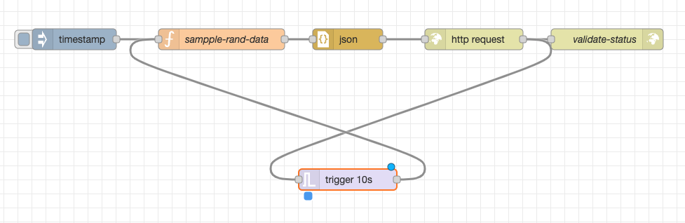
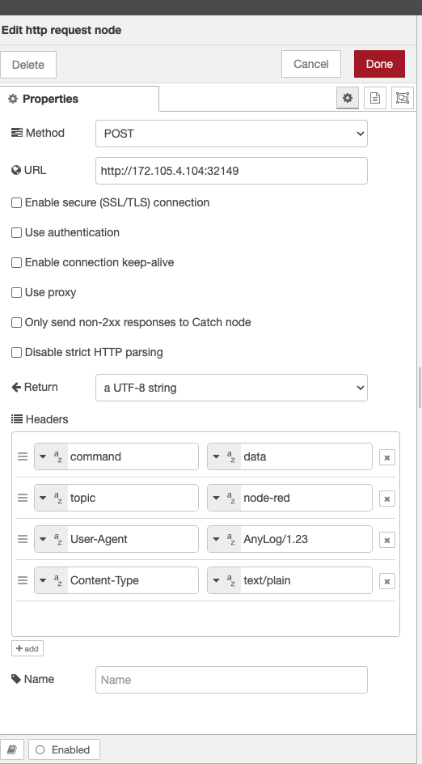

# Node-RED 

[Node-RED](https://nodered.org/) is an open-source flow-based programming tool designed for connecting hardware devices, 
APIs, and online services in a visual and intuitive manner. It allows users to create event-driven applications by wiring 
together nodes that represent different functions or services. Directions for using Node-RED can be found [here](https://nodered.org/docs/user-guide/),

The following provides an example of sending sample data, of timestamp and value, from Node-RED into AnyLog via _POST_.  

1. Install [Node-Red](https://nodered.org/docs/getting-started/local)


2. Create a [new flow](examples/node_red_sample_flow.json) that consists of the following components: 
   * _Inject_ 
   * _function_
   * _JSON_
   * _HTTP request_ & _HTTP response_
   * _Trigger_ to repeat the process every N seconds 
   



3. Create a function that generates a timestamp and value, then stores those into a "dictionary" that also includes a table name
```javascript
// Create a new Date object to get the current timestamp
var timestamp = new Date();

// Generate a random integer between min (inclusive) and max (inclusive)
var min = 1; // replace with your minimum value
var max = 100; // replace with your maximum value

var randomValue = Math.floor(Math.random() * (max - min + 1)) + min;

// Create a new object to hold the combined results
var combinedResults = {
    table: "rand_data", 
    timestamp: timestamp,
    value: randomValue
};

// Set the combined results as the new payload
msg.payload = combinedResults;

return msg
```

4. Edit HTTP request mode to be _POST_ with the following headers:
   * command - data
   * topic - node-red 
   * User-Agent - AnyLog/1.23
   * Content-Type - text/plain



5. On the AnyLog Operator side, create a new `run mqtt client` process against the REST port
```anylog
<run msg client where broker=rest and port=!anylog_rest_port and user-agent=anylog and log=false and topic=(
    name=node-red and 
    dbms=!default_dbms and
    table="bring [table]" and
    column.timestamp.timestamp="bring [timestamp]" and
    column.value.int="bring [value]"
)>
```

6. Run the Node-RED process  

**Sample Result of Data**
```anylog
AL anylog-query +> run client () sql new_company format=table "Select * from rand_data limit 15;" 
[3]
AL anylog-query +> 
row_id insert_timestamp           tsd_name tsd_id timestamp               value
------ -------------------------- -------- ------ ----------------------- ----- 
     1 2024-02-24 00:14:41.157796      131     17 2024-02-24 00:13:34.402    15 
     2 2024-02-24 00:14:41.157796      131     17 2024-02-24 00:13:58.632    35 
     3 2024-02-24 00:14:41.157796      131     17 2024-02-24 00:13:58.750    97 
     4 2024-02-24 00:14:41.157796      131     17 2024-02-24 00:13:59.029    56 
     5 2024-02-24 00:14:41.157796      131     17 2024-02-24 00:13:59.163    98 
     6 2024-02-24 00:14:41.157796      131     17 2024-02-24 00:13:59.338    20 
     7 2024-02-24 00:14:41.157796      131     17 2024-02-24 00:13:59.523    29 
     8 2024-02-24 00:14:41.157796      131     17 2024-02-24 00:13:59.798    54 
     9 2024-02-24 00:14:41.157796      131     17 2024-02-24 00:13:59.937    94 
    10 2024-02-24 00:14:41.157796      131     17 2024-02-24 00:14:00.124    68 
    11 2024-02-24 00:14:41.157796      131     17 2024-02-24 00:14:00.267    17 
    12 2024-02-24 00:14:41.157796      131     17 2024-02-24 00:14:00.443     6 
    13 2024-02-24 00:14:41.157796      131     17 2024-02-24 00:14:00.565    70 
    14 2024-02-24 00:14:41.157796      131     17 2024-02-24 00:14:00.702    34 
    15 2024-02-24 00:14:41.157796      131     17 2024-02-24 00:14:00.856    28 

{"Statistics":[{"Count": 15,
                "Time":"00:00:00",
                "Nodes": 1}]}
```