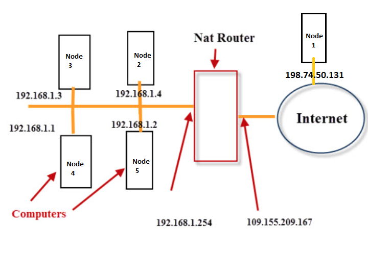

# Connecting nodes

Nodes in the network are connected to peer nodes in the network and to 3rd parties applications.   
A connected node means that the node is configured with one or more listeners waiting for messages from peer nodes and applications. When messages are received, 
the node processes the requests included in the messages (assuming proper permissions), and if needed, sends a reply message.  
This document reviews how the listeners processes are configured.   
The table below summarizes the listeners types:
  
| Listener Name  | Functionality | Protocol/API |
| ------------- | ---- | --- |
| TCP | A listener on a dedicated IP and Port to receive messages from peer nodes.  | AnyLog |
| REST | A listener on a dedicated IP and Port to receive messages from 3rd parties applications.  | [REST](https://en.wikipedia.org/wiki/Representational_state_transfer) |
| Messaging | A listener on a dedicated IP and Port to data published on the AnyLog node as a message broker.  | [MQTT](https://mqtt.org/)  |

The listeners services are enabled by the configuration params. If enabled, the services would except and reply to the following:
* Query for data
* AnyLog commands
* Data streams (to host on the node or to transfer to a destination node)  

**Note: The IP and Ports used by the active listeners on each node needs to be open - remove firewall restrictions as needed.**  
For example, on AWS associate the ports assigned to each service to an **Inbound Rule** allowing incoming messages on that port.

## Publishing the IPs and Ports

When a node joins the network, it can publish (in the form of a policy on the shared metadata), the IPs and Ports of the services enabled on the node.  
This process makes the shared metadata a directory to locate nodes and their serviced IPs and Ports.  
For example, nodes are represented by policies that include their serviced IPs and Ports with additional relevant information 
like physical location. With these policies, a process can identify all the nodes located in a city and request the CPU status from the identified nodes.    
The information contained in each policy is determined by the users such that it represents the information relevant to the specific use cases they support.

**Note: The IPs used by a node needs to be static as they are published on the shared metadata. Without static
IPs, the nodes IP addressees can become inconsistent with their published IPs (hosted in the shared metadata).**  

If the listeners services are enabled on a node, but are not represented on the shared metadata, the node can be active in the network 
(to send and receive messages), however, reaching out to the node requires knowledge of the IP and Port of the listener service used. 

## Associating IPs and Ports to the AnyLog services  

Each service is assigned with one or two addresses which represent the External IP address (Public) and an Internal IP address (Private).  
The External IP address is the IP address that identifies the machine on the Internet, or, with a local network, 
the IP of the router that is connected to the Internet.
Internal Addresses represent the IPs on local (private) networks.  

The diagram below illustrates the IP address allocation on a typical business network:



An external or public IP is used across the entire Internet to locate computer systems and devices.  
A local or internal IP address is used inside a private network to locate the computers and devices connected to it.  
If both are used, then a router needs to be configured with [port forwarding](https://en.wikipedia.org/wiki/Port_forwarding) to redirect messages from the external IP and port 
to the local IP and port.

### Node connected to the Internet:

Node 1 in the diagram is connected to the internet and only offers a single IP to service incoming messages (198.74.50.131).  
The command **get connections** for Node 1 will show the following:

```
get connections

Type       External Address    Internal Address    Bind Address        
---------|-------------------|-------------------|-------------------|
TCP      |198.74.50.131:32348|198.74.50.131:32348|198.74.50.131:32348|
REST     |198.74.50.131:32349|198.74.50.131:32349|198.74.50.131:32349|
Messaging|198.74.50.131:32350|198.74.50.131:32350|198.74.50.131:32350|
```
This node is reachable as follows:
* From a peer node using 198.74.50.131:**32348** (the TCP service of the node is using port 32348).
* From an external app via REST using 198.74.50.131:**32349**  (the REST service of the node is using port 32349).
* From a process that Publish data using 198.74.50.131:**32350**  (the messaging service of the node is using port 32350).  
  
### Node on a local network

Node 2 in the diagram is on the local network and offers 2 IPs to service incoming messages:

The command **get connections** for Node 2 will show the following:

```
get connections

Type      External Address        Internal Address    Bind Address        
---------|----------------------|-------------------|----------------|
TCP      |109.155.209.167:32348|198.168.1.4:32348   |0.0.0.0:32348   |
REST     |109.155.209.167:32349|198.168.1.4:32349   |0.0.0.0:32349   |
Messaging|109.155.209.167:32350|198.168.1.4:32350   |0.0.0.0:32350   |
```
The node will listen to ports 32348, 32349 and 32350  from both IPs (109.155.209.167 and 198.168.1.4).  
If a node on the local network (like node 3) is messaging node 2, it will use the Internal Address (198.168.1.4) whereas a 
node outside the local network (like node 1) will use the External Address (109.155.209.167).

**Note: this type of configuration requires Port Forwarding such that the router can assign the incoming messages to the proper node on the local network.** 
See [Port Forwarding](https://portforward.com/) for details.  

### The Bind Address 
The **bind address** is a boolean parameter in the configuration for each type of service (TCP, REST, Messaging).  
* If the bind is set to **true** - incoming messages are allowed using a single IP and Port (specified in the Bind Address column).
* If the bind is set to **false** - incoming messages are allowed using any IP reachable to the machine 
(External and Internal) with the specified port (the Bind Address column will show 0.0.0.0 followed by the allowed port).

### Reaching to nodes using the CLIs

* A command issued from the node CLI will be using the TCP service.  
Examples:
    * The command **get status** issued from the CLI of Node 1 to node 2 will be as follows:
        ```
        run client 109.155.209.167:32348 get status 
        ```
    * The command **get status** issued from the CLI of Node 3 to node 2 will be as follows:
        ```
        run client 198.168.1.4:32348 get status 
        ```
* A command issued from a 3rd party application will be using the REST service.  
Examples:
    * Grafana connection to Node 1 will use 198.74.50.131:**32349**
    * The AnyLog Remote CLI connection to Node 1 will use 198.74.50.131:**32349**   
    
### Using an Overlay network

Deployments of large scale networks are simpler with an overlay network. The Overlay Network allows for the following:
 * It provides a mechanism to maintain static IPs.
 * It provides the mechanisms to address firewalls limitations.
 * It Isolate the network addressing security considerations. 
 
We use [nebula](../deployments/Networking%20&%20Security/nebula.md) as an Overlay Network Example.    

## Configuring the listeners
### The TCP listener - Communicating with peer nodes

When a node operates, it communicates with peer members of the network.    
When a node starts, it is configured to listen on a socket associated with an Internet Protocol (IP) address and a port number.  
The command that initiate the listener service is: ```run tcp server``` and is detailed [here](../background%20processes.md#the-tcp-server-process).    
The IP and Port specified can be of a local network or of an external/public network or both.  

Users can validate the configuration of the TCP listeners by issuing the **test network** command. See details in the
[Test Network](../test%20commands.md#test-network) page.

### The REST listener - Communicating with 3rd parties applications

When a node operates, it can be configured to communicate with 3rd party applications using [REST](https://en.wikipedia.org/wiki/Representational_state_transfer).  
The command that initiate the listener service is: ```run rest server``` and is detailed [here](../background%20processes.md#rest-requests).  

### The Messaging Listener - Publishing data on an AnyLog node

A node can be configured such that applications can treat the node as a [message broker](https://en.wikipedia.org/wiki/Message_broker) allowing data to be published (and assigned to a topic) on the node.  
Details of the configurations are available [here](../message%20broker.md#using-a-message-broker).

## Test peer connection
Use the AnyLog Command Line Interface (CLI) to test the connection.  
***Note: direct the call to the IP and Port declared using the ```run tcp server``` command.***  

To enter the AnyLog CLI (assuming Docker install, ```anylog-node``` is the name of the container):
<pre>
docker attach --detach-keys="ctrl-d" anylog-node
</pre>
To exit the AnyLog CLI without terminating the node:
<pre>
"ctrl-d"
</pre>

Note: Messages (i.e. AnyLog commands) that are prefixed with ***run client*** followed by one or more destinations, will be delivered to the destination
nodes using the AnyLog protocol. The TCP listener configured on each destination node will receive the message, and if needed, a reply message is returned.  
To validate active and properly configured listener, a node can send a message to its local IP and Port by setting the local IP and Port as the destination (note that
local processing of an AnyLog command issued on the CLI without the ***run client*** prefix is processed locally).  
Destinations can be provided as IP:Port or as a list containing multiple IP:Port within parenthesis separated by a comma.

Note: To message a node on the local network, use the local IP and Port. To message a node which is outside the local network, use the external IP and Port.
  
***Status command***
<pre>
run client 10.0.0.78:7848 get status
</pre>

Example reply:
<pre>
'test-machine@24.23.250.144:7848 running'
</pre>

***View the connection information***
<pre>
get connections
</pre>

***View processes enabled***
<pre>
get processes
</pre>

***Run generic test***
<pre>
test node
</pre>


## Test REST connection 
The commands below can be issued using REST. The examples are done using [cURL](https://curl.se/docs/).  
***Note: direct the call to the IP and Port declared using the ```run rest server``` command.***

***Status command***  
The command ```get status``` returns the node status.

<pre>
curl -X GET http://10.0.0.78:7849 -H "command: get status" -H "User-Agent: AnyLOg/1.23"
</pre>

Example reply:
<pre>
test-machine@24.23.250.144:7848 running
</pre>

The command ```get connections``` returns the connection information.  

<pre>
curl -X GET http://10.0.0.78:7849 -H "command: get connections" -H "User-Agent: AnyLOg/1.23"
</pre>

Example reply:
<pre>
Type      External Address   Local Address
---------|------------------|--------------|
TCP      |24.23.250.144:7848|10.0.0.78:7848|
REST     |10.0.0.78:7849    |10.0.0.78:7849|
Messaging|24.23.250.144:7850|10.0.0.78:7850|
</pre>


The command ```get processes``` returns the processes enabled.
<pre>
curl -X GET 10.0.0.78:7849 -H "command: get processes" -H "User-Agent: AnyLog/1.23" 
</pre>

Example reply:
<pre>
   Process         Status       Details
    ---------------|------------|---------------------------------------------------------------------|
    TCP            |Running     |Listening on: 24.23.250.144:7848 and 10.0.0.78:7848, Threads Pool: 6 |
    REST           |Running     |Listening on: 10.0.0.78:7849, Threads Pool: 5, Timeout: 20, SSL: None|
    Operator       |Running     |Cluster Member: True, Using Master: 45.33.41.185:2048                |
    Publisher      |Not declared|                                                                     |
    Blockchain Sync|Running     |Sync every 30 seconds with master using: 45.33.41.185:2048           |
    Scheduler      |Running     |Schedulers IDs in use: [0 (system)] [1 (user)]                       |
    Distributor    |Running     |                                                                     |
    Consumer       |Not declared|                                                                     |
    MQTT           |Not declared|                                                                     |
    Message Broker |Running     |Listening on: 24.23.250.144:7850 and 10.0.0.78:7850, Threads Pool: 4 |
    SMTP           |Not declared|                                                                     |
    Streamer       |Running     |Default streaming thresholds are 60 seconds and 10,000 bytes         |
    Query Pool     |Running     |Threads Pool: 3                                                      |
    Kafka Consumer |Not declared|                                                                     |
</pre>

