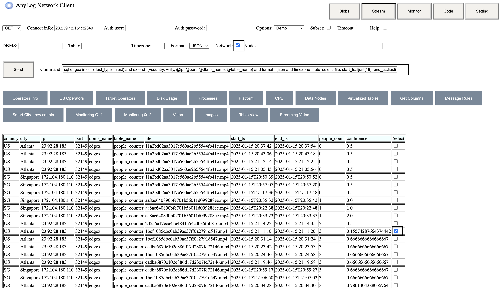
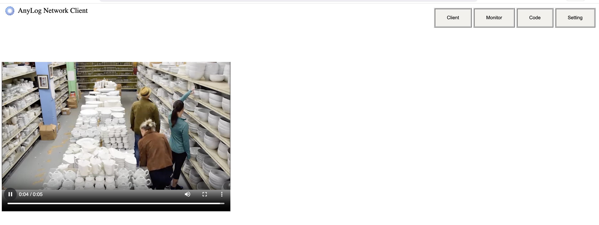

# Blobs by Example 

AnyLog / EdgeLake enables storage of both SQL and non-SQL data, such as images, videos, and other file formats. For 
non-SQL data, storage options include file-based systems or NoSQL databases like MongoDB.

This document provides step-by-step instructions for deploying and managing blob data. For a detailed architectural 
explanation of blob management, refer to the [image mapping document](../image%20mapping.md).

**What are blobs**: Binary Large Objects (BLOBs) are collections of binary data stored as single entities. Examples 
include PDFs, images, and videos. Due to their size and format, blobs cannot be effectively stored in standard SQL 
databases. Instead, they are managed using NoSQL solutions (e.g., MongoDB) or file-based storage systems.

## Node Setup 
The following directions are automatically done using user provided configurations when deploying via docker-compose. 

1. Blob data will be sent into AnyLog/EdgeLake via either REST or Message Broker service 
```anylog
# Sample connection to REST service
<run rest server where
    external_ip=!ip and external_port=!anylog_rest_port and
    internal_ip=!overlay_ip and internal_port=!anylog_rest_port and
    bind=!rest_bind and threads=!rest_threads and timeout=!rest_timeout>

 # Sample connection to Message Broker service
 <run message broker where
    external_ip=!ip and external_port=!anylog_broker_port and
    internal_ip=!!overlay_ip and internal_port=!anylog_broker_port and
    bind=!broker_bind and threads=!broker_threads>
```

2. Connect to both SQL and NoSQL databases 
```anylog
# SQL database 
<connect dbms !default_dbms where
    type=!db_type and
    user = !db_user and
    password = !db_passwd and
    ip = !db_ip and
    port = !db_port
>

# NoSQL database 
<connect dbms !default_dbms where
    type=!nosql_type and
    ip=!nosql_ip and
    port=!nosql_port and
    user=!nosql_user and
    password=!nosql_passwd
>
```

**Output**: Notice that while both NoSQL and SQl use `!default_dbms` as the database name for both SQL and NoSQL, 
AnyLog/EdgeLake is smart enough to rename NoSQL with `blob_` at the start of the database name.   
```shell
Logical DBMS Database Type Owner  IP:Port         Configuration                                Storage                                       
------------|-------------|------|---------------|--------------------------------------------|---------------------------------------------|
blobs_edgex |mongo        |user  |127.0.0.1:27017|                                            |Blobs Persistent                             |
edgex       |sqlite       |user  |Local          |Autocommit On, Fsync full (after each write)|/app/AnyLog-Network/data/dbms/edgex.dbms     |
```

3. Enable blobs archiving service
```anylog 
<run blobs archiver where
    dbms=true and
    folder=false and
    compress=true and
    reuse_blobs=true
>
```

## Accept data 
The process of accepting data is combined of two parts, data mapping and subscribing to the policy. 

From this point, the directions will utilize the logic for getting people video data from 
<a href="https://github.com/AnyLog-co/Sample-Data-Generator" target="_blank">Sample Data Generator</a>. 
Mapping for other data-sets can be found in 
<a href="https://github.com/AnyLog-co/deployment-scripts/tree/main/demo-scripts" target="_blank">deployment-scripts/demo-scripts</a>. 

1. Create a mapping policy 
```anylog
policy_id = people-videos

<new_policy = {
    "mapping": {
        "id": !policy_id,
        "dbms": "bring [dbms]",
        "table": "bring [table]",
        "schema": {
            "timestamp": {
                "type": "timestamp",
                "default": "now()"
            },
            "start_ts": {
                "type": "timestamp",
                "bring": "[start_ts]"
            },
            "end_ts": {
                "type": "timestamp",
                "bring": "[end_ts]"
            },
            "file": {
                "blob": true,
                "bring": "[file_content]",
                "extension": "mp4",
                "apply": "base64decoding",
                "hash": "md5",
                "type": "varchar"
            },
            "people_count": {
                "bring": "[count]",
                "type": "int"
            },
            "confidence": {
                "bring": "[confidence]",
                "type": "float"
            }
        }
    }
}>
```

2. Declare policy 
```anylog
blockchain prepare policy !new_policy

# when using a master node  
blockchain insert where policy=!new_policy and local=true and master=!ledger_conn

# when using a real blockchain (ex. optimismm) 
blockchain insert where policy=!new_policy and local=true and blockchain=optimism 
 ```

3. Declare a run MQTT client to accept the data based on policy for mapping  
```anylog
<run msg client where broker=local and port=!anylog_broker_port and log=fals and topic=(
    name=!policy_id and 
    policy=!policy_id
)>  
```

## Publishing & Query Data
<a href="https://github.com/AnyLog-co/Sample-Data-Generator" target="_blank">Sample Data Generator</a> is a tool 
allowing to send AnyLog/EdgeLake different types of data via REST, MQTT, Kafka and others, as well viewing different  
data set via a REST server (ie browser). 

1. Publish data into AnyLog/EdgeLake via MQTT
```shell
docker run -it -d \
  -e DATA_TYPE=people \
  -e PUBLISHER=mqtt \
  -e DB_NAME=test \
  -e REST_CONN=127.0.0.1:32150 \
  -e BATCH_SIZE=10 \
  -e TOTAL_ROWS=100 \
  -e SLEEP=0.5 \
  -e QOS=1 \
  -e TOPIC=people-videos \
--network host --rm anylogco/sample-data-generator:latest
```

2. via [Remote-CLI](../northbound%20connectors/remote_cli.md), query people data
```anylog 
sql edgex info = (dest_type = rest) and extend=(+country, +city, @ip, @port, @dbms_name, @table_name) and format = json and timezone = utc  select  file, start_ts::ljust(19), end_ts::ljust(19), people_count, confidence from people_counter     where start_ts >= NOW() - 1 hour and end_ts <= NOW() order by people_count, confidence --> selection (columns: ip using ip and port using port and dbms using dbms_name and table using table_name and file using file)
```
<div style="display: flex; align-items: center; justify-content: center;">
  
  
</div>

Within the query command there's an _info_ component (`info=(dest_type=rest)`), this informs thee operator returning the 
data to allow viewing via streaming of the result. If _info_ componnt is not part of the query, then the generated 
blob(s) selected will be stored on the query node . 

