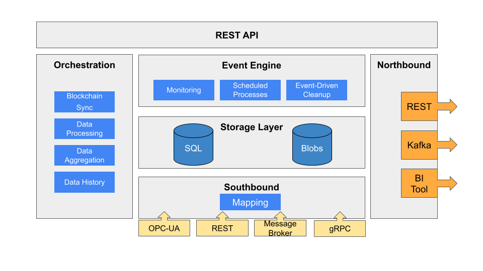

# Introduction to the AnyLog Platform

Welcome to AnyLog! This guide will help you install, configure, and run AnyLog nodes with various roles and features.

* [What is AnyLog](#what-is-anylog)
  * [EdgeLake vs. AnyLog](#edgelake-vs-anylog)
* [Agent Types](#agent-types)
  * [Master Node vs. Blockchain](#master-node-vs-blockchain)
  * [Operator Node](#operator-node)
* [Network Metadata Management](#network-metadata-management)
  * [Metadata Synchronization](#metadata-synchronization)
  * [Querying and Updating Metadata](#querying-and-updating-metadata)
* [Data Storage & Management](#data-storage--management)
  * [High Availability](#high-availability)
* [Network Security](#network-security)

---

## What is AnyLog

**AnyLog** is a decentralized platform for managing **IoT and time-series data** across distributed environments. It enables real-time data ingestion, storage, and querying by connecting independent compute nodes—each running the AnyLog software—that coordinate via metadata and shared protocols.

### EdgeLake vs. AnyLog

**EdgeLake** is the **open-source** and **free** version of the AnyLog platform. It provides a managed, zero-maintenance experience, ideal for organizations seeking decentralized data control without infrastructure complexity.

**EdgeLake Highlights:**
- Turnkey node deployment (edge or cloud)
- Zero-maintenance operation (auto-updates, monitoring, configuration)
- Scalable pricing — starts at **$1/device/month**
- Real-time SQL and REST API access from any node
- Built-in dashboards and analytics

**AnyLog (Enterprise)** includes everything in EdgeLake, with additional capabilities:
- Advanced security and authentication
- Federated data aggregation and ML model training
- Real-time support with SLA options

---

## Agent Types

Each node in the AnyLog network can assume one or more functional roles based on its configuration. These roles are designed to enable distributed data storage, query processing, ingestion, and coordination—each playing a unique part in the overall system architecture.

| **Role**                   | **Description**                                                               | **Notes**                                                          |
|----------------------------|-------------------------------------------------------------------------------|--------------------------------------------------------------------|
| **Operator**               | Stores and manages data in a local SQL database; responds to local queries    |                                                                    |
| **Query**                  | Orchestrates distributed queries across the network                           |                                                                    |
| **Master / Metadata Node** | Maintains global metadata in non-blockchain setups                            | Not needed if using a blockchain (e.g., Ethereum)                 |
| **Publisher**              | Ingests data and forwards it to Operator nodes                                | Not supported in EdgeLake                                          |

  

<strong>Figure:</strong> The diagram illustrates available services within AnyLog/EdgeLake. The node's services and logical databases determine its role.

### Master Node vs. Blockchain

A **Master (Metadata) node** is used to maintain metadata **only when the blockchain is not used**. In a blockchain-enabled network (e.g., Ethereum), the Master node is **not required**, and the metadata layer remains fully decentralized.

- See [Using Ethereum as a Global Metadata Platform](using_ethereum.md) for blockchain-based setup.
- See [Using a Master Node](master_node.md) for traditional metadata coordination.

### Operator Node

An **Operator node** is responsible for managing and storing data locally in a SQL database. It ingests data either directly or via a Publisher node and stores it according to the network’s metadata and schema mapping. Each Operator can use a supported backend database such as **PostgreSQL** or **SQLite**, based on deployment scale and performance needs.

Operators are the foundation of the network’s decentralized storage model. Each Operator node processes queries that target data it hosts. This ensures that even as data is distributed across multiple nodes, individual queries can be executed locally and efficiently. The Operator role is typically present on every node that manages data, and nodes can be configured to act as Operators exclusively or alongside other roles.

### Query Node

A **Query node** acts as a coordinator for executing distributed queries across multiple Operator nodes. When a user or application submits a query, the Query node analyzes the request, identifies the relevant Operators that host the needed data, and dispatches sub-queries to them. Each Operator processes its part of the query and sends back results, which are then aggregated by the Query node into a single response.

This role is essential for providing a unified view over a distributed data network. It abstracts away the complexity of locating and querying individual data sources, allowing clients to interact with the network as if it were a single, federated database. Query nodes can operate independently or be co-located with other roles depending on the deployment architecture.

For a node to act as a query node, all that's needed is enabling `system_query` logical database.

### Publisher Node

A **Publisher node** is responsible for ingesting raw data from external sources such as IoT devices, sensors, or applications. Once data is received, the Publisher formats it and forwards it to the appropriate Operator nodes based on the metadata and routing rules defined in the system.

Publisher nodes are particularly useful in environments with high-frequency data sources or devices that push updates to the edge of the network. While **not supported in EdgeLake**, the Publisher role is available in the enterprise version of AnyLog and can be instrumental in offloading preprocessing and routing tasks from the Operators, enabling greater scalability and cleaner separation of responsibilities.

---

## Network Metadata Management

The **metadata** stores network-related information shared among all nodes:

- Node roles and configuration
- Permissions and access control
- Logical schema of the data
- Data distribution and routing info

The metadata repository can be:
- A **blockchain** (e.g., Ethereum), or
- A centralized **Master node**

Interaction with the metadata is identical across both options. Internally, AnyLog refers to the metadata repository as **"the blockchain"**, even when using a Master node.

### Metadata Synchronization

Each node maintains a local copy of the metadata and runs a background process to periodically synchronize with the metadata repository. This allows:

- Continued operation if the central repository is temporarily unavailable
- Independence from the source of metadata

🔗 See [Blockchain Synchronizer](background_processes.md#blockchain-synchronizer) for technical details.

**Related Documentation**:

| Section | Description |
|---------|-------------|
| [Metadata Management](metadata_management.md#managing-metadata) | Overview of metadata structures and protocols |
| [Metadata Requests](metadata_requests.md) | API and CLI tools for querying metadata |
| [Using Ethereum](using_ethereum.md#using-ethereum-as-a-global-metadata-platform) | Setting up Ethereum as a metadata store |

### Querying and Updating Metadata

You can query and update metadata via the same set of **blockchain commands**, whether the metadata is on a blockchain or a Master node.

🔗 See: [Blockchain Commands](blockchain_commands.md)

---

## Data Storage & Management

Data is stored on **Operator nodes**, each using a local SQL database. AnyLog currently supports:

- [PostgreSQL](https://www.postgresql.org/) — recommended for large-scale nodes and data volumes  
- [SQLite](https://www.sqlite.org/index.html) — ideal for small, embedded, or in-memory deployments

Despite being distributed, the system provides a **unified query interface**. Query nodes automatically discover the relevant Operator nodes, distribute the query, and aggregate results.

### Query Process Flow

1. A **Query node** receives a request.
2. It determines which **Operators** hold the relevant data.
3. The query is forwarded to those Operators.
4. Each Operator processes its portion and replies.
5. The Query node aggregates the results and sends them back to the requester.

**Related Documentation**:

| Section | Description |
|---------|-------------|
| [Adding Data to Nodes](adding_data.md) | How data is ingested across the network |
| [Mapping Data](mapping_data_to_tables.md) | Schema transformations and data normalization |
| [Using a Message Broker](message_broker.md#using-a-message-broker) | Integrating with MQTT brokers |
| [Managing Data Files](managing_data_files_status.md) | Monitoring data lifecycle and status |
| [Querying Data](queries.md#query-nodes-in-the-network) | Executing distributed SQL queries |
| [Query Profiling](profiling_and_monitoring_queries.md) | Performance tuning and diagnostics |
| [Using Grafana](northbound_connectors/using_grafana.md#using-grafana) | Visualization of metrics via Grafana |
| [Using EdgeX](using_edgex.md#using-edgex) | Integration with EdgeX southbound connectors |

---

### High Availability

Nodes can be configured to **dynamically replicate data** for resilience and failover. In case of a node failure:

- Queries are automatically redirected to a backup node
- New nodes can be provisioned to restore redundancy

🔗 More: [High Availability (HA)](high_availability.md#high-availability-ha)

---

## Network Security

AnyLog supports multiple layers of security:

- **Node Authentication**  
  Each node has a public/private key pair. Messages include the public key and a digital signature to verify authenticity.

- **User Authentication**  
  Users may also be assigned key pairs and treated like nodes during authentication.

- **Basic Authentication**  
  Nodes can require username/password for command execution.

- **Certificate-Based SSL**  
  The platform supports client-server certificate authentication for secure connections.

- **Message Encryption**  
  Messages between nodes can be encrypted for confidentiality.

🔐 See [User Authentication](authentication.md) for implementation details.
