# Google Drive

To extract data from AnyLog into Google Drive we recommend using a tool called [Two Minute Reports](https://workspace.google.com/marketplace/app/two_minute_reports/6804555176)
which provides the ability to import data via REST, Database, Social Media and other SEO services. 

## Install 

1. Under _Extensions_ goto _Add-ons_ → _Get add-ons_
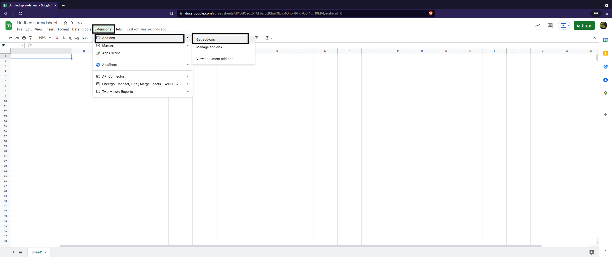


2. In the search bar look for "Two Minute Reports" & double click it
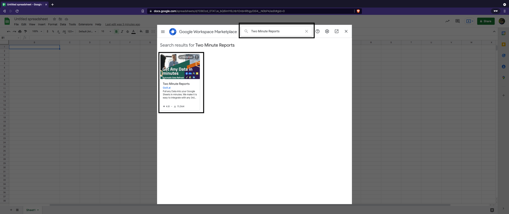


3. Install the add-on to your Google Sheets & press "continue"  

| 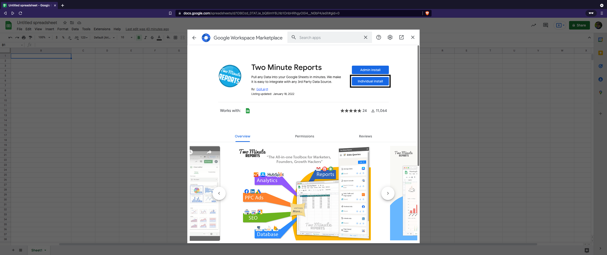 | 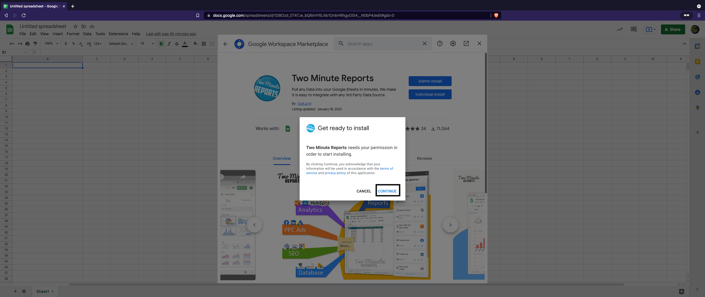 |
| --- | --- |

4. Google Requires users to confirm - click on the user you'd like to install the application on & press "Allow" 

| 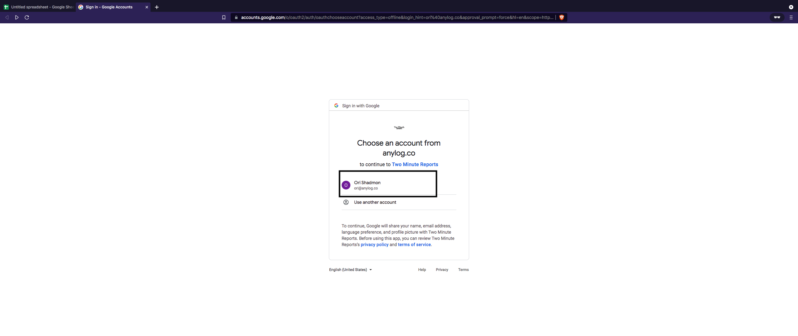 | 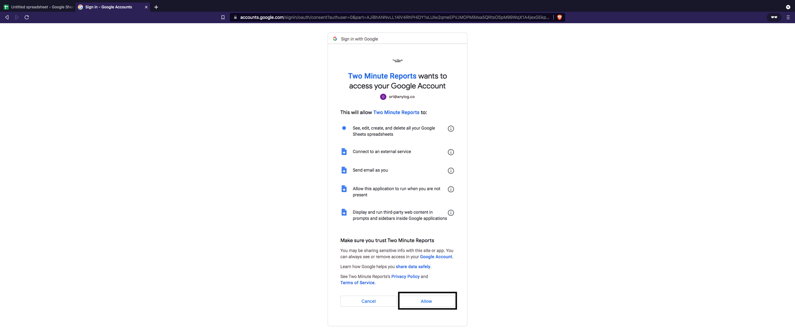 | 
| --- | --- |


## Executing REST Request

1. Once that's completed launch _Two Minute Reports_: _Extensions_ → _Two Minute_Reports_ → Launch

**Note**: _Two Minute Reports_ works best when only a single account is logged in.


2. Press "Add+" to connect to a new REST connection
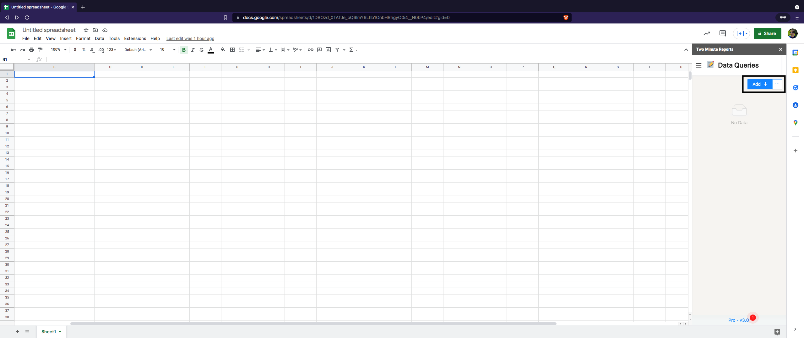


3. Under _Data Source_ set the Type to API Bridge & Fill-out the form

Notice that for the complete form user should specifiy: _Base URL_, _Authentication_ (if set) and headers.    
For demo purposes, I'm using a query that consists of [increments function](../queries.md#the-increment-function) and returns the data as a list of JSON values without statistics:
```sql
sql aiops format=json:list and stat=false "select increments(hour, 1, timestamp), min(timestamp) as timestamp, min(value) as min_value, avg(value) as avg_value, max(value) as max_value from sic1001_mv where timestamp >= NOW() - 1 week"
```

| 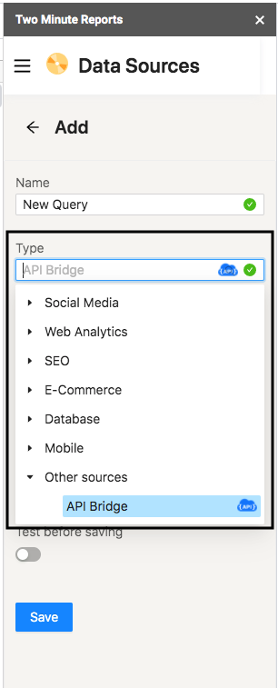 | 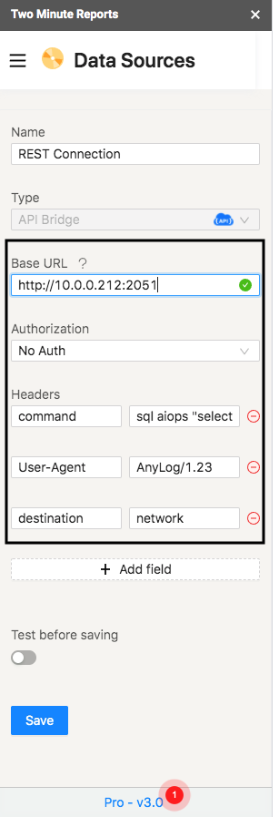 |
| --- | --- |

4. Once the form is complete, test and save the changes - this will validate that the request is valid

| 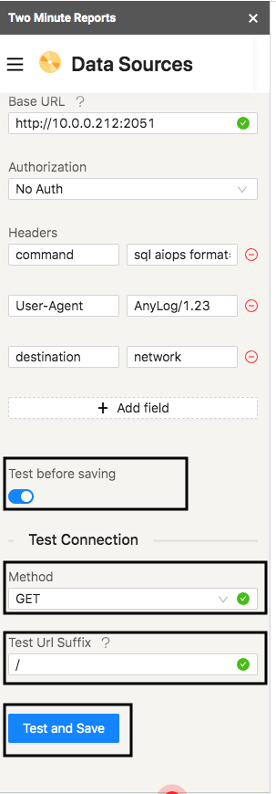 | 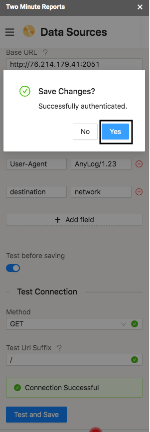 | 
| --- | --- |

5. In menu, goto _Data Queries_

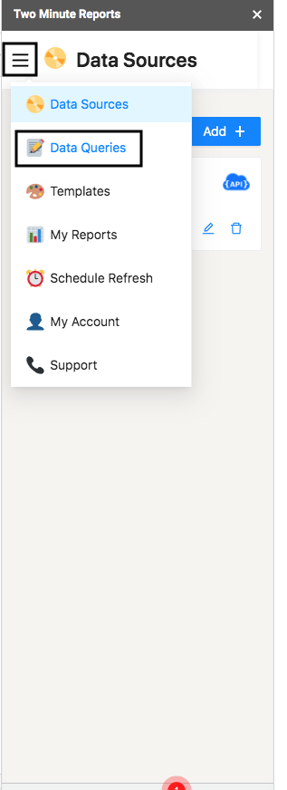


6. Press _Add+_ to create a new Query Form

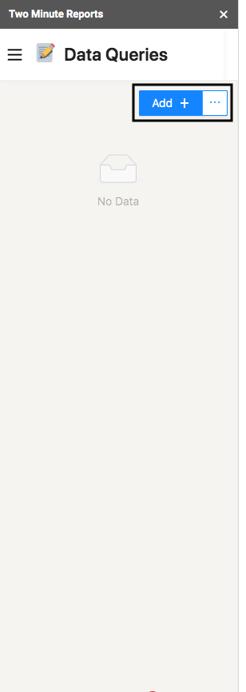

7. Fill-out the form, setting _Data Source_ to be the same as the the one created earlier & press "Run Query"


The steps mentioned above will ultimately result in a table similar to the one shown on the right of the image; with it
users can generate images and graphs as shown on the right side of the image, just like any other data set

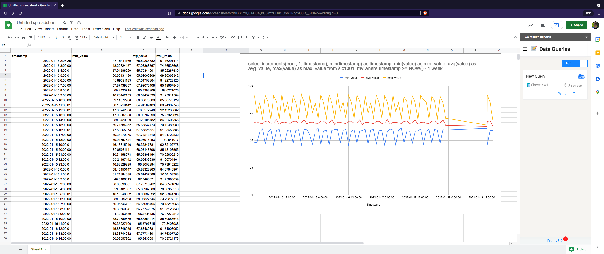
