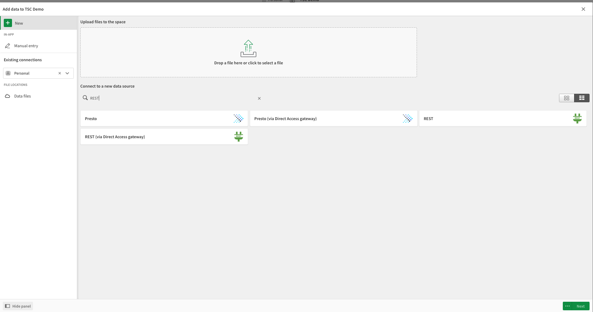

# Qlik

Qlik is a data integration, analytics, and artificial intelligence platform. Using their <a href="https://help.qlik.com/en-US/connectors/Subsystems/REST_connector_help/Content/Connectors_REST/REST-connector.htm" target="_blank">REST connector plugin</a>, 
users are able to pull data from AnyLog/EdgeLake and use it to generate insight on their data. 

## Requirements 
1. An active AnyLog network 
2. A subscription with QLik 

## Preparing the Environment   
1. From _Home_ goto _Create_
2. In _Create_ we want to use the _Analytics App_
3. Data is coming from _Files & Other Data  Sources_

4. We use a standard _REST_

For this demo we'll be creating REST connections for _increments_ and _period_ function respectively.
The main components of the REST interface delt with are the URL bar and cURL request headers. 

|  |  |
|:-------------------------------------------------:|:-------------------------------------------------:|

## Increments Data 
The [increments function](../queries.md#the-increment-function) is used to segment time-series data into fixed, contiguous 
time intervals (e.g., every 5 minutes, every hour, every day).

1. For the URL specify the REST IP and port of the node to send the request against

 
2. In the headers section add the following params: 
    * **command**: `sql nov format=json and stat=false and include=(t2) and extend=(@table_name) "select increments(second, 1, timestamp), min(timestamp) as timestamp, min(value) as min_val, avg(value) as avg_val, max(value) as max_val from t1 WHERE timestamp >= NOW() - 15 minutes ORDER BY timestamp"`
    * **User-Agent**: `AnyLog/1.23`
    * "destination": `network`

3. Validate the data and continue 

4. Create a new Analytics

5. Create a graph based on the given Dimensions 

