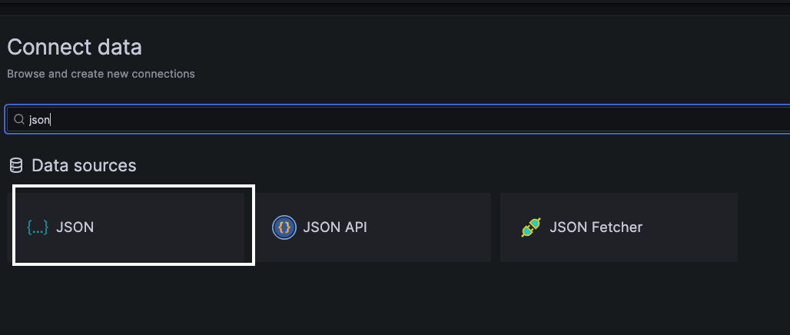
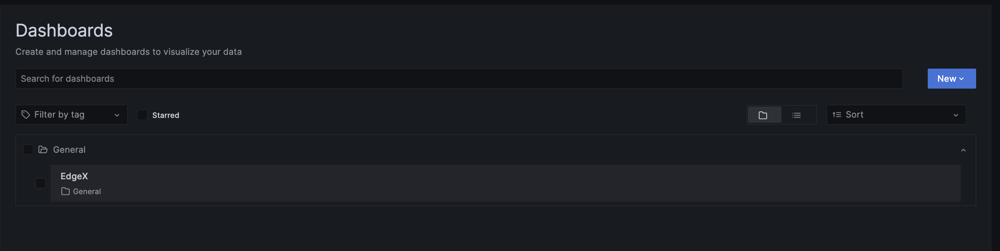
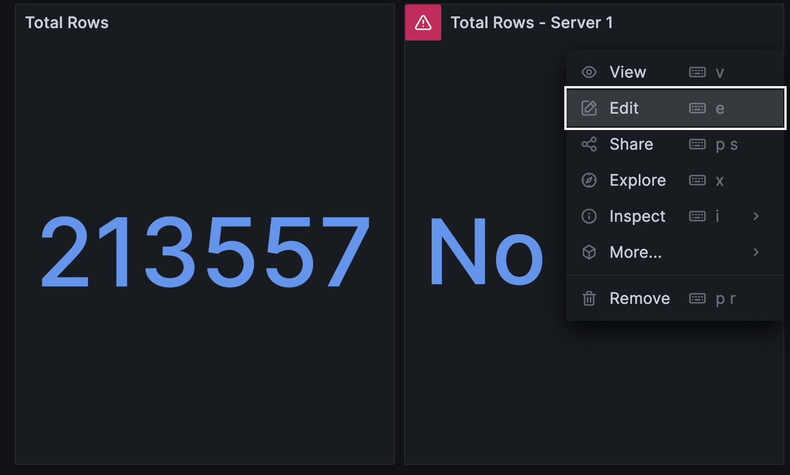

# Importing AnyLog related dashboards into Grafana

Instructions to create and manage your Grafana instance with AnyLog, can be found in [Using Grafana](using%20grafana.md) 


The following document provides 3 sample Grafana dashboards
* [Network Map](../examples/grafana_json/network_summary.json) - The dashboard consists of a map showing all the nodes 
in the network, a list of operator nodes and a list of  tables supported in the network.


  
* [EdgeX Diagram](../examples) - The dashboard consists of a line graph demonstrating min/avg/max, as well gages showing 
the overall number of rows as well as the number of rows per node. The content for these widgets is via our third-party
MQTT client sample connection.  


## Setting Up Grafana

* An [installation of Grafana](https://grafana.com/docs/grafana/latest/setup-grafana/installation/) - We support _Grafana_ version 7.5 and higher, we recommend using _Grafana_ version 9.5.16 or higher. 
```shell
docker run --name=grafana \
  -e GRAFANA_ADMIN_USER=admin \
  -e GRAFANA_ADMIN_PASSWORD=admin \
  -e GF_AUTH_DISABLE_LOGIN_FORM=false \
  -e GF_AUTH_ANONYMOUS_ENABLED=true \
  -e GF_SECURITY_ALLOW_EMBEDDING=true \
  -e GF_INSTALL_PLUGINS=simpod-json-datasource,grafana-worldmap-panel \
  -e GF_SERVER_HTTP_PORT=3000 \
  -v grafana-data:/var/lib/grafana \
  -v grafana-log:/var/log/grafana \
  -v grafana-config:/etc/grafana \
  -it -d -p 3000:3000 --rm grafana/grafana:9.5.16
```

Log into Grafana and Declare a _(JSON) Data Source_

1. [Login to Grafana](https://grafana.com/docs/grafana/latest/getting-started/getting-started/) - The default Grafana HTTP port is 3000  
   * URL: http://localhost:3000/ 
   * username: admin | password: admin


2. In _Data Sources_ section, create a new JSON data source
   * select a JSON data source.
   * On the name tab provide a unique name to the connection.
   * On the URL tab add the REST address offered by the AnyLog node (i.e. http://10.0.0.25:2049)
   * On the ***Custom HTTP Headers***, name the default database. If no header is set, then all AnyLog hosted databases will be available to a query process.


| |  | 
| :---: | :---: |


## Uploading Dashboard

1. In a new Dashboard goto the _Settings_  


2. Go _JSON Model_ and add desired model - A model is the JSON object being used to generate the grafana dashboard (for example: [Kubernetes Alert](kubearmor_alert.json)).

|  |  |
|:--------------------------------------------------------------------------------------------------:|:-------------------------------------------------------------------------------------:|

3. Save Changes


4. Once the changes are saved, you should see a new Dashboard 

| Before |                                After                                |
| :---: |:-------------------------------------------------------------------:|
|  |  | 

5. For each of the widgets update the following information:
   * Data Source 
   * Metric value (AnyLog table name)

Once these changes are saved, the outcome should look something like this:

|          View when accessing Dashboard          |                             Update Data Source                              | Update Metric Value | Outcome | 
|:-----------------------------------------------:|:---------------------------------------------------------------------------:| :---: | :---:  |
|  |  |  |  |   
