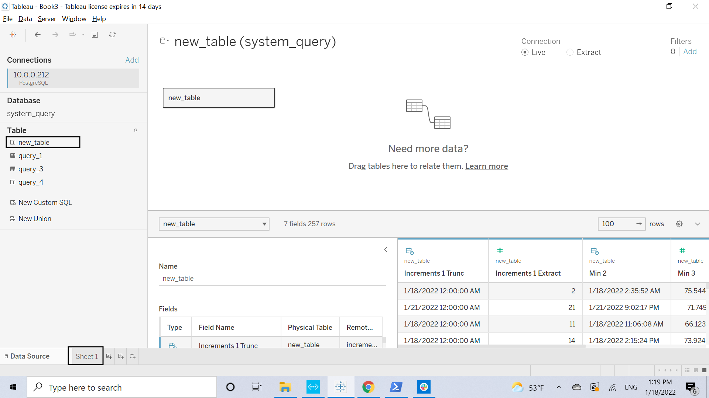
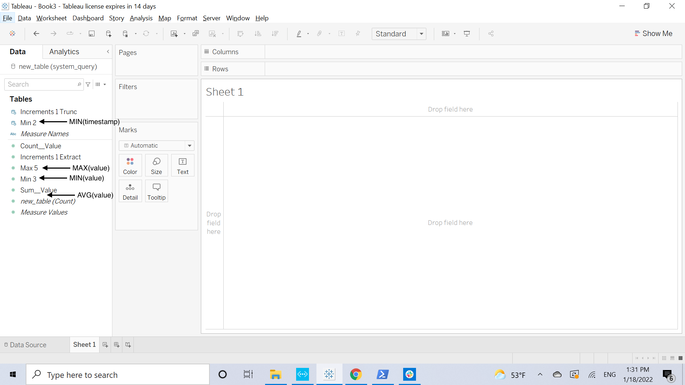

# PSQL Connector & Tableau Visualization
  
For software that doesn't support REST requests, but does support PostgreSQL connector graphs can be generated through 
the `system_query` database.

## Setting up Postgres 
0. [Install Postgres](https://www.postgresqltutorial.com/install-postgresql/)
```bash
docker run -d --network host \
  --name anylog-psql \
  -e POSTGRES_USER=${DB_USR} \
  -e POSTGRES_PASSWORD=${DB_PASSWD} \
  -v pgdata:/var/lib/postgresql/data \
  --rm postgres:14.0-alpine
```

Update Postgres to support [remote access](https://mellowhost.com/blog/how-to-allow-remote-user-access-in-postgresql.html#:~:text=%20How%20to%20Allow%20Remote%20User%20Access%20in,manages%20a%20remote%20access%20file%2C%20to...%20More%20) - if Postgres (_north-bound_) connector is on a separate machine.
1. locate and open`data/postgresql.conf` & open it
    ```bash
    anylog@anylog-2004:~$ docker volume inspect pgdata 
    [
        {
            "CreatedAt": "2022-01-18T00:46:23Z",
            "Driver": "local",
            "Labels": null,
            "Mountpoint": "/var/lib/docker/volumes/pgdata/_data",
            "Name": "pgdata",
            "Options": null,
            "Scope": "local"
        }
    ]
    
    anylog@anylog-2004:~$ sudo ls /var/lib/docker/volumes/pgdata/_data
    [sudo] password for anylog: 
    base    pg_commit_ts  pg_hba.conf    pg_logical    pg_notify    pg_serial     pg_stat      pg_subtrans  pg_twophase  pg_wal   postgresql.auto.conf  postmaster.opts
    global  pg_dynshmem   pg_ident.conf  pg_multixact  pg_replslot  pg_snapshots  pg_stat_tmp  pg_tblspc    PG_VERSION   pg_xact  postgresql.conf       postmaster.pid
    
    anylog@anylog-2004:~$ sudo vim /var/lib/docker/volumes/pgdata/_data/postgresql.conf
    ```
    
2. Allow Remote Access - uncomment `listen_address` and set to "*"
    ```configs
    listen_addresses = '*'
                                        # comma-separated list of addresses;
                                        # defaults to 'localhost'; use '*' for all
    ```
    
3. Grant Remote Access - add the following line at the bottom of `data/pg_hba.conf`
    ```configs
    host    all             new_user           27.147.176.2/32       md5
    ```
   
4. Restart PostgreSQL instance
    ```bash
    docker restart anylog-psql
    ```

## Executing Query
0. On AnyLog connect `system_query` to Postgres database 
```anylog
connect dbms psql anylog@127.0.0.1:demo 5432 system_query
```

1. Execute query - [to run in repeat](../alerts%20and%20monitoring.md#repeatable-queries)
```anylog
AL aiops-single-node > run client () sql aiops format=table and table=new_table and drop=true "select increments(hour, 1, timestamp), min(timestamp), min(value), avg(value), max(value) from fic11_mv where timestamp >= NOW() - 1 day"
```

2. Utilize explain query to view how the results are generated
```anylog
AL aiops-single-node > query explain 

07 Remote DBMS    : aiops
07 Remote Table   : fic11_mv
07 Source Command : select increments(hour, 1, timestamp), min(timestamp), min(value), avg(value), max(value) from fic11_mv where timestamp >= NOW() - 1 day
07 Remote Query   : select date_trunc('day',timestamp), (extract(hour FROM timestamp)::int / 1), min(timestamp), min(value), SUM(value), COUNT(value), max(value) from fic11_mv where timestamp >= '2022-01-17T18:31:31.442147Z' group by 1,2
07 Local Create   : create table new_table (increments_1_trunc timestamp without time zone, increments_1_extract integer, min_2 timestamp without time zone, min_3 double precision, SUM__value numeric, COUNT__value integer, max_5 double precision);
07 Local Query    : select min(min_2), min(min_3), SUM(SUM__value) /NULLIF(SUM(COUNT__value),0), max(max_5) from new_table group by increments_1_trunc,increments_1_extract order by increments_1_trunc,increments_1_extract
```
Disclaimer: [Full list of SQL options](../query%20data/queries.md#query-options)

## Extract Data onto Tableau
1. [Download & Install Tableau](https://www.tableau.com/products/desktop/download)
2. Under _Data_ → _Data Sources_ select PostgreSQL connector type 

|  |  |
| --- | --- |

3. Fill-out the information to connect to database & Press "Ok"


4. Double-click on the table you want to use (in this case `new_table`) and goto worksheet



## Generating Graphs

The `system_query` database gathers (query) results from the different AnyLog instances to generate a unified dataset for 
the user. As such, generating graphs from the final results is a bit complicated. 
   * Min 2 - is column `MIN(timestamp)`
   * Min 3 - is column `MIN(value)`
   * SUM(SUM__VALUE) / COUNT(new_table_count) -- is column `AVG(value)`
   * MAX 5 - is column `MAX(value)`


To generate a graph, use "Min 2" as _Columns_ and all others for _Rows_
