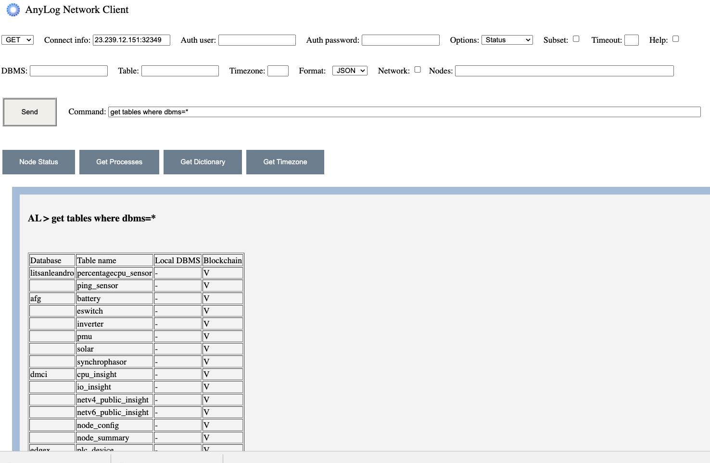
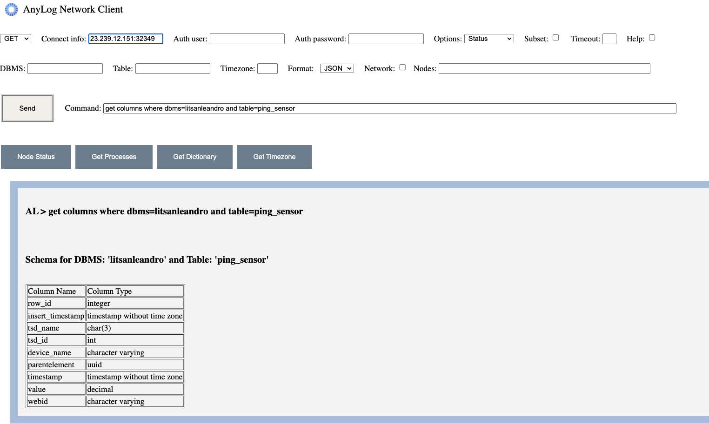
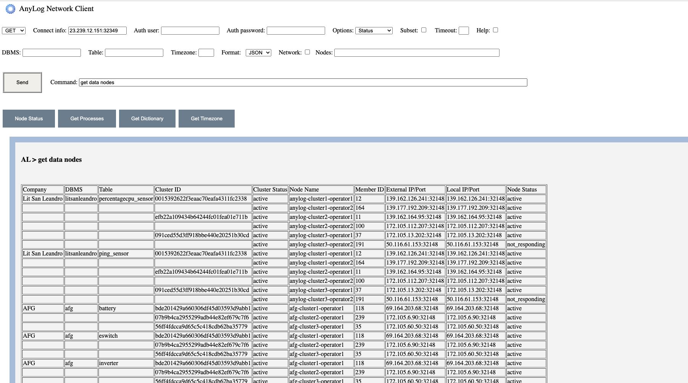
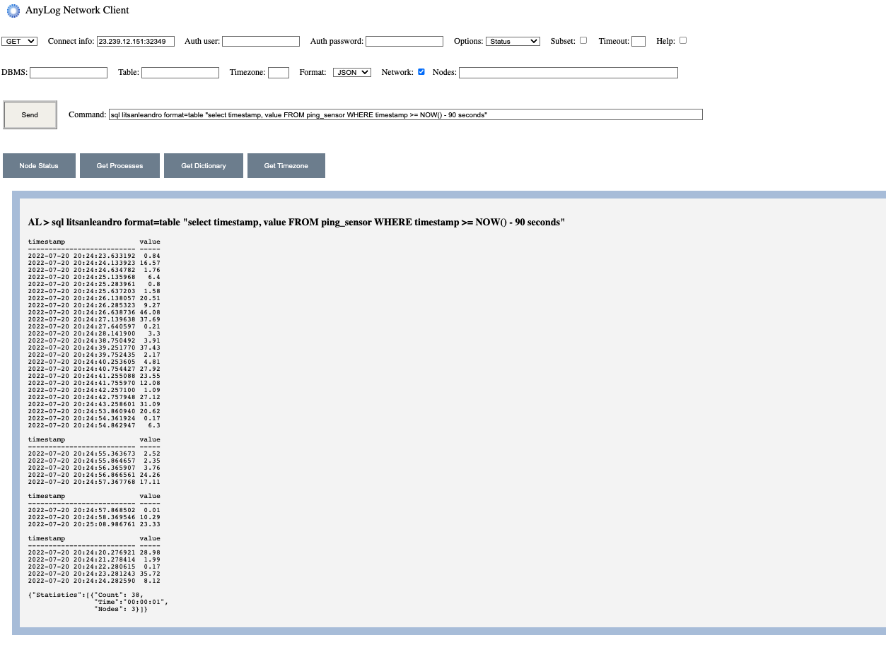
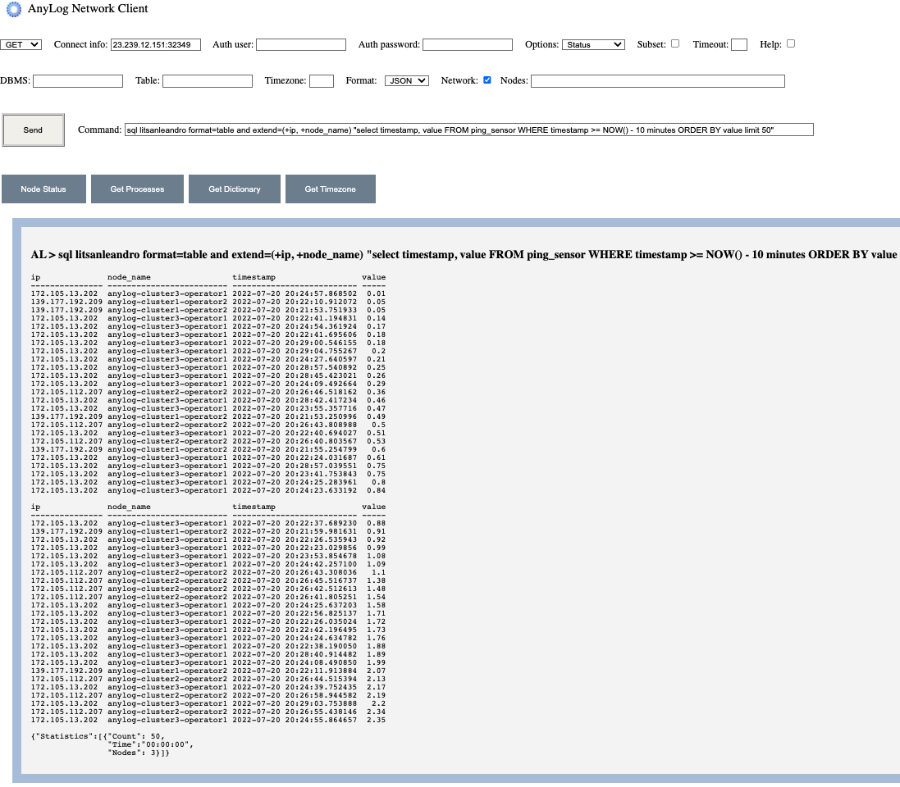

# The Remote CLI

The Remote CLI is a web application that offers a REST based GUI that allows to issue commands to nodes in the network.    
The GUI replaces the need to log to specific nodes by delivering the commands using REST.  

A similar functionality is achieved using [cURL](https://curl.se/) as well as with other tools such as [Postman](https://www.postman.com/).  
Note: [Using Postman](../using%20postman.md) details the usage of Postman with AnyLog nodes.

The Remote CLI contains the following:
1. A client form to issue commands and queries to nodes in the network.
2. Preconfigured buttons allowing to issue commands by clicking on buttons. Users preconfigure the buttons to their frequently used commands and queries.
3. Forms to display and stream video and images.
4. A form that collects monitored info from monitored nodes.
5. A form that translate commands and queries to a) cURL commands, b) QR Codes and c) HTTP requests.
6. A configuration form.

## Installing the Remote CLI

Details are available [here](../../Support/Remote-CLI.md).

## Configuring the Remote CLI
The Remote CLI can be configured to support specific settings, default values and frequently used commands.  
The configurations files are organized in the static/json folder as a set of JSON files.

### The setting files

The initial settings for the Remote CLI are determined by the **setting.json** file.
This JSON file specifies the following:
* The name of the JSON file that specifies the pre-configured buttons. This file determines
the commands that are associated with the buttons on the client form.
* The JSON files that configure the monitoring forms.   

 
The **setting.json** file includes the following sections:
* **client** - specifies the default values on the client form allowing the following options:
   * connect_info - specifies the default AnyLog Node client to use.
   * buttons - the name of the JSON file that defines the preconfigured buttons options on the client form.
   * help - determines how help is provided when a button is selected and the help option is flagged on the client form:
      - if the value is **open**, the button selection opens the URL that is associated with the button.
      - if the value is **url**, the button selection displays the help URL that is associated with the button.
 
* **certificates** - specifies the certificates to use (if authentication on the AnyLog node is enabled).

* **Monitor** - specifies the JSON files that configure the monitored pages.

Example:
```json
{
  "client" : {
    "connect_info": "23.239.12.151:32349",
    "buttons" : "commands.json",
    "help" : "link"
  },
  "certificates" : {
      "enable"   : false,
      "pem_file" : "ca-anylog-public-key.crt",
      "crt_file" : "server-acme-inc-public-key.crt",
      "key_file" : "server-acme-inc-private-key.key"
  },

  "monitor" : [
    ["Monitor Operators", "monitor_operators.json"],
    ["Monitor Members", "monitor_members.json"]
  ]

}

```

The **buttons** configurations are organized as a JSON file.
The name of the file is specified in the **setting.json** file under "client/buttons" ("commands.json" in the example above).
The info contained in the file includes the following:
* **button** - The name appearing on the button.
* **command** - the command to issue when the button is selected.
* **type** - the command type (GET or POST).
* **group** - a category name, allowing users to select buttons by categories.
* **help_url** - the URL to use if **help** is selected on the client form.

Example:
```json
{
 "commands": [
  {
   "button": "Node Status",
   "command": "get status",
   "type": "GET",
   "group": "Monitor",
   "help_url": "blob/master/monitoring%20nodes.md#the-get-status-command"
  },
  {
   "button": "Get Processes",
   "command": "get processes",
   "type": "GET",
   "group": "Monitor",
   "help_url": "blob/master/monitoring%20nodes.md#the-get-processes-command"
  },
  {
   "button": "Get Dictionary",
   "command": "get dictionary",
   "type": "GET",
   "group": "Monitor",
   "help_url": "blob/master/monitoring%20nodes.md#the-get-dictionary-command"
  },
  {
   "button": "Disk Usage",
   "command": "get disk usage .",
   "type": "GET",
   "group": "Monitor",
   "help_url": "blob/master/monitoring%20nodes.md#monitoring-state-commands"
  },
  {
   "button": "CPU Usage",
   "command": "get cpu usage",
   "type": "GET",
   "group": "Monitor",
   "help_url": "blob/master/monitoring%20nodes.md#monitoring-state-commands"
  },
  {
   "button": "Platform Info",
   "command": "get platform info",
   "type": "GET",
   "group": "Monitor",
   "help_url": "blob/master/monitoring%20nodes.md#monitoring-state-commands"
  },
  {
   "button": "Network Info",
   "command": "get node info net_io_counters",
   "type": "GET",
   "group": "Monitor",
   "help_url": "blob/master/monitoring%20nodes.md#the-get-node-info-command"
  },
  {
   "button": "Swap Memory",
   "command": "get node info swap_memory",
   "type": "GET",
   "group": "Monitor",
   "help_url": "blob/master/monitoring%20nodes.md#the-get-node-info-command"
  },
  {
   "button": "Members List",
   "command": "blockchain get (operator, publisher, query) bring.table [*][name] [*][country] [*][city] [*][ip] [*][port]",
   "type": "GET",
   "group": "Monitor"
  },
  {
   "button": "USA Members",
   "command": "blockchain get (operator, publisher, query) where [country] contains US bring.table [*][name] [*][country] [*][city] [*][ip] [*][port]",
   "type": "GET",
   "group": "Monitor"
  }
 ]
}
```

## Usage examples

The following demonstarte commands issued via cURL and their web representation using the Remote CLI:

### Return the list of tables supported by the network 

Using cURL:  
`curl -X GET 23.239.12.151:32349 -H "command: get tables where dbms=*" -H "User-Agent: AnyLog/1.23"`

Using the Remote CLI:



### Return columns in a given table 

Using cURL:

`curl -X GET 23.239.12.151:32349 -H "command: get columns where dbms=litsanleandro and table=ping_sensor" -H "User-Agent: AnyLog/1.23"`

Using the Remote CLI:



### Return Operators nodes associated to a company

Using cURL:

`curl -X GET 23.239.12.151:32349 -H 'command:blockchain get operator where company="Lit San Leandro"' -H "User-Agent: AnyLog/1.23"` 

Using the Remote CLI:


### Get the list of nodes that host the data (for each table)

Using cURL:

`curl -X GET 23.239.12.151:32349 -H "command:get data nodes" -H "User-Agent: AnyLog/1.23" `

Using the Remote CLI:



### Query the last 90 seconds of data

Using cURL:

`curl -X GET /23.239.12.151:32349 -H 'command: sql litsanleandro format=table "select timestamp, value FROM ping_sensor WHERE timestamp >= NOW() -90 seconds"' -H "User-Agent: AnyLog/1.23" -H "destination: network"`

Using the Remote CLI:



### Query the last 10 minutes of data including the source node

Using cURL:

`curl -X GET 23.239.12.151:32349 -H 'command: sql test format=table and extend=(+ip, +node_name) "select timestamp, value FROM rand_data WHERE timestamp >= NOW() - 10 minutes ORDER BY value LIMIT 50"' -H "User-Agent: AnyLog/1.23" -H "destination: network"`

Using the Remote CLI:

