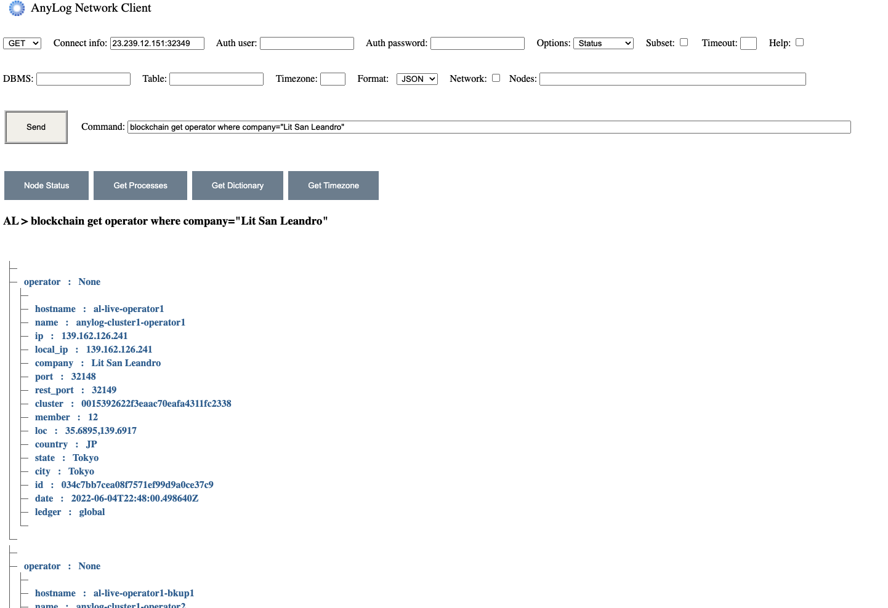

# Remote CLI
The following queries were all executed through the Query node showing to show that from a single point the user can get 
not only the data, but also metadata and general machine information.

* Show tables in network: 

`curl -X GET 23.239.12.151:32349 -H "command: get tables where dbms=*" -H "User-Agent: AnyLog/1.23"`

* Show columns in a given table - `litsanleandro.ping_sensor`: 

`curl -X GET 23.239.12.151:32349 -H "command: get columns where dbms=litsanleandro and table=ping_sensor" -H "User-Agent: AnyLog/1.23"`

* Query data in Blockchain - list all operators for company _Lit San Leandro_. There are 6 operators, but we only see 1 
 due to screen size. 

`curl -X GET 23.239.12.151:32349 -H "command:blockchain get operator where dbms=lit" -H "User-Agent: AnyLog/1.23"` 
 

* Get list of data nodes (operators) and what kind of data they contain. 

`curl -X GET 23.239.12.151:32349 -H "command:get data nodes" -H "User-Agent: AnyLog/1.23" `

* Query the last 90 seconds - notice that unlike the previous examples the "network" option is enabled & data is coming 
from 3 of the 6 nodes. 

`curl -X GET /23.239.12.151:32349 -H 'command: sql litsanleandro format=table "select timestamp, value FROM ping_sensor WHERE timestamp >= NOW() -90 seconds"' -H "User-Agent: AnyLog/1.23" -H "destination: network"`

* Query the last 10 minutes of data per node - notice that like the previous example the "network" option is enabled & data is coming 
from 3 of the 6 nodes. (The reason for the limit is so the result will easily fit the screen)

`curl -X GET 23.239.12.151:32349 -H 'command: sql test format=table and extend=(+ip, +node_name) "select timestamp, value FROM rand_data WHERE timestamp >= NOW() - 10 minutes ORDER BY value LIMIT 50"' -H "User-Agent: AnyLog/1.23" -H "destination: network"`
