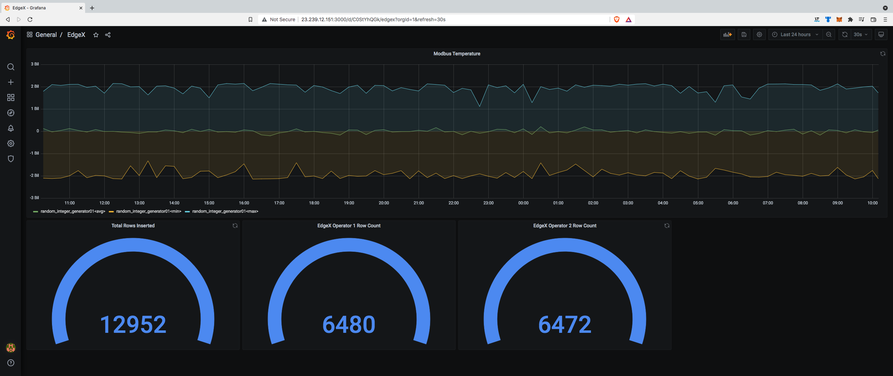

**# Using Grafana

## Overview

Grafana is an open-source BI tool managed by [Grafana Labs](https://grafana.com/). We utilize Grafana as our default 
demo BI tool. However, directions for other BI tools, such as [Microsoft's PowerBI](PowerBI.md), can be found in our 
[North Bound services](../northbound%20connectors) section.   

Using Grafana, users can visualize time series data using pre-defined queries and add new queries using SQL.

## Prerequisites & Links

* An [installation of Grafana](https://grafana.com/docs/grafana/latest/setup-grafana/installation/) - We support _Grafana_ version 7.5 and higher, we recommend using _Grafana_ version 9.5.16 or higher. 
```shell
docker run --name=grafana \
  -e GRAFANA_ADMIN_USER=admin \
  -e GRAFANA_ADMIN_PASSWORD=passwd \
  -e GF_AUTH_DISABLE_LOGIN_FORM=false \
  -e GF_AUTH_ANONYMOUS_ENABLED=true \
  -e GF_SECURITY_ALLOW_EMBEDDING=true \
  -e GF_INSTALL_PLUGINS=simpod-json-datasource,grafana-worldmap-panel \
  -e GF_SERVER_HTTP_PORT=3000 \
  -v grafana-data:/var/lib/grafana \
  -v grafana-log:/var/log/grafana \
  -v grafana-config:/etc/grafana \
  -it -d -p 3000:3000 --rm grafana/grafana:9.5.16
```

* An AnyLog Node that provides a REST connection - To configure an AnyLog Node to satisfy REST calls, issue the following command on the AnyLog command line:  
  * [ip] and [port] are the IP and Port that would be available to REST calls.
  * [max time] is an optional value that determines the max execution time in seconds for a call before being aborted.
  * A 0 value means a call would never be aborted and the default time is 20 seconds.
```anylog
<run rest server where
    external_ip=!external_ip and external_port=!anylog_rest_port and
    internal_ip=!ip and internal_port=!anylog_rest_port and
    bind=!rest_bind and threads=!rest_threads and timeout=!rest_timeout
>
```
* [Support](https://grafana.com/docs/grafana/latest/)


## Setting Up Grafana 
1. [Login to Grafana](https://grafana.com/docs/grafana/latest/getting-started/getting-started/) - The default HTTP port that AnyLog GUI listens to is 3000 - On a local machine go to ```http://localhost:3000/```.

 

2. In _Data Sources_ section, create a new JSON data source
   * select a JSON data source.
   * On the name tab provide a unique name to the connection.
   * On the URL Tab add the REST address offered by the AnyLog node (i.e. http://10.0.0.25:2049)
   * On the ***Custom HTTP Headers***, name the default database. If no header is set, then all accessible databases to 
   the node will be available to query       
 

Select the ***Save and Test*** option that should return a green banner message: ***Data source is working***.


### Enabling Authentication

Enabling authentication is explained at [Authenticating HTTP requests](../authentication.md#Authenticating-http-requests).

When authentication only REST requests via _username_ and _password_ ([basic authentication](../authentication.md#enabling-basic-authentication-in-a-node-in-the-network)) 
the Grafana configuration should have _basic auth_ enabled.


While authentication using [SSL Certificates](../authentication.md#using-ssl-certificates) should have _TLS Client Auth_ and _Skip TLS Verify_ enabled. 


**Notes**: Failure to connect may be the result of one of the following
* AnyLog instance is not running or not configured to support REST calls.
* Wrong IP and Port.
* Firewalls are not properly configured and make the IP and Port not available.
* AnyLog is configured with authentication detection that is not being satisfied.
* If the connected node is not able to determine tables for the selected database, the dashboard (Edit Panel/Metric Selection) presents "Error: No table connected" in the pull-down menu.

## Using Grafana to visualize AnyLog data

Grafana allows to present data in 2 modes _Time Series_ collects and visualize data values as a function of time, and 
_Table_ format where data is presented in rows and columns.


### Blockchain based Visualization


## Using the Time Series format
The time series format   
AnyLog offers 2 predefined queries and users can modify the default queries or specify additional queries using the ***Additional JSON Data*** options on the panel.    

### The predefined queries 
***The increments query*** (The default query)   
A query to retrieve statistics on the time series data in the selected time range.  
Depending on the number of data point requested, the time range is divided to intervals and the min, max and average are collected for each interval and graphically presented.  
In the default behavior, AnyLog makes the best guess to determine the relevant column representing the time and the relevant value column.  
The default behaviour can be modified by updating ***Additional JSON Data*** section (on the lower left side of the panel).  
To execute a period query, include the key: 'type' and the value: 'increments' in the Additional JSON Data section.  

***The period query***  
A query to retrieve data values at the end of the provided time range (or, if not available, before and nearest to the end of the time range).
The derived time is the latest time with values within the time range.         
From the derived time, the query will determine a time interval that ends at the derived time and provides the avg, min and max values.    
To execute a period query, include the key: 'type' and the value: 'period' in the Additional JSON Data section.  

More information on increments and period types of queries are available in [queries and info requests](https://github.com/AnyLog-co/documentation/blob/master/queries%20and%20info%20requests.md).
  
## Using the Table format
The default behaviour shows the data provided to the ***time series format*** with the default query. 
The default behaviour can be modified by updating ***Additional JSON Data*** section (on the lower left side of the panel).

## Modifying the default behaviour

Updating the ***Additional JSON Data*** section provides additional information to the query process.  
The information provided overrides the default behaviour and can pull data from any database managed by AnyLog (as long as the user maintains valid permissions).  
The additional information is provided using a JSON script with the following attribute names:

<pre>
dbms            - The name of the logical database to use. Overrides the dbms name in the configuration page.
table           - The name of the table to use. Overrides the table name in the sql statement.
type            - The type of the query. The default value is 'sq' and other valid types are: 'increments', 'period' and 'info'.         
sql             - A sql statement to use.
details         - An AnyLog command which is not a SQL statement.
where           - A "WHERE" condition added to the SQL statement. Can add filter or other conditions to the executed SQL.
functions       - A list of SQL functions to use which overwrites the default functions. 
timezone        - ***utc*** (default) or ***default*** to change time values to local time before the transfer to Grafana.
time_column     - The name of the time column in the Time Series format.
value_column    - The name of the value column in the Time Series format.
time_range      - When using a Table view, determines if the query needs to consider the time range. The default value is 'true'.
servers         - Replacing the network determined servers with a list of Operators (data hosting servers) to use.
instructions    - Additional AnyLog query instructions.
</pre>

## Modifying the default behaviour using the Grafana Panel

### Modifying the time range
* A query issued using ***Time Series*** format is always bounded by the time range specified on the panel.
* A query issued using ***Table*** format is bounded by defauly with the time range.  
Users can modify the query to ignore the time selection by updating the Additional JSON Data with the key: 'time_range' and the value: 'false'.  
  
Example:
<pre>  
{
    "sql" : "select * from ping_sensor",
    "time_range" : false
}
</pre>

### Modifying the query data points limit
Both types of queries - ***Time Series*** and ***Table*** are always bounded by ***Max data points*** that determine the number of entries returned.    
This value is configured by modifying the value ***Max data points*** in the Grafana ***Query Options*** on the panel.

## Debug Queries

Adding ***trace_level*** as a key to the ***Additional JSON Data*** section with a number value will display the generated query on the node console.  
The following example displays the generated query whenever the network is requested to process a query by Grafana:
<pre>  
{
"type" : "increments",
"time_column" : "timestamp",
"value_column" : "value",
"trace_level" : 1
}           
</pre>

## Examples

The examples below query data from logical tables in the AnyLog Network.  
In these examples, the table name is 'ping_senor', the name of the time column is 'timestamp' and the name of the value column is 'value'.  
When interval is considered, the interval is determined by dividing the time range by the number of data points requested. These values can be modified on the Grafana panel or specified in the query.    

### Executing an 'increments' query
A pre-defined qiery - for the time range in the panel, divide the time range to intervals and calculate min, max and average value for each interval in the range.
<pre> 
{
"type" : "increments",
"time_column" : "timestamp",
"value_column" : "value"
}
</pre>

The "increments" function provides by default values representing the "min", "max" and "avg" values for every interval.
The following example adds "range" (the difference between max and min) and "count" (number of values in each interval) to the returned values:
<pre> 
{
"type" : "increments",
"time_column" : "timestamp",
"value_column" : "value",
"timezone" : "local",
"functions" : ["avg", "min", "max", "range", "count"]
"}
</pre>


### Executing a 'period' query
A pre-defined qiery that considers the time range in the panel, determines the last time with value and calculate the min max and average values for the data values in the interval.
<pre> 
{
"type" : "period",
"time_column" : "timestamp",
"value_column" : "value"
}
</pre>

### Executing a 'range' query
Depending on the number of data points, divide the time range into intervals and return the difference between the Max Value and the Min Value in each interval.
In the example below, the intervals are determined by the user to be one-day intervals.
<pre>
{
"sql" : "select increments('day', 1, timestamp), max(timestamp), range(value) from ping_sensor",
"time_column" : "timestamp",
"value_column" : "value"
}
</pre>

### Executing multiple queries
The 2 queries below are defined on the same panel and provide visualization of 2 different devices (that are stored at the same table).  
Query 1:
<pre>
{
    "sql": "SELECT increments(), MIN(timestamp), MAX(timestamp), AVG(value) FROM ping_sensor",
    "where": "device_name='SPEED_SENSOR'",
    "time_column" : "timestamp",
    "value_column" : "value"
}
</pre>
Query 2:
<pre>
{
    "sql": "SELECT increments(), MIN(timestamp), MAX(timestamp), AVG(value) FROM ping_sensor",
    "where": "device_name='REMOTE-SENSOR'",
    "time_column" : "timestamp",
    "value_column" : "value"
}
</pre>

## Metadata Queries

The AnyLog Metadata can be queried using Grafana Table Format.
Metadata queries are specified using JSON in the ***Additional JSON Data*** section.  
Using the value ***info*** for the key ***type*** identifies a request which is not SQL.  
The request for Metadata is specified using the key ***details***.   
Examples:  
Retrieving the tables in a database called lsl_demo:
<pre>
{
   "type" : "info",
   "details": "blockchain get table where dbms = lsl_demo" 
}
</pre>
Retrieving the list of Operators:
<pre>
{
   "type" : "info",
   "details": "blockchain get operator" 
}
</pre>
Retrieving the list of Publishers:
<pre>
{
   "type" : "info",
   "details": "blockchain get publisher" 
}
</pre>

## Using the Worldmap Panel to plot the AnyLog Network

The Worldmap Panel is a tile map of the world that can be overlaid with circles representing Nodes in the AnyLog Network and their status.

### Prerequisites

* Install the Grafana Worldmap plugin.  
 Installation details are available on the [Grafana Worldmap Panel Page](https://grafana.com/grafana/plugins/grafana-worldmap-panel/installation).

* AnyLog Nodes registered on the blockchain with the following information:
    
    - Location information in the form of latitude and Longitude.  
    Location should be represented using the key: ***loc*** with the location values as a string with a comma separating between the latitude and Longitude.   
    For example: ```"loc": "33.836082,-81.163727"```      
    The example below demonstrates the AnyLog commands to map IP and Port to latitude Longitude:
    <pre>
    info = rest get where url = https://ipinfo.io/json
    coordinates = from !info bring ['loc']
    latitude = python !coordinates.split(',')[0]
    longitude = python !coordinates.split(',')[1]
    </pre>
    
    Additional optional information that is leveraged by the map:
    - Name
    - IP and Port
    - Hostname
    
### Configuring the Grafana Panel

The grafana Panel includes 2 sections that needs to be updated.

For the Query Info update the following fields:

* Format as: Table
* Matric: Any table
* In the Additional Json Data add the following keys and values:

| key  | value  | Explanation |
| ---- | -------| ------------|
| type | map | Queries the metadata to provide the list of nodes. |
| member | A list one or more members to query | The members listed would be shown on the map. |
| metric  | A list of integer values | Assigns a metric to each listed member. The metric determines the color on the map. |
| attribute | A list with an attribute name of each member / The value assigned to the attribute name in the Policy is shown when the cursor hovers over the circle |

Example:
<pre>
{
    "type" : "map",
    "member" : ["operator","publisher"],
    "metric" : [0,2],
    "attribute" : ["name", "hostname"]
}
</pre>

In the Panel Info under Map Data Options update the following fields:

* Table Query Format: coordinates
* Location Name Field: hostname
* Metric Field: metric
* Latitude Field: latitude
* Longitude Field: longitude


## Sample Results

The following image provides a sample Grafana dashboard generated by AnyLog


* Graph - the graph at the top of the page shows `MIN`, `MAX` and `AVG` values against [increments function](../queries.md#the-increment-function)
```json
{
    "type": "increments",
    "value_column": "value",
    "time_column": "timestamp"
}
```

* The 3 widgets uses the [period function](../queries.md#the-period-function) to get row count for against `modbus_temperature`.
The example bellow shows the _Body_ call against Operator 1.   
```json
{
    "type": "period",
    "value_column": "value",
    "time_column": "timestamp",
    "sql": "select max(timestamp), count(value) as total_row_count from modbus_temperature",
    "servers": "172.105.86.168:2048"
}
```
