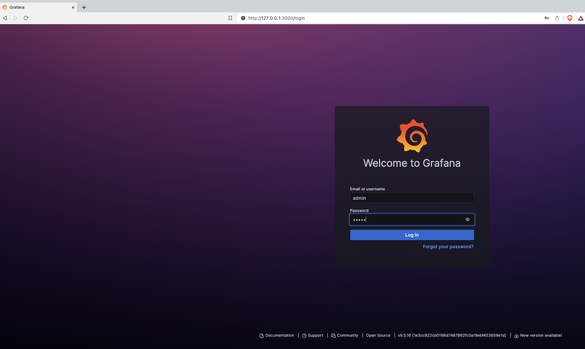
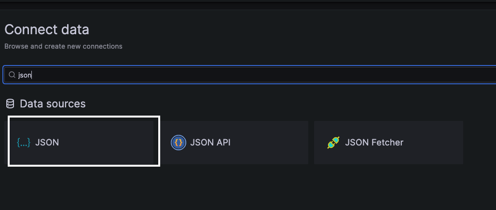
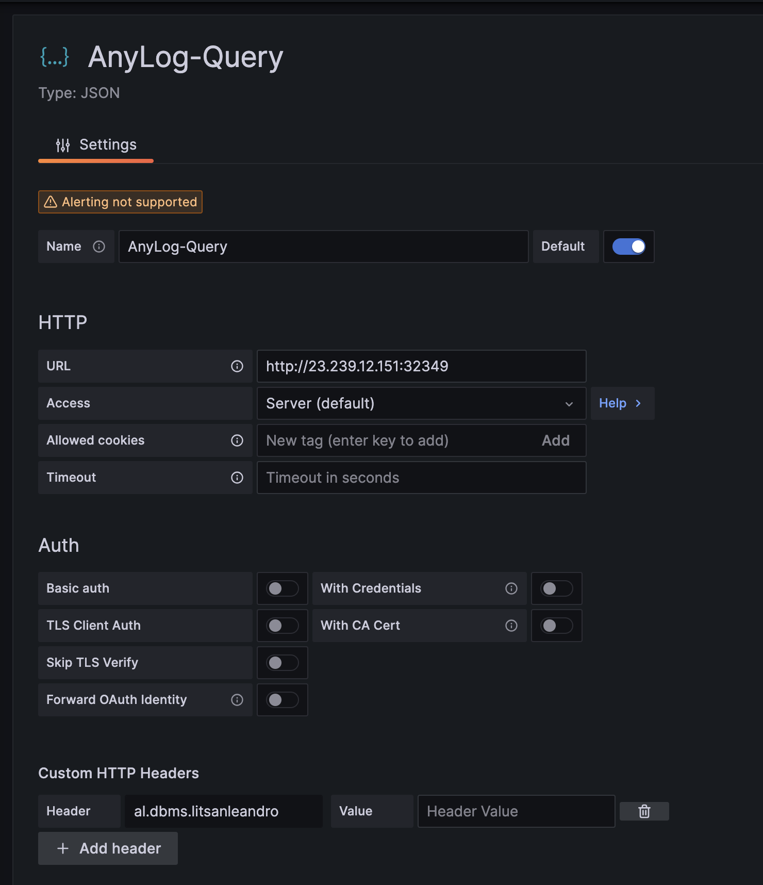
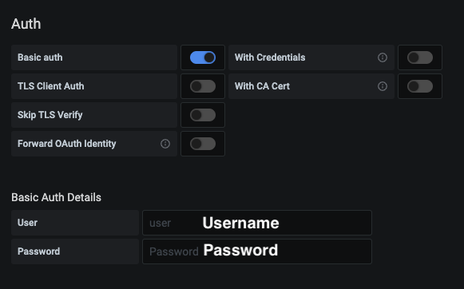
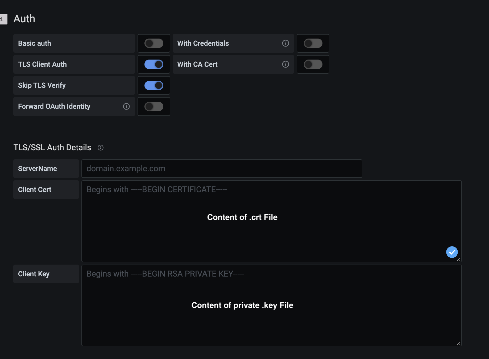
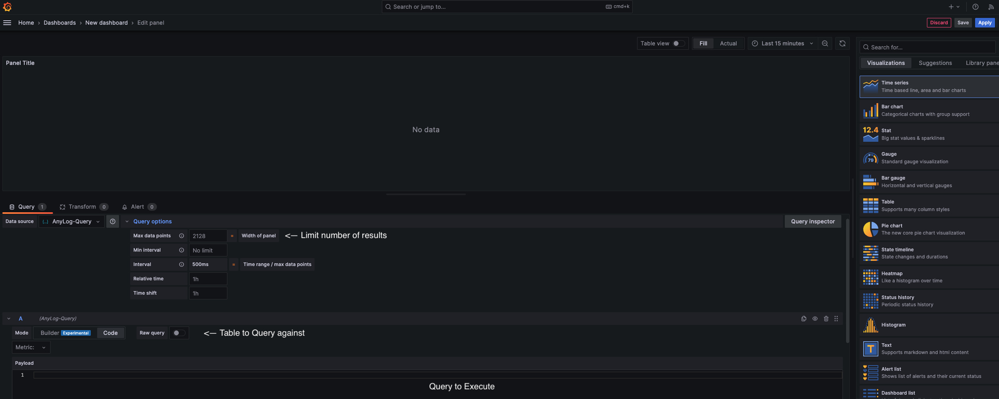
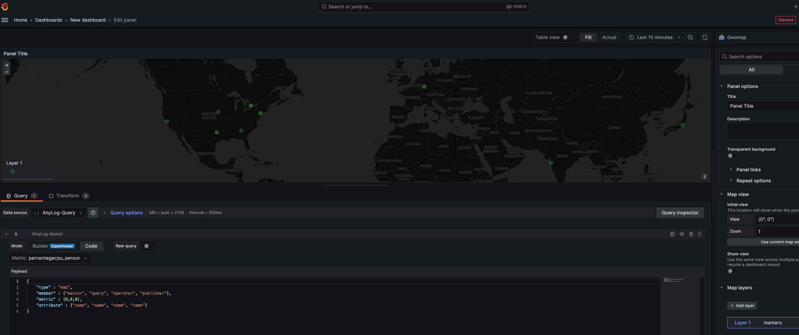
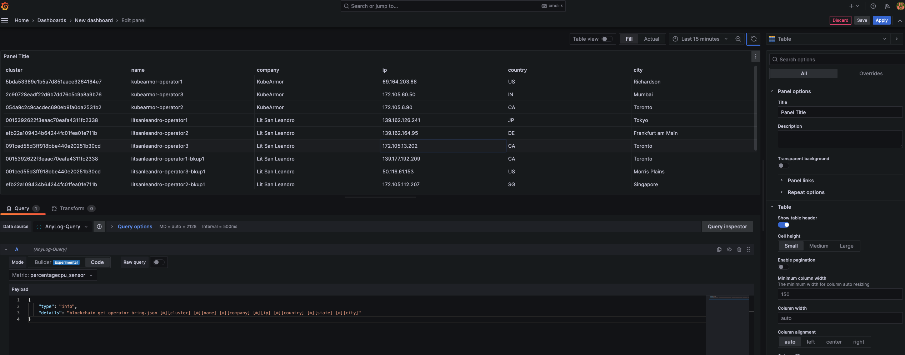
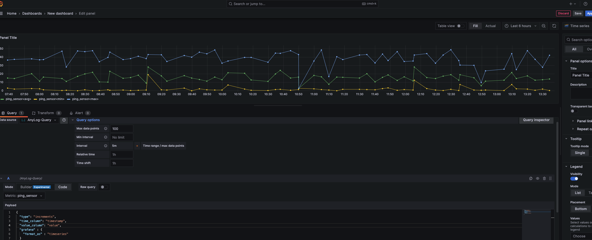
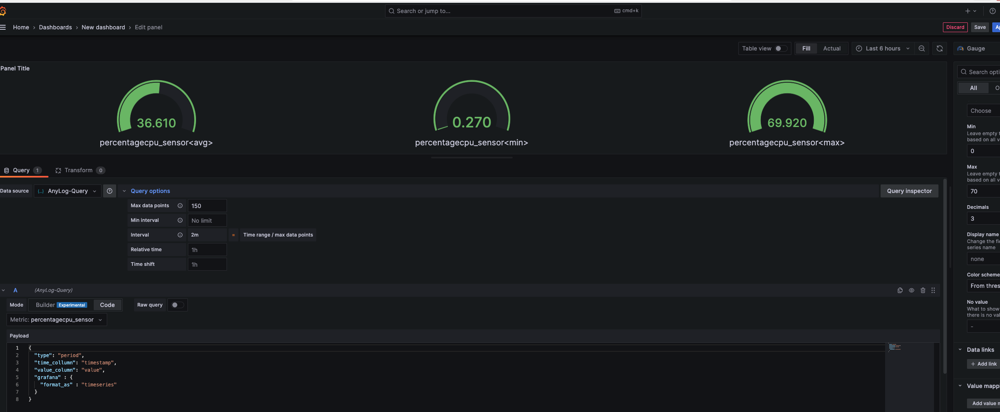

# Using Grafana

## Overview

Grafana is an open-source BI tool managed by [Grafana Labs](https://grafana.com/). We utilize Grafana as our default 
demo BI tool. However, directions for other BI tools, such as [Microsoft's PowerBI](PowerBI.md), can be found in our 
[North Bound services](../northbound%20connectors) section.   

Using Grafana, users can visualize time series data using pre-defined queries and add new queries using SQL.

Directions for importing our demo images dashboards can be found in [import grafana dashboard document](import_grafana_dashboard.md)


## Prerequisites & Links

* An [installation of Grafana](https://grafana.com/docs/grafana/latest/setup-grafana/installation/) - We support _Grafana_ version 7.5 and higher, we recommend using _Grafana_ version 9.5.16 or higher. 
```shell
docker run --name=grafana \
  -e GRAFANA_ADMIN_USER=admin \
  -e GRAFANA_ADMIN_PASSWORD=admin \
  -e GF_AUTH_DISABLE_LOGIN_FORM=false \
  -e GF_AUTH_ANONYMOUS_ENABLED=true \
  -e GF_SECURITY_ALLOW_EMBEDDING=true \
  -e GF_INSTALL_PLUGINS=simpod-json-datasource,grafana-worldmap-panel \
  -e GF_SERVER_HTTP_PORT=3000 \
  -v grafana-data:/var/lib/grafana \
  -v grafana-log:/var/log/grafana \
  -v grafana-config:/etc/grafana \
  -it -d -p 3000:3000 --rm grafana/grafana:9.5.16
```

* An AnyLog Node that provides a REST connection - To configure an AnyLog Node to satisfy REST calls, issue the following command on the AnyLog command line:  
  * [ip] and [port] are the IP and Port that would be available to REST calls.
  * [max time] is an optional value that determines the max execution time in seconds for a call before being aborted.
  * A 0 value means a call would never be aborted and the default time is 20 seconds.
```anylog
<run rest server where
    external_ip=!external_ip and external_port=!anylog_rest_port and
    internal_ip=!ip and internal_port=!anylog_rest_port and
    bind=!rest_bind and threads=!rest_threads and timeout=!rest_timeout
>
```
* [Support](https://grafana.com/docs/grafana/latest/)


## Setting Up Grafana 
1. [Login to Grafana](https://grafana.com/docs/grafana/latest/getting-started/getting-started/) - The default HTTP port that AnyLog GUI listens to is 3000 - On a local machine go to ```http://localhost:3000/```.



2. In _Data Sources_ section, create a new JSON data source
   * select a JSON data source.
   * On the name tab provide a unique name to the connection.
   * On the URL Tab add the REST address offered by the AnyLog node (i.e. http://10.0.0.25:2049)
   * On the ***Custom HTTP Headers***, name the default database. If no header is set, then all accessible databases to 
   the node will be available to query

| |  | 
| :---: | :---: |

Select the ***Save and Test*** option that should return a green banner message: ***Data source is working***.


### Enabling Authentication

Enabling authentication is explained at [Authenticating HTTP requests](../authentication.md#Authenticating-http-requests).

When authentication only REST requests via _username_ and _password_ ([basic authentication](../authentication.md#enabling-basic-authentication-in-a-node-in-the-network)) 
the Grafana configuration should have _basic auth_ enabled.



While authentication using [SSL Certificates](../authentication.md#using-ssl-certificates) should have _TLS Client Auth_ and _Skip TLS Verify_ enabled. 



**Notes**: Failure to connect may be the result of one of the following
* AnyLog instance is not running or not configured to support REST calls.
* Wrong IP and Port.
* Firewalls are not properly configured and make the IP and Port not available.
* AnyLog is configured with authentication detection that is not being satisfied.
* If the connected node is not able to determine tables for the selected database, the dashboard (Edit Panel/Metric Selection) presents "Error: No table connected" in the pull-down menu.


## Using Grafana to visualize AnyLog

Grafana allows to present data in 2 modes _Time Series_ collects and visualize data values as a function of time, and 
_Table_ format where data is presented in rows and columns.

AnyLog offers 2 predefined query types ([_Increments_ and _Period_](#using-the-time-series-data-visualization)) which 
users can modify or specify additional queries either "as-is" or using _Additional JSON Data_ options on the panel.

**Additional JSON Data** section(s) provides additional information to the query process. The information provided overrides 
the default behaviour and can pull data from any database managed by AnyLog (as long as the user maintains valid permissions).  
The additional information is provided using a JSON script with the following attribute names:

<pre>
dbms            - The name of the logical database to use. Overrides the dbms name in the configuration page.
table           - The name of the table to use. Overrides the table name in the sql statement.
type            - The type of the query. The default value is 'sq' and other valid types are: 'increments', 'period' and 'info'.         
sql             - A sql statement to use.
details         - An AnyLog command which is not a SQL statement.
where           - A "WHERE" condition added to the SQL statement. Can add filter or other conditions to the executed SQL.
functions       - A list of SQL functions to use which overwrites the default functions. 
timezone        - ***utc*** (default) or ***default*** to change time values to local time before the transfer to Grafana.
time_column     - The name of the time column in the Time Series format.
value_column    - The name of the value column in the Time Series format.
time_range      - When using a Table view, determines if the query needs to consider the time range. The default value is 'true'.
servers         - Replacing the network determined servers with a list of Operators (data hosting servers) to use.
instructions    - Additional AnyLog query instructions.
</pre>




### Blockchain based Visualization

**Creating Network Map**
1. In the _Visualizations_ section, select _Geomap_

2. In the _Metric_  section, select a table name to "query" against

3. Update _Payload_ with the following information
```json
{
    "type" : "map",
    "member" : ["master", "query", "operator", "publisher"],
    "metric" : [0,0,0],
    "attribute" : ["name", "name", "name", "name"]
}
```




**Creating Table from Blockchain**
1. In the _Visualizations_ section, select _Table_

2. In the _Metric_  section, select a table name to "query" against

3. Update _Payload_ with the following information
```json
{
    "type": "info", 
    "details": "blockchain get operator bring.json [*][cluster] [*][name] [*][company] [*][ip] [*][country] [*][state] [*][city]"
}
```



### Using the Time-Series Data Visualization

**Increments query** (The default query) is used to retriv statistics on the time series data in the selected time 
range. Depending on the number of data point requested, the time range is divided to intervals and the min, max and 
average are collected for each interval and graphically presented.  

**Example**:
```shell
# Input in Grafana 
{
  "type": "increments",
  "time_column": "timestamp",
  "value_column": "value",
  "grafana": {
    "format_as": "timeseries"
  }
}

# Query Being Executed
SELECT 
  increments(second, 1, timestamp), max(timestamp) as timestamp, avg(value) as avg_val, min(valu e) as min_val, 
  max(value) as max_val 
FROM 
  percentagecpu_sensor 
WHERE 
  timestamp >= '2024-02-19T19:42: 02.133Z' and timestamp <= '2024-02-19T19:57:02.133Z' 
LIMIT 2128;
```

***Period query*** is a query to retrieve data values at the end of the provided time range (or, if not available, before 
and nearest to the end of the time range). The derived time is the latest time with values within the time range. From the 
derived time, the query will determine a time interval that ends at the derived time and provides the avg, min and max values.    
To execute a period query, include the key: 'type' and the value: 'period' in the Additional JSON Data section.  

**Example**: 
```shell
# Input in Grafana
{
  "type": "period", 
  "time_column": "timestamp",
  "value_column": "value",
  "grafana" : {
    "format_as" : "timeseries"
  }
}
# Query Being Executed
SELECT 
    max(timestamp) as timestamp, avg(value) as avg_val, min(value) as min_val, max(value) as max_val 
FROM 
    ping_sensor 
```

More information on increments and period types of queries are available in [queries and info requests](../queries.md#optimized-time-series-data-queries).


**Increments Graph**
1. In the _Visualizations_ section, select _Time series_

2. In the _Metric_  section, select a table name to "query" against

3. Update _Payload_ with the following information
```json
{
  "type": "increments",
  "time_column": "timestamp",
  "value_column": "value",
  "grafana" : {
    "format_as" : "timeseries"
  }
}
```

4. Under _Query Options_, update _Max data points_ (ie limit) otherwise the outcome would look like a single line as 
opposed to clearly showing _min_ / _max_ / _avg_ value(s). 



**Period Graphs**
1. In the _Visualizations_ section, select _Gauge_

2. In the _Metric_  section, select a table name to "query" against

3. Update _Payload_ with the following information
```json
{
  "type": "period", 
  "time_column": "timestamp",
  "value_column": "value",
  "grafana" : {
    "format_as" : "timeseries"
  }
}
```

4. Under _Query Options_, update _Max data points_ (ie limit) otherwise the outcome would look like a single line as 
opposed to clearly showing _min_ / _max_ / _avg_ value(s). 




**Other Examples**

* Extending query to use where conditions
```json
# Increments
{
  "type": "increments",
  "time_column": "timestamp",
  "value_column": "value",
  "where": "device_name='ADVA FSP3000R7'",
  "grafana" : {
    "format_as" : "timeseries"
  }
}
          
# Period
{
  "type": "period", 
  "time_column": "timestamp",
  "value_column": "value",
  "where": "device_name='ADVA FSP3000R7'",
  "grafana" : {
    "format_as" : "timeseries"
  }
}
```

* Extend to specify which _Functions_ without _time_range_ to query 
```json
{
  "type": "period", 
  "time_column": "timestamp",
  "value_column": "value",
  "time_range": false,
  "functions": ["min", "max", "avg", "count"],
  "grafana" : {
    "format_as" : "timeseries"
  }
}
```