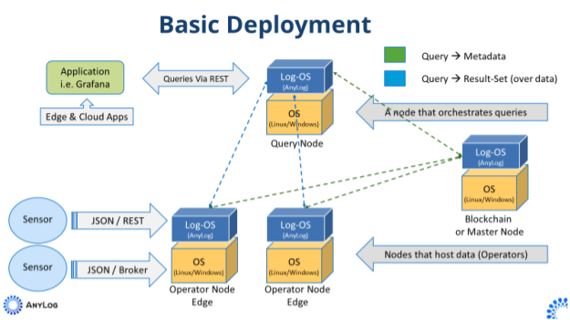

# Session II - Deployment of the test network

## Overview

This document describes how to deploy and configure an AnyLog Network. This guided session provides directions to:
Deploy an  AnyLog Network consisting of  4 nodes (2 operators, 1 query, 1 master).

When an AnyLog node is deployed, the software packages needs to be organized on the node with proper configurations.  
Each AnyLog Node is using the same software stack, however, the nodes in the network are assigned to different roles, and
these roles are determined by the configurations.    
The main roles are summarized in the table below:

| Node Name (Role)  | Functionality |
| -------------     | ------------- |
| Master            | A node that manages the shared metadata (if a blockchain platform is used, this node is redundant). |
| Operator          |  A node that hosts the data. In this session, users deploy 2 Operator nodes. |
| Query             | A node that coordinates the query process. |

Additional information on the types of nodes is in the [Getting Started](../getting%20started.md) document.
  
The roles are determined by configuration commands which are processed by each node at startup and enable services 
offered by the node. The same node may be assigned to multiple roles - there are no restrictions on the services that can be
offered by a node.

The following table summarizes different supported deployment and configuration options:

| Functionality  | Option         | Comments       |
| ---------------| -------------- | -------------  |
| Deployment     | Docker         | Supported      |
| Deployment     | Kubernetes     | Supported      |
| Configuration  | AnyLog CLI     | Interactively issuing configuration commands on the CLI    |
| Configuration  | REST           | Interactively issuing configuration commands via REST    |
| Configuration  | Script file    | Organizing the configuration command in a file and associating the file to a node |
| Configuration  | Questionnaire  | Creating a configuration file using a questionnaire  |
| Configuration  | Policy         | Organizing the configuration commands in a policy and associating the policy to a node |

Since configuration is "command based", it is simple to change configurations, and even dynamically (using the CLI),
by disabling a service or enabling a service using the proper commands.  

In this training, users will be creating a default configuration file and make minimal modifications using a questionnaire.    
Users can bypass the questionnaire and make the needed changes in the configuration file - in this training, the 
configuration file is named **anylog_configs.env** and sored in a folder as follows:

| Node              | Folder |
| -------------     | ------------- |
| Master            | deployments/docker-compose/anylog-master |
| Operator          | deployments/docker-compose/anylog-operator |
| Query             |  deployments/docker-compose/anylog-query-remote-cli |

Advanced users can generate their own configuration files using a questionnaire, or placing the commands in files or a policies.
* The [Netowrk Setup](../examples/Network%20setup.md) document is a step by step guide to deploy an AnyLog network without 
a pre-existing configuration.
* The [deploying_node](../deployments/deploying_node.md) document is a guide to deploy a network using a questionnaire
that to generate the config file (using a detailed questionnaire that addresses many of the existing setups).
* The [Policies based Configuration](../policies.md#policies-based-configuration) section details how to use 
policies (placed on the shared metadata layer) to configure nodes in the network.

**Deployment Diagram**:



In this test network, data is ingested by the 2 operator nodes. 
Users interact with the network, by issuing commands and queries to the Query node, and these are satisfied as if 
the data is hosted on a single database and as if the distributed nodes are a single machine.
In addition, users will notice that data management and monitoring are automated and activated as a service by the 
proper configuration commands. 

## The deployed software

The following table summarizes the commonly used packages deployed with AnyLog.  

| Package Name                                        | Functionality | Reference Document | 
| --------------------------------------------------- | ------------- |-------------- |
| [AnyLog](https://www.anylog.co/)                    | The AnyLog software package on each node.  | [Deploying a Node](../deployments/deploying_node.md) |
| [PostgreSQL](https://www.postgresql.org/)           |  A local database.  | [PostgreSQL Install](https://www.postgresql.org/download/)|
| [MongoDB](https://www.mongodb.com/)           |  A local database for unstructured data.  | [MongoDB Download](https://www.mongodb.com/try/download/community)|
| [A data generator](https://github.com/AnyLog-co/Sample-Data-Generator)  |  A data generator that generates simulated data for learning and testing purposes.  | [Data Generator READ.ME](https://github.com/AnyLog-co/Sample-Data-Generator/blob/master/README.md)|
| [Edgex](https://www.edgexfoundry.org/)              |  A connector to PLCs and sensors.  | [EdgeX](https://docs.edgexfoundry.org/2.1/getting-started/quick-start/) |
| [Remote-CLI](../northbound%20connectors/remote_cli.md)   | A web based interface to the network.  |  |
| [Grafana](https://grafana.com/)                     |  A visualization tool. | [Get Started with Grafana](https://grafana.com/get/?plcmt=top-nav&cta=downloads&tab=self-managed) |

**In this session, users will use the following packages:**
* AnyLog, on each of the 4 network nodes. Configuration will be using the default setting (other than proprietary info listed below). 
* Local database is SQLite (and is available by default without a dedicated install).
* Remote CLI - deployed with the Query Node.
* Data Generator - deployed on operator I (Operator II will be configured to get data from a 3rd party message broker).
* Grafana, on a dedicated node, as an example for an application interacting with the network data.

## Prerequisites
Prior to this session, users are required to prepare:
* 4 machines (virtual or physical) to host the AnyLog nodes, as follows:
    - A Linux environment.
    - A minimum of 256MB of RAM.
    - A minimum of 10GB of disk space.
* 1 Machine (physical or virtual) for applications that interact with the network (i.e. Grafana), as follows:
    - Linux or Windows environment.
    - A minimum of 256MB of RAM.
    - A minimum of 10GB of disk space.
* Each node accessible by IP and Port (remove firewalls restrictions).
* [Docker](https://docs.docker.com/) & [Docker Compose](https://docs.docker.com/compose/) installed (navigate to [Get Docker](https://docs.docker.com/get-docker/) site to access
   the Docker download that’s suitable for your platform).
* To enable the questionnaire, install the following packages (these packages are redundant for deployments with pre-packaged configurations,
or if the questionnaire is not used to create the **anylog_configs.env** file):  
    - [Python](https://www.python.org/downloads/)
    - [Dotenv](https://pypi.org/project/python-dotenv/)     

**Note 1**: The prerequisites for a customer deployment are available [here](../deployments/prerequisite.md).

**Note 2** We recommend deploying an overlay network, such as [nebula](../deployments/Networking%20&%20Security/nebula.md).
 * It provides a mechanism to maintain static IPs.
 * It provides the mechanisms to address firewalls limitations.
 * It Isolate the network addressing security considerations. 

**Note 3** If an overlay network is not used in the training, remove firewalls restrictions to allow the the nodes
to communicate with peers and with 3rd parties applications.

## Associate the training machines with their roles 

Identify the machine assigned to each of the 4 AnyLog Instances (Master, Query and 2 Operators).

## Static IPs
AnyLog requires static IPs for the nodes in the network. Some setups are not providing static IPs. There are different ways
to represent nodes with static IPs through redirection. For example, [Nginx](https://www.nginx.com/) provide the functionality
and an example of Nginx with Kubernetes is detailed [here](https://kubernetes.github.io/ingress-nginx/examples/static-ip/). 

## The Network ID

* With a Master Node deployment, the network ID is the Master's IP and Port.
* By default, a node is using its default IP (the IP that identifies the node on the network used) and the Port is 2048.
 
**Note:** 
If the default IP is not known, when the Master node is initiated, the command **get connections** on the node CLI returns
the IPs and ports used - the Network ID is the IP and port assigned to TCP-External.

## Deploy the Network Nodes

Other than the 5 exceptions listed below, the AnyLog nodes will be using the default configuration:
 1. The AnyLog license key is unique per company.
 2. Your company name (the user company name).
 3. Add the network ID (the IP and port of the Master) to the Operators and the Query Nodes.
 4. Enable monitoring (in the default configuration, monitoring is disabled).
 5. On the Query node and each of the Operator nodes: IP and Port of the Master (the network ID).
 
 In this training process, these configuration parameters are modified in the config file of each node using the questionnaire
 (note that in a customer deployment, these configurations can be pre-packaged).
 
## Get the Docker credentials and the AnyLog license key   
If you do not have Docker credentials, or an AnyLog license key please contact us at [info@anylog.co](mailto:info@anylog.co) 
 
## Deploy an AnyLog Instance on each node

Follow these steps on each of the 4 nodes (Master, Query and 3 Operator nodes).

1. Clone AnyLog deployment.
```shell 
git clone https://github.com/AnyLog-co/deployments  
```

Note: to re-install, move older install using the following command:
```
rm -rf deployments
```

2. Register docker credentials 
```shell
bash deployments/installations/docker_credentials.sh [DOCKER_ACCESS_CODE]
```

## The AnyLog Configuration file

After the install, each node maintains a configuration file named: **anylog_configs.env**.  
This file is in the following directories:

| Node              | Folder |
| -------------     | ------------- |
| Master            | deployments/docker-compose/anylog-master |
| Operator          | deployments/docker-compose/anylog-operator |
| Query             |  deployments/docker-compose/anylog-query |

## Modify configurations 

On each machine, modify the ```anylog_configs.env``` according to the following instructions:

1. Using an editor, enter the file:
   ```
   vi anylog_configs.env
   ```
   
2. Update the following values:
    * LICENSE_KEY with the AnyLog License Key (uncomment the entry).
    * COMPANY_NAME with your company name
    * MONITOR_NODES set the value to **true**
    * MONITOR_NODE_COMPANY with your company name
    For the Query Node and the 2 Operator nodes, add the ID of the network
    * LEDGER_CONN with the IP and Port of the Master Node (for example: LEDGER_CONN=198.74.50.131:32048)
    Note: deploy and start the Master, on the AnyLog CLI issue **get connections**, the ID is the address under TCP/External-address.
    
# Start / Restart a deployed node
 
```shell
# master 
cd deployments/docker-compose/anylog-master
docker-compose up -d

# operator
cd deployments/docker-compose/anylog-operator
docker-compose up -d

# query with remote-cli 
cd deployments/docker-compose/anylog-query
docker-compose up -d
```

View running containers:
```
docker ps -a 
``` 

### Attach to the process - allowing users to operate on the node CLI:

1. Attach
```
docker attach --detach-keys=ctrl-d [NODE NAME]
```
**Nodes Names**:
* Master - **anylog-master**
* Operator - **anylog-operator**
* Query - **anylog-query**
Example:
```
docker attach --detach-keys=ctrl-d anylog-master
```

2. Detach from the process (AnyLog remains active)

Using the keys: **ctrl+d**

3. Shutdown an AnyLog node

On the CLI:
```
exit node
```

Terminate a docker process:

In the the docker-compose directory of the node to terminate (Master in the example below):
```
 cd deployments/docker-compose/anylog-master
```
Do one of the following:
```
docker-compose down               # will stop the process 
docker-compose down -v            # stop the process + will also remove the volume
docker-compose down --rmi all     # stop the process + will also remove the image 
docker-compose down -v --rmi all  # will do all three  
```

# Populating Data

Data will be added to the 2 Operator nodes in the following manner:
 
* AnyLog Operator I  - A data generator creates simulated data on Operator Node I. 
    * **Note 1:** The data generator requires [Python](https://www.python.org/downloads/) preinstalled). 
    * **Note 2:** The data generator source code and documentation are available on Github: [Sample-Data-Generator](https://github.com/AnyLog-co/Sample-Data-Generator).
    
  - Advanced users can use other data generators. For example, by leveraging an [EdgeX deployment](https://github.com/AnyLog-co/lfedge-code).
    
* AnyLog Operator II - receive data by subscribing to a 3rd-party MQTT broker.

To populate simulated data - AnyLog [Data Generator](https://github.com/AnyLog-co/Sample-Data-Generator)
provides options to generate a variety data types used for demonstration and tesing purposes. 

Note: The Data Generator can distribute the generated data to multiple nodes (if the IP:Port of multiple nodes are specified as the destination). 
   
1. Clone Data Generator
```shell
cd $HOME
git clone https://github.com/AnyLog-co/Sample-Data-Generator
```

2. Install requirements
```shell
python3 -m pip install --upgrade -r $HOME/Sample-Data-Generator/requirements.txt
```

3. Run data generator 
* ping sensor / percenagecpu sensor — combination of data that’s of different types
* trig — timestamp and sin/cos/tan values between -3.14 and 3.14
* performance — timestamp / random float value
* opcua — timestamp + about 10 columns of float values
* power — multiple tables
  * To generate a Grafana map for the coordinates in power data use: [blockchain_add_policy_simple.py](../examples/Sample%20Python%20Scripts/blockchain/blockchain_add_policy_simple.py)
  
  ```shell    
  $HOME/Sample-Data-Generator/data_generator_generic.py trig put test \
    --total-rows 1000000 \
    --batch-size 1000 \
    --sleep 0.5 \
    --timezone utc \
    --enable-timezone-range \
    --conn 10.0.0.226:32149 \
    --topic trig_data \
    --exception  
  ```

## Validate Deployment
* Attaching to an AnyLog node 
```shell
# master 
docker attach --detach-keys="ctrl-d" anylog-master-node 

# operator 1 
docker attach --detach-keys="ctrl-d" anylog-operator-node1

# operator 2
docker attach --detach-keys="ctrl-d" anylog-operator-node2

# query 
docker attach --detach-keys="ctrl-d" anylog-query-node

# detach from AnyLog node - ctrl-d
```

* View basic configurations -- `get connections`, `get processes` and `get databases`   
```shell
ubuntu@demo:~$ docker attach --detach-keys="ctrl-d" anylog-master-node

AL master-node +> get connections (need to update this to the new format showing binds)

Type      External Address     Local Address        
---------|--------------------|--------------------|
TCP      |139.162.200.15:32048|139.162.200.15:32048|
REST     |139.162.200.15:32049|139.162.200.15:32049|
Messaging|Not declared        |Not declared        |

AL master-node +> get processes 

    Process         Status       Details                                                                     
    ---------------|------------|---------------------------------------------------------------------------|
    TCP            |Running     |Listening on: 139.162.200.15:32048, Threads Pool: 6                        |
    REST           |Running     |Listening on: 139.162.200.15:32049, Threads Pool: 5, Timeout: 30, SSL: None|
    Operator       |Not declared|                                                                           |
    Publisher      |Not declared|                                                                           |
    Blockchain Sync|Running     |Sync every 30 seconds with master using: 127.0.0.1:32048                   |
    Scheduler      |Running     |Schedulers IDs in use: [0 (system)] [1 (user)]                             |
    Distributor    |Not declared|                                                                           |
    Consumer       |Not declared|                                                                           |
    MQTT           |Not declared|                                                                           |
    Message Broker |Not declared|No active connection                                                       |
    SMTP           |Not declared|                                                                           |
    Streamer       |Running     |Default streaming thresholds are 60 seconds and 10,240 bytes               |
    Query Pool     |Running     |Threads Pool: 3                                                            |
    Kafka Consumer |Not declared|                                                                           |

AL master-node +> get databases 

List of DBMS connections
Logical DBMS         Database Type IP:Port                        Storage
-------------------- ------------- ------------------------------ -------------------------
blockchain           psql          127.0.0.1:5432                 Persistent
system_query         sqlite        Local                          MEMORY

# detach from AnyLog node - ctrl-d 
```

* Make sure data is coming into Operator node - `get msg client`, `get streaming`, `get operator`
```shell
ubuntu@demo:~$ docker attach --detach-keys="ctrl-d" anylog-operator-node1 

AL anylog-operator-node1 +> get msg client 

Subscription: 0001
User:         unused
Broker:       local
Connection:   Not connected: MQTT_ERR_NO_CONN

     Messages    Success     Errors      Last message time    Last error time      Last Error
     ----------  ----------  ----------  -------------------  -------------------  ----------------------------------
            843         843           0  2022-07-29 00:34:24
     
     Subscribed Topics:
     Topic       QOS DBMS  Table     Column name Column Type Mapping Function        Optional Policies 
     -----------|---|-----|---------|-----------|-----------|-----------------------|--------|--------|
     anylogedgex|  0|test|rand_data|timestamp  |timestamp  |now()                  |False   |        |
                |   |     |         |value      |float      |['[readings][][value]']|False   |        |

     
     Directories Used:
     Directory Name Location                       
     --------------|------------------------------|
     Prep Dir      |/app/AnyLog-Network/data/prep |
     Watch Dir     |/app/AnyLog-Network/data/watch|
     Error Dir     |/app/AnyLog-Network/data/error|

AL anylog-operator-node1 +> get streaming 

Flush Thresholds
Threshold         Value  Streamer 
-----------------|------|--------|
Default Time     |    60|Running |
Default Volume   |10,240|        |
Default Immediate|True  |        |
Buffered Rows    |     8|        |
Flushed Rows     |     9|        |


Statistics
DBMS-Table      File Put File Rows Streaming Put Streaming Rows Streaming Cached Immediate Last Process        
---------------|--------|---------|-------------|--------------|----------------|---------|-------------------|
test.rand_data|       0|        0|          846|           846|               8|      824|2022-07-29 00:34:44|

AL anylog-operator-node1 +> get operator 

Status:     Active
Time:       1:37:43 (H:M:S)
Policy:     29ebc0cf136de22b25c3036a32363f65
Cluster:    e9c30c8935f845a8976ff0f827378b92
Member:     113
Statistics JSON files:
DBMS                   TABLE                  FILES      IMMEDIATE  LAST PROCESS
---------------------- ---------------------- ---------- ---------- --------------------
test                  rand_data                       4         90 2022-07-29 00:34:07

Statistics SQL files:
DBMS                   TABLE                  FILES      IMMEDIATE  LAST PROCESS
---------------------- ---------------------- ---------- ---------- --------------------
test                  rand_data                       4          0 2022-07-29 00:01:05

Errors summary
Error Type           Counter DBMS Name Table Name Last Error Last Error Text 
--------------------|-------|---------|----------|----------|---------------|
Duplicate JSON Files|      0|         |          |         0|               |
JSON Files Errors   |      0|         |          |         0|               |
SQL Files Errors    |      0|         |          |         0|               |

# detach from AnyLog node - ctrl-d
```

* Query data -- `get data nodes` and `select * from rand_data limit 10;` 
```shell
ubuntu@demo:~$ docker attach --detach-keys="ctrl-d" anylog-query-node 

AL query-node +> get data nodes 

Company DBMS  Table     Cluster ID                       Cluster Status Node Name             Member ID External IP/Port     Local IP/Port        Node Status 
-------|-----|---------|--------------------------------|--------------|---------------------|---------|--------------------|--------------------|-----------|
AnyLog |test |rand_data|b8517462b22804cfc357c86030e04520|active        |anylog-operator-node2|       59|139.162.200.15:32158|139.162.200.15:32158|active     |
       |     |         |e9c30c8935f845a8976ff0f827378b92|active        |anylog-operator-node1|      113|139.162.200.15:32148|139.162.200.15:32148|active     |

AL query-node +> run client () sql test format=table "select * from rand_data limit 10;" 
[0]
AL query-node +> 
row_id insert_timestamp           tsd_name tsd_id timestamp                  value      
------ -------------------------- -------- ------ -------------------------- ---------- 
     1 2022-07-28 22:58:16.526417       59      2 2022-07-28 22:57:12.078936 2062547502 
     2 2022-07-28 22:58:16.526417       59      2 2022-07-28 22:57:15.288161     -21506 
     3 2022-07-28 22:58:16.526417       59      2 2022-07-28 22:57:15.365373        -88 
     4 2022-07-28 22:58:16.526417       59      2 2022-07-28 22:57:15.365744 1140863460 
     5 2022-07-28 22:58:16.526417       59      2 2022-07-28 22:57:35.288549       -631 
     6 2022-07-28 22:58:16.526417       59      2 2022-07-28 22:57:35.365486        -49 
     7 2022-07-28 22:58:16.526417       59      2 2022-07-28 22:57:35.365981 1699705479 

row_id insert_timestamp           tsd_name tsd_id timestamp                  value 
------ -------------------------- -------- ------ -------------------------- ----- 
     1 2022-07-28 22:58:22.252761      113      1 2022-07-28 22:57:20.004870    35 

row_id insert_timestamp           tsd_name tsd_id timestamp                  value  
------ -------------------------- -------- ------ -------------------------- ------ 
     1 2022-07-29 00:00:19.696563       59     66 2022-07-29 00:00:15.367675 -25863 

row_id insert_timestamp           tsd_name tsd_id timestamp                  value  
------ -------------------------- -------- ------ -------------------------- ------ 
     1 2022-07-29 00:00:05.287433      113     61 2022-07-29 00:00:04.050341 -12346 

{"Statistics":[{"Count": 10,
                "Time":"00:00:00",
                "Nodes": 2}]}
# detach from AnyLog node - ctrl-d
```